# Git 基本介绍

🔔

玩游戏一条命通关难度大吗? 很大

所以我们是不是要适当存档? 是的

那从 0 开始一次性就能把代码都写完? 中间肯定不能出错? 不能

所以我们需要写完一段代码/功能，就存档保存一下!

我们写项目的时候，每天想要保存一个版本，如果手动管理，可能会复制工程文件夹，如下：

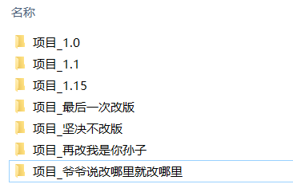

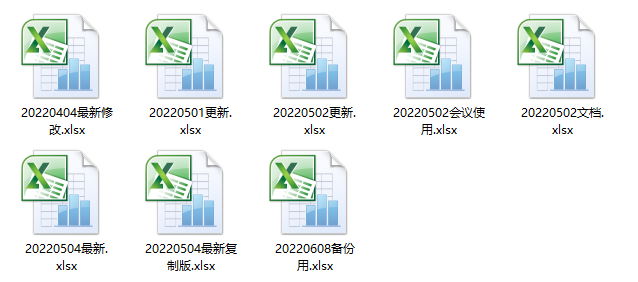

📌

**问题**

- 操作麻烦：每次需要复制，粘贴，重命名，占磁盘空间；

- 命名麻烦：起不好名字，都不知道这个文件夹和上个文件夹比修改了什么；

- 存储麻烦：如果电脑/磁盘损坏，项目文件容易丢失；

- 合并麻烦：如果自己写项目还好，但是很多人合作一个项目，往同一个文件合代码是一件费时费力的事情。

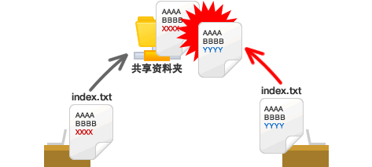

💡

**解决方案**

- Git是一个分布式版本管理控制系统（缩写VCS），用于敏捷高效地处理任何或小或大的项目，它可以在任何时间点，将文档的状态作为更新记录保存起来，也可以在任何时间点，将更新记录恢复回来；

- 作用：文件存档备份、文件版本管理、多人协同合作（自动合并）。


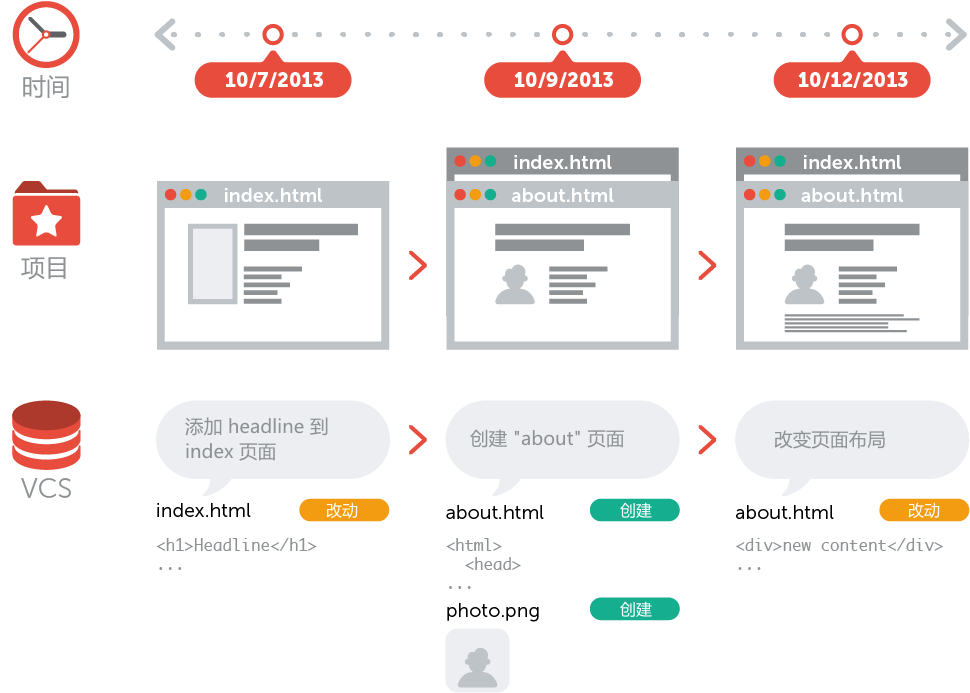

# Git 环境搭建

## 2.1 下载安装

1.  先去官网下载这个软件，根据自己电脑系统下载此软件，[https://git-scm.com/](https://git-scm.com/)。

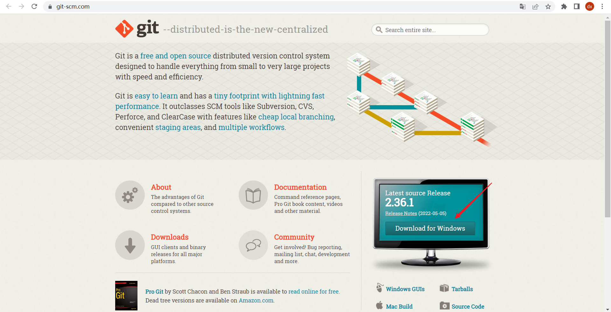

1.  安装的位置，不要在中文路径下。
2.  查看安装是否成功: 在任意文件夹右键，查看是否有Git Base Here 选项，有就成功了。

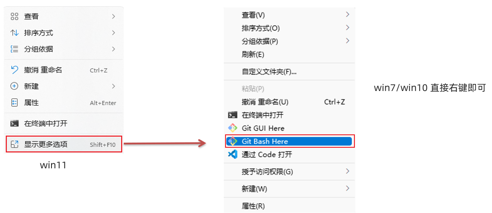

1.  也可以在命令行公交中输入 `git --version` 查看版本。

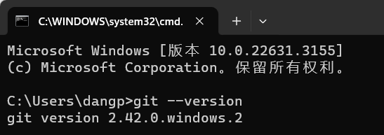

## 2.2 配置信息

安装 Git 软件后，需要配置全局**用户名**和**邮箱，**以后提交时，知道是谁提交的。

```
# git config 固定命令，设置 git 相关配置
# --global 全局配置：一次配置，整机在使用 git 时都生效
git config --global user.name "你的用户名"
git config --global user.email "你的邮箱地址"

# 如何单独的配置一个文件夹的仓库信息
# 命令行窗口要在当前文件夹打开
git init # 初始化一个仓库
git config --local user.name "你的用户名"
```

配置后，可以运行 `git config --list` 命令查看是否成功。

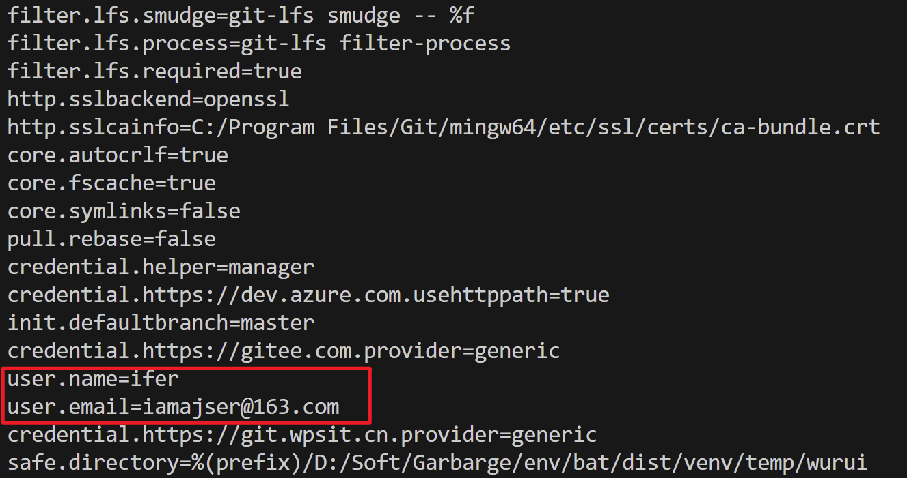

## 2.3 区域划分

|  |  |  |
|:---|:---|:---|
| **本地 Git 仓库** | **暂存区** | **工作区** |
| 用于存放提交记录 | 临时存放被修改文件 | 被 Git 管理的项目目录 |

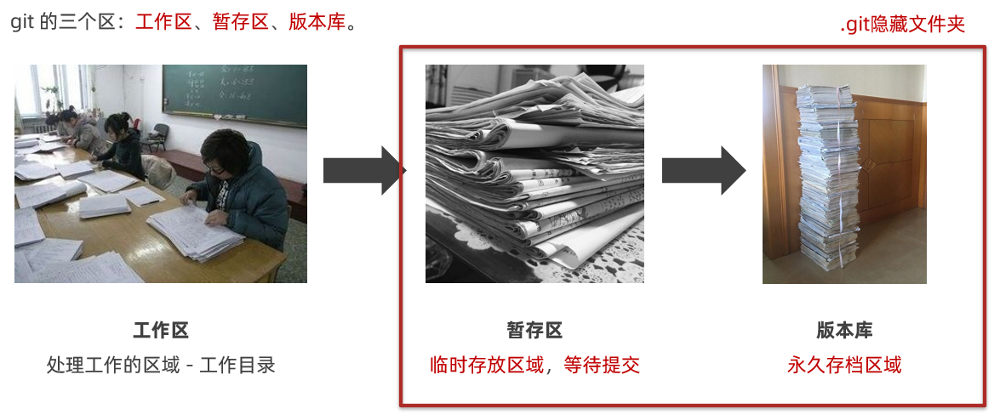

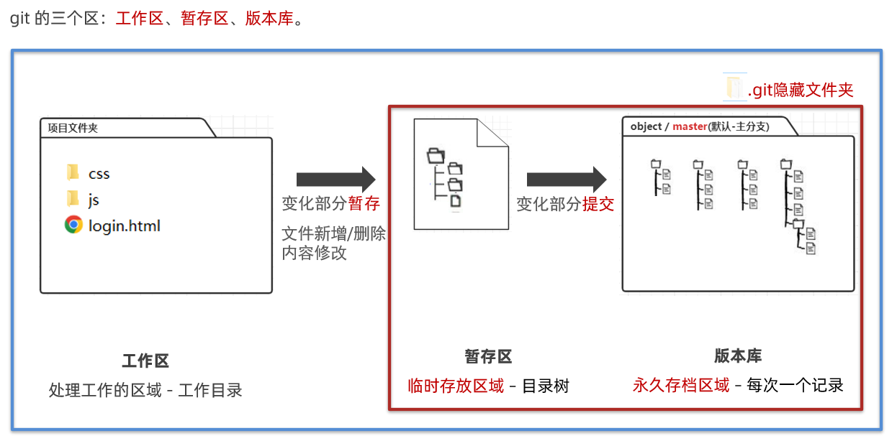

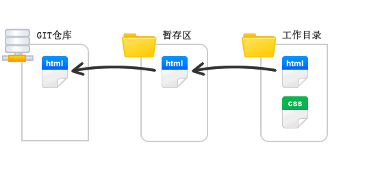

# Git 基础使用

## 3.1 如何提交

🔔

我们新建一个文件夹 / 现有的文件夹 是 Git 仓库吗？

不是！！！因为没有 .git 文件夹，没有被 git 管理。

1.  新文件夹 / 现有文件夹，可以运行如下命令，得到 .git 文件夹，即可让 git 开始准备管理。

```
git init
```

1.  得到 .git 文件夹。


1.  新建 `css/index.css`、`js/index.js`、`index.html`，随意写入一些内容。
2.  接下来，要把工作区变化，放到暂存区中。

```
# 将index.html 添加到暂存区
git add index.html

# 将 css 目录下一切添加到暂存区
git add css
```

1.  每次一个个加，麻烦！如下命令，可以一次性把所有变化文件，放入暂存区。

```
# 注意: add 后面有个空格，此.的意思是把当前目录下所有变化都暂存
git add .
```

1.  把暂存区内容，提交到版本库，命令如下。

```
git commit -m '提交的内容说明'
```

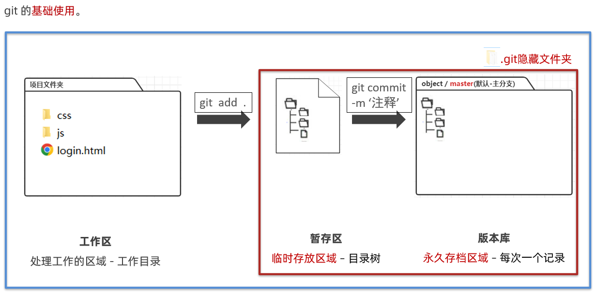

💡

**Commit 的原子性（小而完美）**

## 3.2 日志状态

1.  查看所有提交的日志记录，命令如下。

```
git log
```

1.  运行命令效果如下。

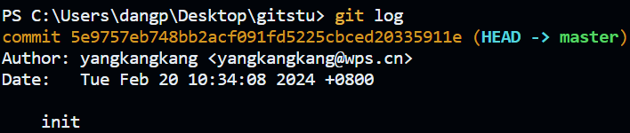

1.  当我们的日志越来越多，可能想要简化查看，可以输入如下命令。

```
# --oneline 在一行显示简略信息
git log --oneline
```

1.  运行命令效果如下。

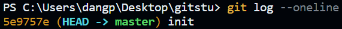

1.  我们再新增一个 `login.html`，并修改 `index.css` 里代码。如果刚才改的代码过多，忘记改过哪些了，可以运行如下命令，查看 git 仓库变化。

```
git status
```

1.  执行后，查看命令如下。

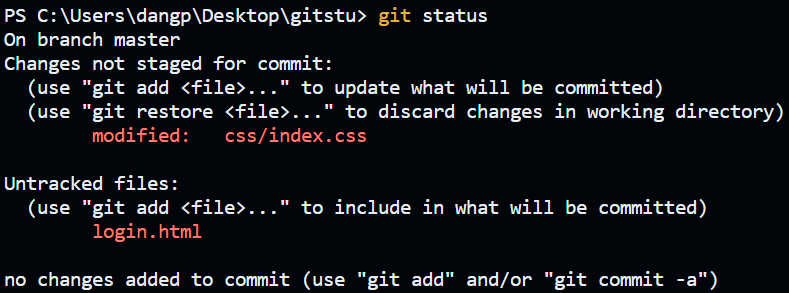

1.  暂存，并再次提交产生一次版本记录。

```
git add .
git commit -m '新建登录页面和修改样式'
```

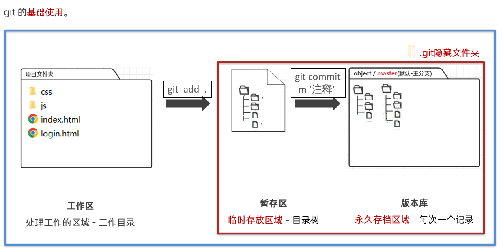

## 3.3 撤销操作

💡

我们玩游戏，突然感觉没玩好，想要回到上次存档的记录重新来? 可以！

代码写到后面发现，最近这2天的需求写错了，回到2天前? 可以！

但是以上的**回退前提，**你前面确实 add / commit 存档过。

#### **3.3.1 暂存区中覆盖工作区**

**🌳 场景：**当工作目录中添加的一些代码存在一些问题，但是又不记得修改了哪一些地方了，此时就可以用暂存区的文件来覆盖我们工作目录的文件。

```
git checkout 文件
```

#### **3.3.2 将文件从暂存区删除**

**🌳 场景：**当我们不小心把其他的一些测试代码或者是一些没用的文件添加到了暂存区后，我们可以通过命令进行移除。

```
git rm --cached 文件名
```

#### **3.3.3 恢复指定版本的项目**

回退命令语法如下：

```
git reset --hard 版本号
```

可以运行如下命令查看版本号：

```
git log --oneline
```

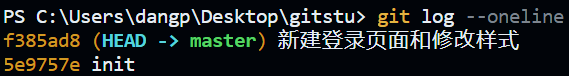

尝试回退到 5e9757e 这次记录上：

```
git reset --hard 5e9757e
```

观察自己工作区的代码，发现确实回退。如果想要在回到最近一次提交的记录，发现 git log 看不到未来的记录了，此时输入 git reflog 命令，可以查看 git 所有的操作记录，包括你的 reset 记录。

```
git reflog
```

好了，根据版本号，再次穿越，又回来啦！

```
git reset --hard f385ad8
```

可以打印 git log --oneline，查看 HEAD 标记在哪里？HEAD 是头指针，指向现在工作区所在的记录。

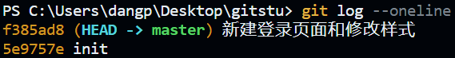

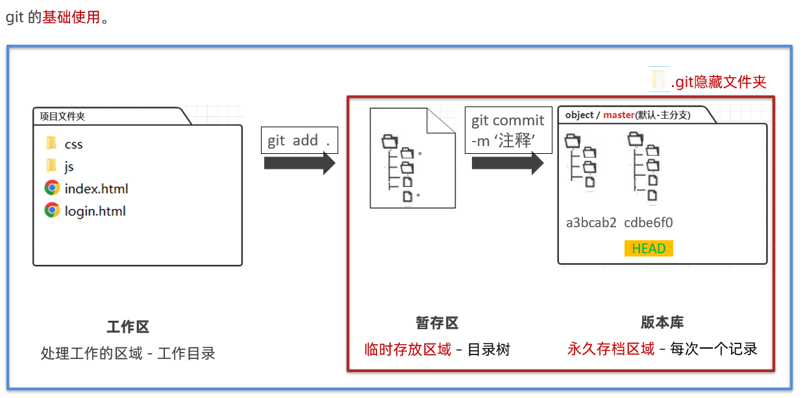

## 3.4 忽略文件

有的时候，我们某些文件/文件夹，不想被 Git 进行跟踪管理，可以新建 `.gitignore` 的忽略文件，并写入忽略规则如下。

```
# 忽略某个指定文件
password.txt

# 忽略文件夹
css

# 忽略文件夹下的某个文件
css/index.js

# 忽略文件夹下某类文件
css/*.js
```

1.  根目录新建 password.txt，查看 git 追踪到了哪些变化。

```
git status
```

1.  发现只新增了 .gitignore，符合规则的都备忽略掉了。

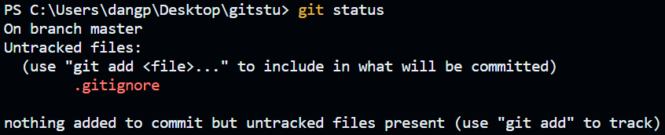

# 关于 Git 分支

## 4.1 基本概念

为了便于理解，大家暂时可以认为分支就是当前工作目录中代码的一份副本。使用分支，可以让我们从开发主线上分离出来，以免影响开发主线。

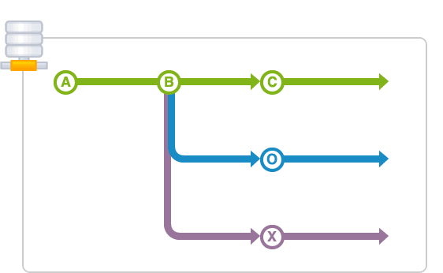

## 4.2 分支划分

### 4.2.1 主分支（master）

第一次向 git 仓库中提交更新记录时自动产生的一个分支。这个属于是主分支，主分支中的代码是很稳定的代码，所以我们在开发的时候一般都不会把代码直接提交到主分支中，主分支中的代码一般都是用于线上的项目；我们一般在开发的时候，会把代码先同步到开发分支上，等功能完成并且测试没有问题了，我们才会同步到主分支上。

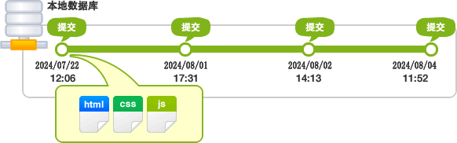

### 4.2.2 开发分支（develop）

作为开发的分支，基于 master 分支创建，这条分支就是用于我们日常开发的分支。

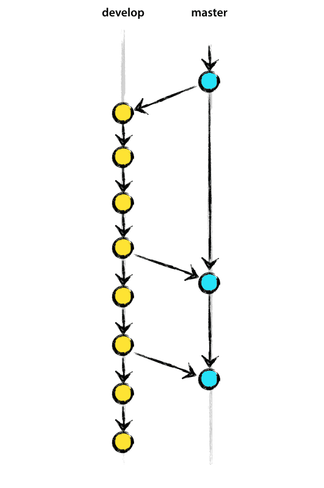

### 4.2.3 功能分支（feature）

作为开发具体功能的分支，基于开发分支创建，为了不影响整体的开发项目，我们在实现某一些有难度的功能时候，会创建功能分支，等到功能实现完毕，没有问题了我们才会同步到开发分支上。

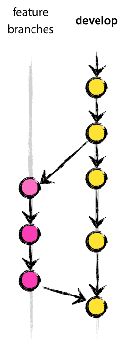

## 4.3 创建分支

1.  现在已经有了"登录"和"主页"了，我们来创建一个"注册"分支 reg，命令如下：

```
# 创建分支
git branch 分支名
# 也可以执行下面命令，表示基于某次提交开分支
git branch dev commitID
```

1.  注意：创建后不会自动切换分支，我们可以运行命令查看现在这个 .git 版本库里所有分支。

```
# 查看当前版本库所有分支
git branch

# * 代表你现在所处的分支
```

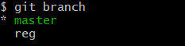

1.  手动切换到分支上，命令如下：

```
# 切换分支命令
# 这里你会发现 master 分支上的所有代码(和当前节点所有提交记录) 都被复制了过来，在这个基础上，接着往后开发就行，不是你的页面不同碰
git checkout 分支名
```

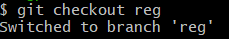

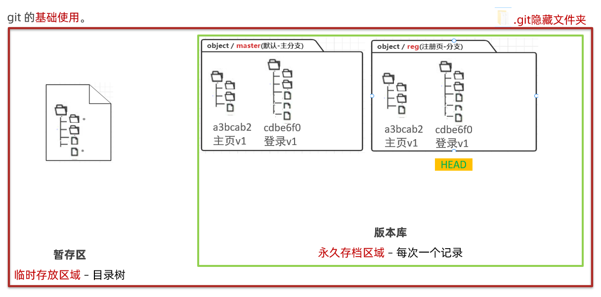

1.  在当前 reg 分支下，例如新建 reg.html 文件，并随便写点内容。
2.  然后暂存，提交，以后在当前 reg 分支下开发，就会在 reg 范围内，每次提交产生一次版本记录，但是不会影响到别的分支里，我们如果用的是 git 专用终端，还可以在这里看到所在分支的名字。

## 4.4 合并分支

当我们某个分支的业务开发完毕以后呢，可以合并到主分支/其他分支上。首先，切换到你要合并到的目标分支上，这里以master主分支为例。

```
# 切换分支
git checkout master
```

1.  合并命令语法。

```
# 把目标分支名下的所有记录，合并到当前分支下
git merge 目标分支名
```

1.  执行命令。

```
git merge reg
```

👋

需要分清谁要合并谁，例如我们在开发分支上完成了功能，应该合并到主分支上，所以我们要站在主分支来进行合并开发分支。

## 4.5 解决冲突

在 2 个分支，修改了同1个文件并**提交过**，在合并的时候，可能会产生冲突。模拟一次冲突的制造：

1.  在master分支下，修改 login.html 的某行代码，并完成一次暂存提交；
2.  切换到 reg 分支下，也修改 login.html 的对应行代码，并完成一次暂存提交；
3.  再切换回到master分支下，用合并命令，把 reg 分支下代码和变化合并过来。

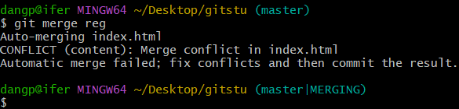

1.  VSCode 中冲突的代码会长这样。

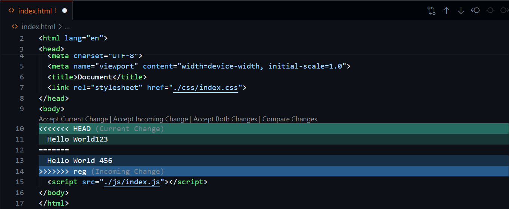

1.  这个时候，要积极寻找对方是哪个人，然后商量，留下谁的? 手动删除掉没用的信息后，重新暂存提交，即可完成冲突解决。

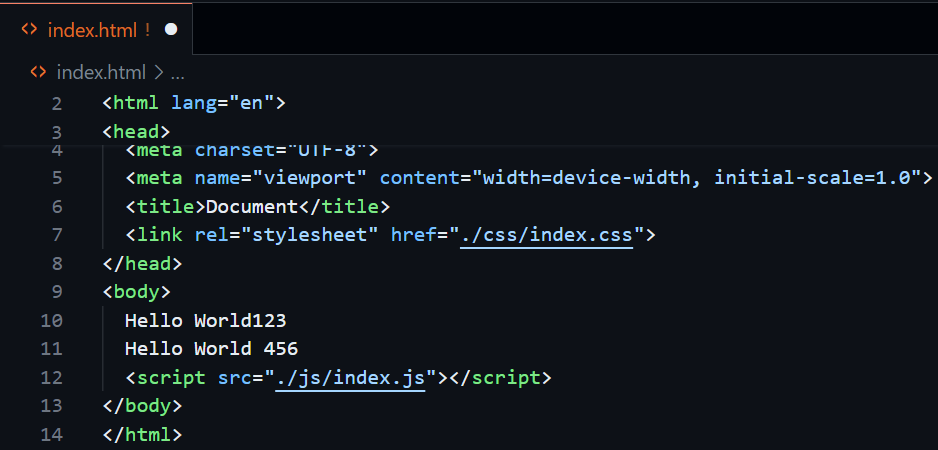

1.  接着我们，重新提交代码。

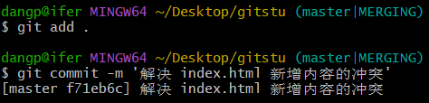

## 4.6 删除分支

假如注册功能开发完毕，代码已经合并到 master 分支上，我们无需 reg 分支，可以执行如下命令删除：

```
git branch -d 分支名
```

#  冲突练习与解决

1.  从 master 分支切出一个新分支 test；

2. 在 test 分支将**某一行**的文本内容修改为 hi，并提交 commit；

3. 切到 master 分支，将**某一行**的内容修改为 hello world 并提交；

4. 执行 git merge test, 这时因为基于同一个基线的两个分支同时修改了一个模块，出现冲突；

5. 我们认为 hello world 才是正确版本，因此将冲突部分修改为 hello world；

6. 执行 git add / git commit 提交代码，至此，完成冲突解决并将文案修改合到了主干。

#  使用远程仓库

如果使用的是 gitee / github 这些平台就自行注册账号，但大部分公司都有自己内部的代码平台，他们会给你分配账号。

```
账号: xxx@xxx.com
密码: xxx
```

1.  配置 SSH 公钥，生成秘钥对，输入以下命令，敲击三次回车。

```
ssh-keygen -t rsa -C "你的邮箱"
```

1.  用 VSCode 打开公钥，路径 `C:\用户\用户名\\.ssh\id_rsa.pub`。

```
ssh-rsa AAAAB3NzaC1yc2EAAAADAQABAAABgQCeltU31o+kpaC9EqO5oJGFrH28p9iiJL00qHXu7Km9rDsYSjGWdCD23OQUI7cHS0fvjSNpdS5KkFdTRut45vlFM0k1eFmVxKXHVfRcuoQu7vdsBuZxVKpL/xwAkzh3ffjVd4Woj7dksKM/nLsZOS5WYNu8oALCjWi+UYIqKNl7OP8B/+Pl7AkdI90PzfTLvf1dxXfw0n93K/vYTl5OCu0gOnXjmFem4heU6dKQM8WDAlJjy2PsrUi5bDKJ80MsnuHng5yP2R1zMUpeq2rzyVR/53DpWamztxYHiHvgMC2Hmb6O/dRb+d/3GYVDJ5yAH10SIhYh0m5o12ewu0yOLccejuCmFfz5pET6/QPwi3J7nN8dQEt0EqpsfsM4PDkosvoulHBW24sYHw/VlEMH5LplLRwJ7vNC2BNpmyc1oJVy0nTXm3hTS74aTz3ZVvlDDH5+BaNteGPUh50pZUeNDPyRm0ixL4qEgxZX7p6fhH2ywzSUe/VFVcWkxI/bLqiLiL0= 6634284@qq.com
```

1.  将公钥全选-复制-粘贴到代码平台的 ssh 配置中。
2.  下载代码，将远程仓库的代码下载到本地。

```
git clone git@gitee.com:ifercarly/js-data-test.git
```

1.  发现只有一个默认分支 master。

```
git branch
```

1.  需要将远程的开发分支 develop 拉取下来，在本地建分支。

```
git checkout -b develop
```

1.  拉取远程分支 (**不要在 master 分支直接拉取 develop 分支的代码**)。

```
# 每次拉取都需要指定远程仓库名和分支名
git pull 远程仓库名 分支名
```

```
# 以上 2 行命令可以合并写做一行
git checkout -b develop origin/develop
```

```
# 拓展：设置 git pull 默认拉取的分支
git branch --set-upstream-to=origin/develop develop
```

1.  写代码提交，新建一个功能分支，分支的命名取决于公司的命名规范。

```
git checkout -b xiaolong-login
```

1.  完成开发需求，提交。

```
git add .
git commit -m "修改了登录页面xxx"
```

1.   将分支提交到远程，第一次提交分支，需要加 -u 指定仓库名 指定分支名。

```
git push -u origin xiaolong-login
```

1.   报告老大，做 code review（代码审查），老大告诉你 OK 了。

你有权限合并：切换回 develop 分支，合并 xiaolong-login 分支。

```
git checkout develop
git merge xiaolong-login
git push
```

你没有权限合并：老大来合并。

基本原则：勤拉取、勤提交、勤合并，去公司之后每天早上第一件事。

```
git pull
git pull origin master
git pull origin develop
```

#  常用命令速查

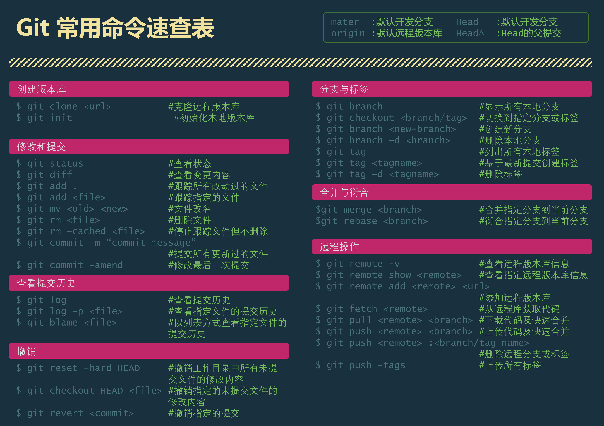

#  Git 提交规范

```
feat：新功能（feature）
fix：修补bug
docs：文档（documentation）
style： 格式（不影响代码运行的变动）
refactor：重构（即不是新增功能，也不是修改bug的代码变动）
test：增加测试
chore：构建过程或辅助工具的变动
```

[Commit message 和 Change log 编写指南](https://www.ruanyifeng.com/blog/2016/01/commit_message_change_log.html)

#  其他命令举例

## git reset

```
git reset --soft head^1 # 再执行 git reset --hard HEAD，HEAD 是一个指针，可以理解为你现在在哪里的标记
git reset --hard head^1
```

|  |  |  |  |
|:---|:---|:---|:---|
| **选项** | **HEAD 位置** | **暂存区** | **工作目录** |
| `--soft` | 移动到 HEAD^1 | ✅ 保留 | ✅ 保留 |
| `--hard` | 移动到 HEAD^1 | ❌ 清空 | ❌ 清空 |

## git rebase


git commit 演示

```
git init
# 此时处于 master 分支
vim index1.txt
# 插入 a
# 形成一次 feat: a 提交
# 插入 b
# 形成一次 feat: b 提交

git checkout -b feature # vim index2.txt，在此分支形成 d、e 两次提交

git checkout master # vim index1.txt，c 提交

master: a => b => c
feature:       => d => e

回到 master
git merge feature
git log
a、b、d、e、c、Merge branch 'feature'

$ git log --oneline --graph

# merge 会形成一个新的 commit
*   d9af613 (HEAD -> master) Merge branch 'feature'
# 并且有分叉，分叉内容表示：master 和 feature 分支并行开发时产生的提交
|\
| * 1b22217 (feature) e # 并行开发时 feature 的提交
| * 99bb345 d # 并行开发时 feature 的提交
* | 26226e0 c # 并行开发时 master 的提交
|/
* 33dd457 b
* cff953e a
```

git rebase 变基（合并分支演示）

```
git init
vim index1.txt
master # a 提交、b 提交
git checkout -b feature # vim index2.txt，d 提交、e 提交

git checkout master # vim index1.txt，c 提交

master: a => b => c
feature:       => d => e

# 注意这里是在 feature 分支执行的
git checkout feature
git rebase master
git log # 线性
# 回到 master 再用 merge，发现也不会有分叉了
git checkout master
git merge feature

$ git log --oneline --graph
* 6a1ebaf (HEAD -> master, feature) feat: e
* e2621ce feat: d
* c8803f3 feat: c
* 7052a28 feat: b
* b526887 feat: a
```

git rebase 变基（重写提交历史演示，例如将多次提交压缩成一次）

```
# git rebase 可以压缩合并多次提交
# 先形成大于两次提交
# git rebase 一般只在自己分支使用，因为会重写提交历史

git rebase -i HEAD~~ # HEAD~2

# f => fixup（缩写 f）：压缩，并丢失提交信息，squash 会保留提交信息，并弹出继续编辑的框
```

表示干掉 world 这次提交，合并到 hello 的那次提交...

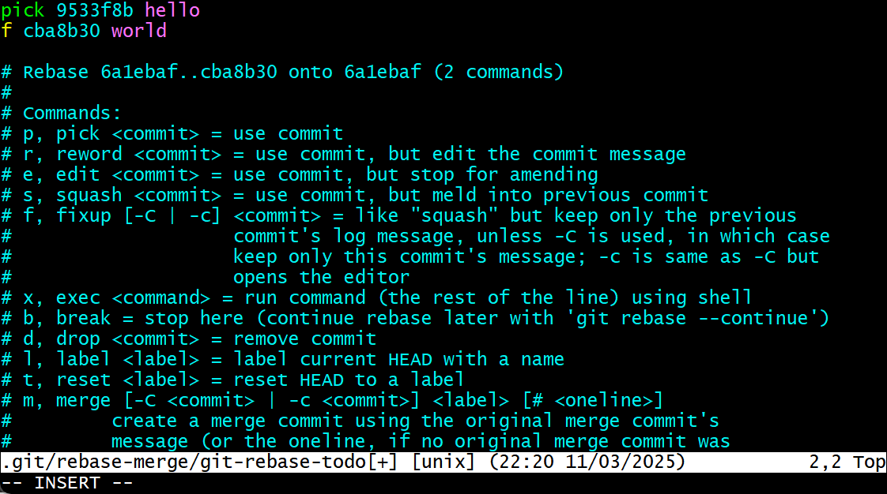

推送的时候可能需要 --force 操作。

## git diff

```
git diff # 工作区 VS 暂存区
dif diff <commit1> <commit2> # 可以比较两个指定提交
```

## git cherry-pick

当你需要将其他分支中的某个（或某几个）提交应用到当前分支，但又不想合并整个分支时（比如只想移植一个 bug 修复，而不是整个开发分支的所有变更），`git cherry-pick` 会非常有用。cherry-pick 会生成新的提交，原提交仍保留在原分支，两者是独立的。

```
# master 分支，存在 a、b 两次提交
# git checkout -b feature，形成 c、d 两次提交
# git checkout master，回到 master
git log feature --oneline # 查看 feature 分支的 log

1bb77d2 (feature) feat: d
33d99aa feat: c
5674f3b (HEAD -> master) feat: b
b38d360 feat: a

# feature 分支存在 c、d 两次提交
git cherry-pick 33d99aa # 只合并（pick） feature 分支 c 的提交
```

📌

**冲突处理**

如果 cherry-pick 过程中出现代码冲突（比如目标提交修改的文件在当前分支已被修改），Git 会暂停操作并提示冲突文件。解决步骤：

1.  手动编辑冲突文件，解决冲突。

1.  执行 `git add <冲突文件>` 标记为已解决。

1.  执行 `git cherry-pick --continue` 完成 cherry-pick；若想放弃，执行 `git cherry-pick --abort`。
