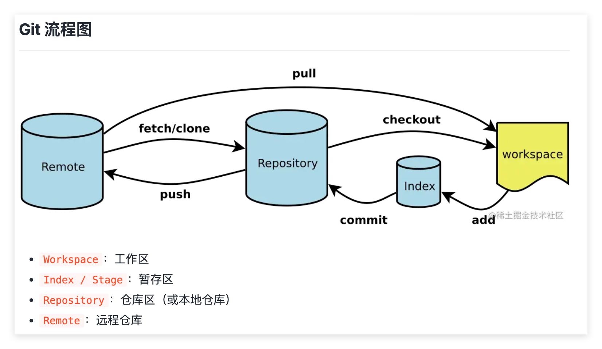
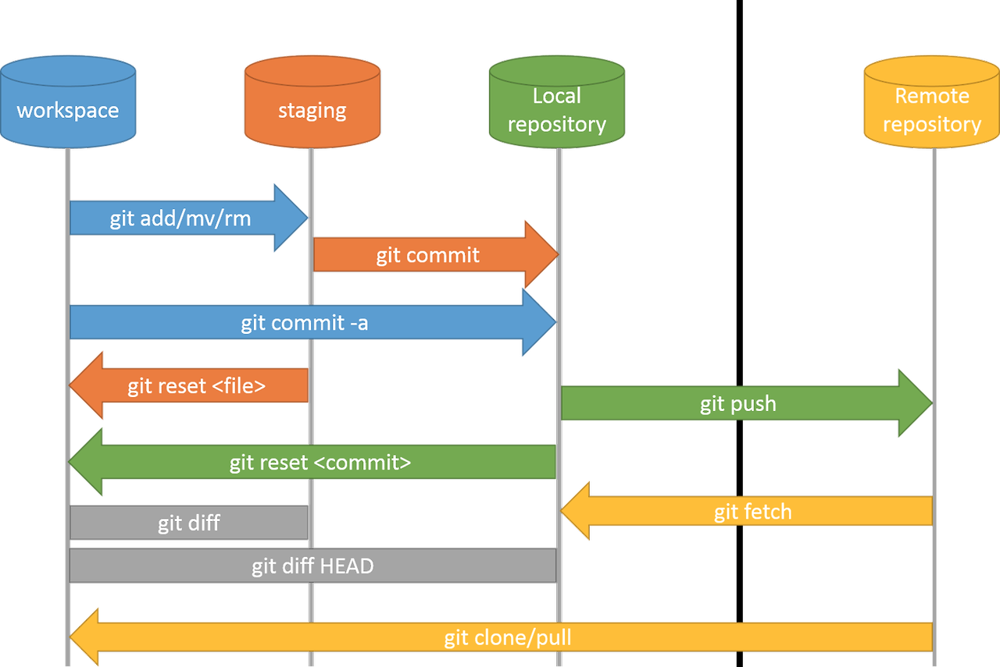
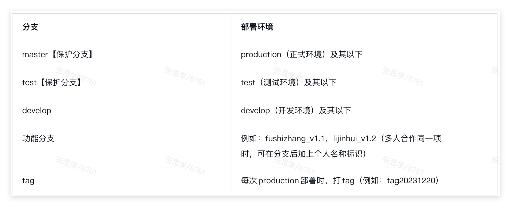
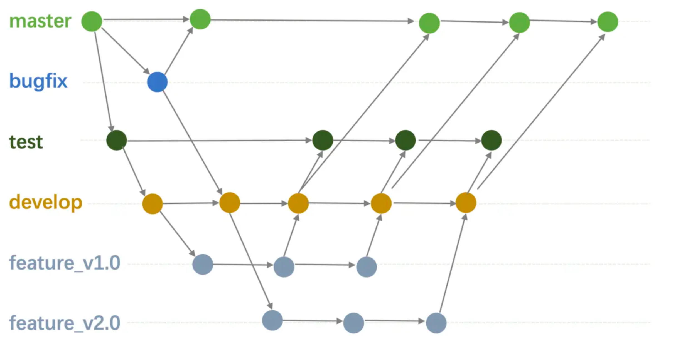

# Git 教程
# 一、Git 入门
## 1.1 版本控制简介
- 什么是版本控制
- 集中式 vs 分布式版本控制
- Git 的优势
## 1.2 安装 Git
## 1.3 配置 Git
- 查看配置信息
- 配置用户信息
- 配置SSH秘钥（可选但非常推荐）
> ai自行搜索：git如何配置ssh秘钥
## 1.4 创建 Git 仓库
- 1. 在本地初始化一个新的 Git 仓库
> 
> 初始化：
> 提交：
> 关联远程仓库：
- 2. 从远程仓库克隆到本地（新手推荐）
> git clone <远程仓库的 URL>
> 上面的URL可以是传统意义的URL，下载时需要输入用户名和密码。
> 更多的时候是一个git开头的地址，需要配置SSH秘钥（参考1.3）。
- 3. 当前 .git 目录
## 1.5 基本工作流程

- 工作区、暂存区和版本库
- 添加文件到暂存区 (git add)
- 提交更改到仓库 (git commit)
- 本次仓库推送到远程仓库（git push）
- 查看提交历史 (git log)
## 1.6 文件状态管理
- 查看文件状态 (git status)
- 查看提交历史（git log）
- 忽略文件 (.gitignore)
- 当前仓库git配置（.git）
- 撤销修改 (git checkout, git restore)
- 删除文件 (git rm)
## 1.7 远程仓库管理
- 添加远程仓库 (git remote add)
- 查看远程仓库信息 (git remote -v)
- 推送本地提交到远程仓库 (git push)
- 拉取远程仓库更新到本地 (git pull)
- 克隆远程仓库 (git clone)
## 1.8 git commit 规范
> 参考文档：https://juejin.cn/post/6844903866451001352
> ps：建议经常git commit
> 问题：如果经常git commit会导致历史记录非常多和琐碎，如何解决？
##  1.9 vscode中git的使用
> 工作区、暂存区和版本库的切换，等等其他
# 二、分支管理
- 创建分支 (git branch)
- 删除分支 (git branch -d)
- 切换分支 (git checkout)
- 合并分支 (git merge)
  -  快进合并 （fast-forward）
  -  递归合并
  -  三方合并（three-way-merge）
> 解决冲突（重点，业务开发中经常会发生，专业班一定要掌握）

# 三、Git 进阶操作
## 3.1 设置别名
## 3.2 标签管理
- 创建标签 (git tag)
- 查看标签 (git tag)
- 推送标签到远程仓库 (git push --tags)
- 删除标签 (git tag -d)
## 3.3 版本回退
- 查看提交历史 (git log)
- 回退到指定版本 (git reset)
- 撤销回退 (git reflog)
## 3.4 储藏更改
- 储藏当前工作目录 (git stash)
- 查看储藏列表 (git stash list)
- 恢复储藏内容 (git stash apply)
- 删除储藏内容 (git stash drop)
## 3.4 子模块
- 添加子模块 (git submodule add)
- 初始化子模块 (git submodule init)
- 更新子模块 (git submodule update)
- 删除子模块
  
# 四、Git 团队协作
## 4.1 git工作流
- 集中式工作流
- 功能分支工作流
- Gitflow 工作流
- Forking 工作流
> https://juejin.cn/post/7050012586296737805
> 
## 4.2 分支策略
- 主分支 (master/main)
- 开发分支 (develop)
- 功能分支 (feature)
- 发布分支 (release)
- 修复分支 (hotfix)
## 4.3 Pull Request
- 创建 Pull Request
- 代码审查
- 合并 Pull Request
## 4.4 代码冲突解决
- 冲突产生的原因
- 手动解决冲突
- 使用工具解决冲突

# 五、Git 高级技巧
## 5.1 交互式 rebase
- 修改提交历史
- 合并提交
- 删除提交
## 5.2 cherry-pick
- 选择性地应用提交
## 5.3 git revert
- 取消指定的提交内容
## 5.4 git reflog
- 本地仓库中所有引用（如分支、HEAD）的更新历史
## 5.4 Git Hooks
- 自定义 Git 行为
- 常用钩子介绍
- 前端代码规范中的husky原理
## 5.5 git clone url --depth 1
- 对于非常大的仓库，部分克隆，而不是完整的历史记录

# 六：GitLab 与远程仓库协作
## 6.1 GitLab 简介
- git 和 gitlab关系
- 什么是 GitLab，以及页面预览
- GitLab 的核心功能（代码托管、CI/CD、项目管理等）
- GitLab 与 GitHub 的区别
## 6.2 GitLab 基本操作
- 创建 GitLab 项目
- 设置项目可见性（私有、内部、公开）
- 添加项目成员并分配权限
- 设置保护分支（重点）
- 克隆 GitLab 项目到本地 (git clone)
## 6.3 GitLab 远程仓库操作
- 关联本地仓库与 GitLab 远程仓库 (git remote add)
- 推送本地分支到 GitLab (git push)
- 从 GitLab 拉取更新 (git pull)
## 6.4 GitLab 分支与合并请求 (Merge Request)
- 创建分支并推送到 GitLab
- 提交合并请求 (Merge Request)
- 代码审查与讨论
- 解决合并冲突
- 完成合并请求
## 6.5 GitLab CI/CD 简介
- 什么是 CI/CD
- 配置 .gitlab-ci.yml 文件
- 使用 GitLab Runner 执行自动化任务
- 实现自动化测试与部署

# 七、Git 实战案例
> 💡研发培训院团队协作开发项目git工作流介绍

## 分支管理

> master分⽀：主⼲分⽀，⼀定不能被污染 
> develop分⽀：开发分⽀，所有的开发都必须在开发分⽀进⾏，所有的修改必须合并到开发分⽀
> 
## 开发流程
1. 项⽬初始化后，从master新建test和develop分⽀，分别对应正式环境，测试环境和开发环境 
2. 开发新功能时，从develop新建功能分⽀v1.0（此处以1.0版本举例，具体前面可带自己姓名） 
3. v1.0功能开发完后，合并v1.0到develop分⽀，本地启动develop分⽀测试联调 
4. v1.0测试联调完后，合并develop到test分⽀，部署test分⽀到测试环境进⾏测试 
5. v1.0测试完后，合并develop到master分⽀，部署master分⽀到正式环境上线，并且打tag分⽀ 
6. 开发其他版本新功能时，重复2-5步即可
7. 假如master分⽀发现bug，从master新建bugfix1.0临时分⽀，在bugfix1.0分⽀进⾏修复， 
修复后，合并bugfix1.0到develop分⽀，合并bugfix1.0到master分⽀，部署master分⽀到 
正式环境上线并且打tag分⽀tag20231220，之后可删除bugfix1.0分⽀ 

# 八、常见问题及解决方案
> 😃解决方案请自行查阅资料学习。
- 如何撤销上一次提交？
- 如何修改上一次提交的信息？
- 如何撤销工作区的更改？
- 如何删除本地分支？
- 如何删除远程分支？
- 本地分支有未提交的内容，如何切换到其他分支？
- 如何修改远程仓库地址？（项目迁移时保存历史）
- 如何强制推送本地分支到远程？（为什么要强制，什么时候需要强制）
- 如何恢复误删的分支？
- 如何解决合并冲突？
- 如何回退到某个提交？
- 如何修改提交中的某个commit msg？
- 如何合并多个提交？
- 如何把当前的提交合并到上一个提交中去？
- 如何提交本地的feature分支功能到远程的master分支？

# 附录
## Git 学习资源推荐
- git沙箱游戏
https://learngitbranching.js.org/?locale=zh_CN
- git官方教程
https://git-scm.com/book/zh/v2
- 相见恨晚！终于有篇文章能把Git给讲明白了
https://juejin.cn/post/7182500848713334821#heading-10
- 多年 Git 使用心得 & 常见问题整理
https://juejin.cn/post/6844904191203213326
- Git 工作流实践方案探索
https://juejin.cn/post/7050012586296737805
- gitlab ci
https://meigit.readthedocs.io/en/latest/gitlab_ci_.gitlab-ci.yml_detail.html
