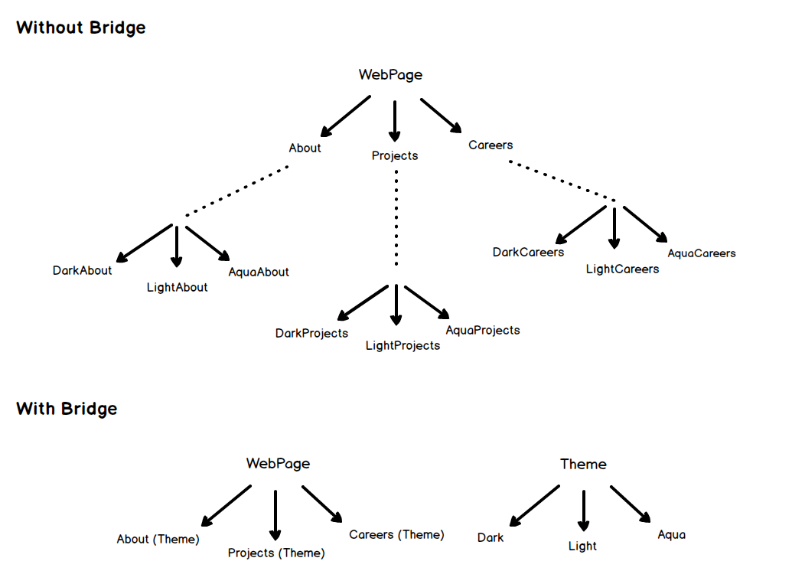

\


------------------------------------------------------------------------

🎉 对设计模式的超简单解读！ 🎉

设计模式这个话题常常令人望而生畏。在这里，我将试着用尽可能简单的方式来解释它们，让它们深深地刻在您（也许还有我）的脑海里。

------------------------------------------------------------------------

<sub>如果您喜欢这篇教程，不妨看看教程原作者的[另一个项目 (opens new window)](https://roadmap.sh/)，或是去 [X (opens new window)](https://x.com/kamrify) 上跟他打声招呼。</sub>

<sub>本项目基于 [Design Patterns for Humans](https://github.com/kamranahmedse/design-patterns-for-humans)，案例 JavaScript 代码来自 [JavaScript Design Patterns for Humans](https://github.com/sohamkamani/javascript-design-patterns-for-humans)。译者在学习的过程中，想要使用自己的语言风格来翻译这篇“给人类写的”设计模式教程。尽管有 AI 的助力，奈何才疏学浅，如有谬误，敬请提交 PR 斧正。</sub>

# [#](#献给中文读者的设计模式教程) 献给中文读者的设计模式教程

## [#](#🚀-介绍) 🚀 介绍

设计模式是针对反复出现的问题的解决方案；**是解决特定问题的指导原则**。它们不是类、包或库，无法直接放进您的应用程序里然后静等好事降临。准确地说，它们是关于如何在特定情况下解决特定问题的指导方针。

> 设计模式是为解决反复出现的问题而提出的方案与指导原则。

维基百科解释道

> 在软件工程领域，软件设计模式是针对软件设计中给定上下文下反复出现的问题，所提出的通用、可重用的解决方案。它不是完整的设计实现，无法直接转译为源代码或机器码。它是关于如何解决问题的描述或模板，可以在许多不同的场景下使用。

### [#](#⚠️-请注意) ⚠️ 请注意

- 设计模式并不是解决您所有问题的万全之策。
- 不要强行套用它们，否则可能适得其反。
- 请记住，设计模式是**解决**问题的方案，而不是**找到**问题；所以不要想太多。
- 如果在正确的地方以正确的方式使用，设计模式定能成为您的得力帮手；否则可能导致代码一团糟。

### [#](#🐢-在开始之前) 🐢 在开始之前

- 所有的设计模式示例都基于 JavaScript 的 [ES6 (opens new window)](https://github.com/lukehoban/es6features) 规范实现。
- 由于 JavaScript 没有接口的概念，因此代码示例中使用了隐式接口——即只要一个类具有某接口应有的属性和方法，就认为它实现了该接口。为便于辨识，我们在每个示例中都用注释标注了所用的接口。

### [#](#🛎️-设计模式的类型) 🛎️ 设计模式的类型

- [创建型](#%EF%B8%8F-%E5%88%9B%E5%BB%BA%E5%9E%8B%E8%AE%BE%E8%AE%A1%E6%A8%A1%E5%BC%8F--creational-design-patterns)
- [结构型](#-%E7%BB%93%E6%9E%84%E5%9E%8B%E8%AE%BE%E8%AE%A1%E6%A8%A1%E5%BC%8F--structural-design-patterns)
- [行为型](#-%E8%A1%8C%E4%B8%BA%E5%9E%8B%E8%AE%BE%E8%AE%A1%E6%A8%A1%E5%BC%8F--behavioral-design-patterns)

## [#](#🏗️-创建型设计模式-creational-design-patterns) 🏗️ 创建型设计模式 / Creational Design Patterns

简单来说

> 创建型设计模式关注如何实例化一个对象或一组相关的对象。

维基百科解释道

> 在软件工程领域，创建型设计模式是处理对象创建机制的设计模式，试图以符合要求的方式来创建对象。创建对象的基础方式可能导致设计问题或增加设计复杂度。创建型设计模式通过以某种方式控制对象创建的过程，来解决这个问题。

- [简单工厂模式](#-%E7%AE%80%E5%8D%95%E5%B7%A5%E5%8E%82%E6%A8%A1%E5%BC%8F--simple-factory)
- [工厂方法模式](#-%E5%B7%A5%E5%8E%82%E6%96%B9%E6%B3%95%E6%A8%A1%E5%BC%8F--factory-method)
- [抽象工厂模式](#-%E6%8A%BD%E8%B1%A1%E5%B7%A5%E5%8E%82%E6%A8%A1%E5%BC%8F--abstract-factory)
- [生成器模式](#-%E7%94%9F%E6%88%90%E5%99%A8%E6%A8%A1%E5%BC%8F--builder)
- [原型模式](#-%E5%8E%9F%E5%9E%8B%E6%A8%A1%E5%BC%8F--prototype)
- [单例模式](#-%E5%8D%95%E4%BE%8B%E6%A8%A1%E5%BC%8F--singleton)

### [#](#🏠-简单工厂模式-simple-factory) 🏠 简单工厂模式 / Simple Factory

现实生活中的例子

> 想象您正在修建一栋房子而您需要房门。您可以穿好木工服，拿上木头、胶水和钉子等必要的工具，在房子里亲手制作这扇房门；或者，您只需要简单地打个电话给工厂，让他们送来制造好的房门 —— 这样您既不需要学习该如何制作房门，也不必处理制作房门带来的乱摊子。

简单来说

> 简单工厂简单地为客户端生成一个实例，而不向客户端暴露任何实例化的逻辑。

维基百科解释道

> 在面向对象编程（OOP）中，工厂是用于创建其它对象的对象——更准确地说，工厂是一个函数或方法，通过调用它的某个方法（假设为 "new"）可以返回拥有不同原型或类的对象。

**编程示例**

首先，我们定义并实现了房门的接口

``` js
/**
 * Door interface
 *
 * getWidth()
 * getHeight()
 */

class WoodenDoor {
    constructor(width, height) {
        this.width = width;
        this.height = height;
    }

    getWidth() {
        return this.width;
    }

    getHeight() {
        return this.height;
    }
}
```

1\
2\
3\
4\
5\
6\
7\
8\
9\
10\
11\
12\
13\
14\
15\
16\
17\
18\
19\
20\

接下来，我们拥有了生产房门的工厂，它可以返回制造好的房门

``` js
const DoorFactory = {
    makeDoor: (width, height) => new WoodenDoor(width, height),
};
```

1\
2\

可以像这样使用它

``` js
// 制造一个 100x200 的房门给我
const door = DoorFactory.makeDoor(100, 200);

console.log("Width:", door.getWidth());
console.log("Height:", door.getHeight());

// 制造一个 50x100 的房门给我
const door = DoorFactory.makeDoor(50, 100);
```

1\
2\
3\
4\
5\
6\
7\

**什么时候使用？**

当创建对象不仅只有赋值操作，还会涉及到一些逻辑过程时，应当把它放到一个专用的工厂中，而不是在每个地方编写重复的代码。

### [#](#🏭-工厂方法模式-factory-method) 🏭 工厂方法模式 / Factory Method

现实生活中的例子

> 以招聘经理为例。一个人不可能面试所有的岗位。根据岗位开放状态，她必须制定面试的流程，然后将面试任务委派给不同的面试官。

简单来说

> 工厂方法模式提供了一种将实例化的逻辑分派给子类的方法。

维基百科解释道

> 在基于类的编程中，工厂方法模式是一种创建型模式，它使用工厂方法来处理创建对象的问题，而不必指定将要创建的对象所基于的具体类。这是通过调用工厂方法来创建对象所实现的——要么在接口中指定并由子类实现，要么在基类中实现并可选地由派生类覆盖——而不是通过调用构造函数实现。

**编程示例**

以刚才的招聘经理为例。首先，我们定义并实现了面试官的接口

``` js
/**
 * Interviewer interface
 *
 * askQuestions()
 */

class Developer {
    askQuestions() {
        console.log("询问设计模式问题！");
    }
}

class CommunityExecutive {
    askQuestions() {
        console.log("询问社区建设问题！");
    }
}
```

1\
2\
3\
4\
5\
6\
7\
8\
9\
10\
11\
12\
13\
14\
15\
16\

接着创建我们的 `HiringManager`

``` js
class HiringManager {
    takeInterview() {
        const interviewer = this.makeInterviewer();
        interviewer.askQuestions();
    }
}
```

1\
2\
3\
4\
5\

现在，任何子类都可以继承它并提供所需的面试官

``` js
class DevelopmentManager extends HiringManager {
    makeInterviewer() {
        return new Developer();
    }
}

class MarketingManager extends HiringManager {
    makeInterviewer() {
        return new CommunityExecutive();
    }
}
```

1\
2\
3\
4\
5\
6\
7\
8\
9\
10\

可以像这样使用它

``` js
const devManager = new DevelopmentManager();
devManager.takeInterview(); // 输出：询问设计模式问题！

const marketingManager = new MarketingManager();
marketingManager.takeInterview(); // 输出：询问社区建设问题！
```

1\
2\
3\
4\

**什么时候使用？**

当类中存在一些通用的处理过程，但是所需的子类要在运行时动态确定时，工厂方法模式非常有用。换句话说，当客户端不知道自己可能需要哪个具体的子类时。

### [#](#🔨-抽象工厂模式-abstract-factory) 🔨 抽象工厂模式 / Abstract Factory

现实生活中的例子

> 拓展简单工厂模式中关于房门的例子。根据您的需要，您可能会从木门商店买木门，从铁门商店买到铁门，或是从相应的商店买到塑料门。另外您还可能需要具备不同专业能力的师傅来安装这些房门，例如让木匠安装木门，让焊工安装铁门等。正如您所看到的，现在房门与装门师傅之间存在一种依赖关系：安装木门需要木匠，安装铁门需要焊工等。

简单来说

> 工厂的工厂。将各个独立但相互关联或依赖的工厂组合在一起，而不必指定它们的具体类。

维基百科解释道

> 抽象工厂模式提供了一种封装一组具有共同主题的独立工厂的方法，而不必指定它们的具体类。

**编程示例**

将上面房门的例子用代码实现。首先，我们定义了 `Door` 接口并实现了一些类型的房门

``` js
/**
 * Door interface :
 *
 * getDescription()
 */

class WoodenDoor {
    getDescription() {
        console.log("我是一个木门");
    }
}

class IronDoor {
    getDescription() {
        console.log("我是一个铁门");
    }
}
```

1\
2\
3\
4\
5\
6\
7\
8\
9\
10\
11\
12\
13\
14\
15\
16\

接着我们为每一种类型的房门定义了对应的安装师傅

``` js
/**
 * DoorFittingExpert interface :
 *
 * getDescription()
 */

class Carpenter {
    getDescription() {
        console.log("我只能安装木门");
    }
}

class Welder {
    getDescription() {
        console.log("我只能安装铁门");
    }
}
```

1\
2\
3\
4\
5\
6\
7\
8\
9\
10\
11\
12\
13\
14\
15\
16\

现在我们来定义抽象工厂，它允许我们创建一系列相关联的对象，即木门工厂能够制造木门并提供安装木门的师傅，铁门工厂能够制造铁门并提供安装铁门的师傅。

``` js
/**
 * DoorFactory interface :
 *
 * makeDoor()
 * makeFittingExpert()
 */

// 返回木匠和木门的木门工厂
class WoodenDoorFactory {
    makeDoor() {
        return new WoodenDoor();
    }

    makeFittingExpert() {
        return new Carpenter();
    }
}

// 获得铁门和相应安装师傅的铁门工厂
class IronDoorFactory {
    makeDoor() {
        return new IronDoor();
    }

    makeFittingExpert() {
        return new Welder();
    }
}
```

1\
2\
3\
4\
5\
6\
7\
8\
9\
10\
11\
12\
13\
14\
15\
16\
17\
18\
19\
20\
21\
22\
23\
24\
25\
26\
27\

可以像这样使用它

``` js
woodenFactory = new WoodenDoorFactory();

door = woodenFactory.makeDoor();
expert = woodenFactory.makeFittingExpert();

door.getDescription(); // 输出：我是一个木门
expert.getDescription(); // 输出：我只能安装木门

// 对铁门的处理与上面类似
ironFactory = new IronDoorFactory();

door = ironFactory.makeDoor();
expert = ironFactory.makeFittingExpert();

door.getDescription(); // 输出：我是一个铁门
expert.getDescription(); // 输出：我只能安装铁门
```

1\
2\
3\
4\
5\
6\
7\
8\
9\
10\
11\
12\
13\
14\
15\

正如您看到的，木门工厂已经封装了 `carpenter` 和 `wooden door`，铁门工厂也已封装了 `iron door` 和 `welder`。因而它确保了对于每一个制造出来的门，我们都能找到正确的安装师傅。

**什么时候使用？**

当对象间存在相互关联的依赖关系，并涉及不那么简单的创建逻辑时

### [#](#👷-生成器模式-builder) 👷 生成器模式 / Builder

译注：又名**建造模式**

现实生活中的例子

> 想象您在哈帝斯汉堡店里，点了一份“大哈迪汉堡”。准备好后，店员话不多说直接把汉堡递给您——这就是一个简单工厂的例子。但在某些情况下，制作汉堡可能包含额外的步骤。举个例子，您想要一份定制的餐点，就有很多选项：您要什么面包片？喜欢哪款酱汁？想吃哪种奶酪？诸如此类。在这种情况下，就需要用到生成器模式了。

简单来说

> 生成器模式允许您创建不同风格的对象，同时避免污染构造函数。当一个对象可能存在多种风格时，或者当一个对象的创建过程包含很多步骤时，生成器模式非常有用。

维基百科解释道

> 生成器模式是一种创建型软件设计模式，旨在解决重叠构造函数反模式（Telescoping Constructor Anti-pattern）的问题。

既然提到了，那么请允许我插一嘴什么是重叠构造函数反模式。我们都曾看到过像这样的构造函数：

``` js
class Burger {
    constructor(
        size,
        cheese = true,
        pepperoni = true,
        tomato = false,
        lettuce = true,
    ) {
        // ...
    }
}
```

1\
2\
3\
4\
5\
6\
7\
8\
9\
10\

正如您所看到的，构造函数的参数数量很快就会失控，参数的含义也变得难以理解。而且日后若要添加更多选项，参数列表还会继续膨胀。这就是重叠构造函数反模式。

**编程示例**

明智的选择是使用生成器模式。首先我们定义了想要制作的汉堡

``` js
class Burger {
    constructor(builder) {
        this.size = builder.size;
        this.cheeze = builder.cheeze || false;
        this.pepperoni = builder.pepperoni || false;
        this.lettuce = builder.lettuce || false;
        this.tomato = builder.tomato || false;
    }
}
```

1\
2\
3\
4\
5\
6\
7\
8\

接着我们编写了生成器

``` js
class BurgerBuilder {
    constructor(size) {
        this.size = size;
    }

    addPepperoni() {
        this.pepperoni = true;
        return this;
    }

    addLettuce() {
        this.lettuce = true;
        return this;
    }

    addCheeze() {
        this.cheeze = true;
        return this;
    }

    addTomato() {
        this.tomato = true;
        return this;
    }

    build() {
        return new Burger(this);
    }
}
```

1\
2\
3\
4\
5\
6\
7\
8\
9\
10\
11\
12\
13\
14\
15\
16\
17\
18\
19\
20\
21\
22\
23\
24\
25\
26\
27\
28\

可以像这样使用它

``` js
const burger = new BurgerBuilder(14)
    .addPepperoni()
    .addLettuce()
    .addTomato()
    .build();
```

1\
2\
3\
4\

**JavaScript 版本特别提示**：当您发现一个函数或方法的参数太多（一般超过 2 个参数都被认为是太多）时，应当使用一个对象参数，来取代多个参数。理由有二：

1.  它可以让您的代码看上去更整洁，因为只有一个参数。
2.  您不需要担心参数的顺序，因为参数将根据对象的命名属性传递。

举个例子，应当使用

``` js
const burger = new Burger({
    size: 14,
    pepperoni: true,
    cheeze: false,
    lettuce: true,
    tomato: true,
});
```

1\
2\
3\
4\
5\
6\

来取代

``` js
const burger = new Burger(14, true, false, true, true);
```

**什么时候使用？**

当一个对象可能有多种风格，并想要避免重叠构造函数时。生成器模式与工厂模式的关键区别是：工厂模式适用于创建过程只有一个步骤的场景，生成器模式适用于创建过程包含多个步骤的场景。

### [#](#🐑-原型模式-prototype) 🐑 原型模式 / Prototype

现实生活中的例子

> 还记得多莉吗？那只被克隆的羊！克隆就是原型模式的关键。

简单来说

> 基于已存在的对象，通过克隆创建新的对象。

维基百科解释道

> 在软件开发领域，原型模式是一种创建型设计模式。当创建的对象类型由一个原型实例确定时，使用原型模式，这个原型实例将被克隆来生成新的对象。

简而言之，原型模式允许您复制现有对象并按需修改，而不必费力地从头创建并配置。

**编程示例**

首先定义我们要克隆的羊

``` js
class Sheep {
    constructor(name, category = "山羊") {
        this.name = name;
        this.category = category;
    }
    setName(name) {
        this.name = name;
    }
    getName() {
        console.log(this.name);
    }
    setCategory(category) {
        this.category = category;
    }
    getCategory() {
        console.log(this.category);
    }
}
```

1\
2\
3\
4\
5\
6\
7\
8\
9\
10\
11\
12\
13\
14\
15\
16\
17\

现在我们有了 `SheepPrototype` 对象，它将克隆给定原型的对象。它的构造函数接受 `Sheep` 对象

``` js
class SheepPrototype {
    constructor(proto) {
        this.proto = proto;
    }
    clone() {
        return new Sheep(this.proto.name, this.proto.category);
    }
}
```

1\
2\
3\
4\
5\
6\
7\

可以像这样使用它

``` js
const originalSheep = new Sheep("Jolly");
originalSheep.getName(); // Jolly
originalSheep.getCategory(); // 山羊

// 克隆并根据需要修改
const prototype = new SheepPrototype(originalSheep);
const clonedSheep = prototype.clone();
clonedSheep.setName("Dolly");
clonedSheep.getName(); // Dolly
clonedSheep.getCategory(); // 山羊
```

1\
2\
3\
4\
5\
6\
7\
8\
9\

**JavaScript 版本特别提示**：此编程示例是原型模式的经典实现，但是 JavaScript 能够使用[内建原型工具 (opens new window)](https://developer.mozilla.org/zh-CN/docs/Learn/JavaScript/Objects/Object_prototypes)更有效地实现原型模式。

**什么时候使用？**

当所需对象与现有对象相似时，或直接创建的成本高于克隆时。

### [#](#💍-单例模式-singleton) 💍 单例模式 / Singleton

现实生活中的例子

> 一个国家里同时只能有一位总统。无论何时只要职责需要，这位总统就必须采取行动。这里的总统即是单例。

简单来说

> 确保只创建了特定类的唯一对象。

维基百科解释道

> 在软件工程领域，单例模式是一种软件设计模式，它将类的实例化限制为一个对象。当系统中恰好需要一个对象来协调运行时，单例模式很有帮助。

单例模式实际上被认为是一种反模式（Anti-pattern），应避免过度使用。它并非一无是处，也有合理的应用场景。但仍需谨慎使用，因为它会在应用中引入全局状态——一处修改可能波及其他地方，使得调试难度大增。此外，它还会导致代码紧密耦合，使得模拟（Mock）单例变得困难。

**编程示例**

在 JavaScript 中，单例可以使用模块模式实现。把私有变量和方法隐藏在函数闭包中，至于公有方法则有选择地暴露出去。

``` js
const president = (function () {
    const presidentsPrivateInformation = "Super private";

    const name = "Turd Sandwich";

    const getName = () => name;

    return {
        getName,
    };
})();
```

1\
2\
3\
4\
5\
6\
7\
8\
9\
10\

总统的 `presidentsPrivateInformation` 和 `name` 为私有变量。但是，总统的 `name` 可以通过对外暴露的 `president.getName()` 方法访问。

``` js
president.getName(); // 输出：'Turd Sandwich'
president.name; // 输出：undefined
president.presidentsPrivateInformation; // 输出：undefined
```

1\
2\

## [#](#🔩-结构型设计模式-structural-design-patterns) 🔩 结构型设计模式 / Structural Design Patterns

简单来说

> 结构型设计模式主要关注对象的组成，换句话说，关注实体之间如何相互使用。再换句话说，结构型设计模式有助于回答“如何构建软件的组件”这个问题。

维基百科解释道

> 在软件工程领域，结构型设计模式通过识别实现实体间关系的简洁方法，来简化设计。

- [适配器模式](#-%E9%80%82%E9%85%8D%E5%99%A8%E6%A8%A1%E5%BC%8F--adapter)
- [桥接模式](#-%E6%A1%A5%E6%8E%A5%E6%A8%A1%E5%BC%8F--bridge)
- [组合模式](#-%E7%BB%84%E5%90%88%E6%A8%A1%E5%BC%8F--composite)
- [装饰器模式](#-%E8%A3%85%E9%A5%B0%E5%99%A8%E6%A8%A1%E5%BC%8F--decorator)
- [门面模式](#-%E9%97%A8%E9%9D%A2%E6%A8%A1%E5%BC%8F--facade)
- [享元模式](#-%E4%BA%AB%E5%85%83%E6%A8%A1%E5%BC%8F--flyweight)
- [代理模式](#-%E4%BB%A3%E7%90%86%E6%A8%A1%E5%BC%8F--proxy)

### [#](#🔌-适配器模式-adapter) 🔌 适配器模式 / Adapter

现实生活中的例子

> 您想将存储卡里的图片文件传输到电脑中。为此您需要一种与电脑端口兼容的适配器来连接存储卡。在这种情况下，读卡器就是适配器。 另一个例子是电源适配器。三脚插头无法插入双孔插座，我们可以使用电源适配器让二者兼容。 再举个例子，翻译者将一个人说的话转译给另一个人。

简单来说

> 适配器模式允许您将与其它类不兼容的对象包装到一个适配器中，让这个对象与另一个类兼容。

维基百科解释道

> 在软件工程领域，适配器模式是一种设计模式，它允许一个现有类的接口用作另一个接口。适配器模式常用于使现有的类与其它的类一起工作，而无需修改它们的源码。

**编程示例**

让我们实现一个游戏：一个猎人要狩猎狮子。

首先我们定义了 `Lion` 接口，所有种类的狮子都需要实现这个接口中的 `roar()` 方法

``` js
/**
 * Lion interface :
 *
 * roar()
 */

class AfricanLion {
    roar() {}
}

class AsianLion {
    roar() {}
}
```

1\
2\
3\
4\
5\
6\
7\
8\
9\
10\
11\
12\

猎人可以狩猎任意一种 `Lion`

``` js
class Hunter {
    hunt(lion) {
        // ... 前面的一些代码
        lion.roar();
        // ... 后面的一些代码
    }
}
```

1\
2\
3\
4\
5\
6\

假设我们要在游戏中加入猎人也可以狩猎的 `WildDog`。但由于野狗的接口不同（它用的是 `bark()` 方法，我们无法直接把它加进游戏。为了让它能与猎人兼容，我们需要创建一个兼容适配器

``` js
// 需要追加到游戏中的野狗
class WildDog {
    bark() {}
}

// 与野狗相关的适配器，让它与我们的游戏兼容
class WildDogAdapter {
    constructor(dog) {
        this.dog = dog;
    }

    roar() {
        this.dog.bark();
    }
}
```

1\
2\
3\
4\
5\
6\
7\
8\
9\
10\
11\
12\
13\
14\

于是，通过 `WildDogAdapter`，我们游戏中的猎人便可以狩猎 `WildDog` 了。

``` js
wildDog = new WildDog();
wildDogAdapter = new WildDogAdapter(wildDog);

hunter = new Hunter();
hunter.hunt(wildDogAdapter);
```

1\
2\
3\
4\

### [#](#🚡-桥接模式-bridge) 🚡 桥接模式 / Bridge

现实生活中的例子

> 您有一个包含多个页面的网站，现在您打算允许用户修改网站主题。您会怎么做？为每个页面的每个主题都创建一份副本，还是将主题独立出来、根据用户偏好动态加载？桥接模式允许您实现后者。



简单来说

> 桥接模式是一种偏好于组合而非继承的设计模式。具体实现的细节从一个层级被推送到另一个具有独立层级的对象。

维基百科解释道

> 桥接模式是一种用在软件工程领域的设计模式，旨在“将抽象与其实现解耦，使得两者可以独立改变”。

**编程示例**

将上面的网站示例用代码实现。首先我们定义了 `WebPage` 的层级

``` js
/**
 * Webpage interface :
 *
 * constructor(theme)
 * getContent()
 */

class About {
    constructor(theme) {
        this.theme = theme;
    }

    getContent() {
        return "About page in " + this.theme.getColor();
    }
}

class Careers {
    constructor(theme) {
        this.theme = theme;
    }

    getContent() {
        return "Careers page in " + this.theme.getColor();
    }
}
```

1\
2\
3\
4\
5\
6\
7\
8\
9\
10\
11\
12\
13\
14\
15\
16\
17\
18\
19\
20\
21\
22\
23\
24\
25\

以及独立的主题层级

``` js
/**
 * Theme interface :
 *
 * getColor()
 */

class DarkTheme {
    getColor() {
        return "Dark Black";
    }
}
class LightTheme {
    getColor() {
        return "Off White";
    }
}
class AquaTheme {
    getColor() {
        return "Light Blue";
    }
}
```

1\
2\
3\
4\
5\
6\
7\
8\
9\
10\
11\
12\
13\
14\
15\
16\
17\
18\
19\
20\

最后，将两个层级组合起来使用

``` js
const darkTheme = new DarkTheme();
const lightTheme = new LightTheme();

const about = new About(darkTheme);
const careers = new Careers(lightTheme);

console.log(about.getContent()); // "About page in Dark Black"
console.log(careers.getContent()); // "Careers page in Off White"
```

1\
2\
3\
4\
5\
6\
7\

### [#](#🌿-组合模式-composite) 🌿 组合模式 / Composite

现实生活中的例子

> 所有公司都是员工的组合体。每个员工都具备一些共同点：有薪酬，担负某些职责，可能需要向某人汇报，可能拥有下属等等。

简单来说

> 组合模式使得客户端以统一的方式处理不同的对象。

维基百科解释道

> 在软件工程领域，组合模式是一种分区设计模式。组合模式描述了对一组对象的处理方式，使之与处理单个对象实例相同。其目的是将对象组合成树结构，以表达“部分-整体”的层级关系。实现组合模式后，客户端便能以统一的方式处理单个对象和组合体。

**编程示例**

以前面的员工为例。首先我们定义了两种不同的员工类型

``` js
/**
 * Employee interface :
 *
 * constructor(name, salary)
 * getName()
 * setSalary()
 * getSalary()
 * getRoles()
 */

class Developer {
    constructor(name, salary) {
        this.name = name;
        this.salary = salary;
    }

    getName() {
        return this.name;
    }

    setSalary(salary) {
        this.salary = salary;
    }

    getSalary() {
        return this.salary;
    }

    getRoles() {
        return this.roles;
    }

    develop() {
        /* */
    }
}

class Designer {
    constructor(name, salary) {
        this.name = name;
        this.salary = salary;
    }

    getName() {
        return this.name;
    }

    setSalary(salary) {
        this.salary = salary;
    }

    getSalary() {
        return this.salary;
    }

    getRoles() {
        return this.roles;
    }

    design() {
        /* */
    }
}
```

1\
2\
3\
4\
5\
6\
7\
8\
9\
10\
11\
12\
13\
14\
15\
16\
17\
18\
19\
20\
21\
22\
23\
24\
25\
26\
27\
28\
29\
30\
31\
32\
33\
34\
35\
36\
37\
38\
39\
40\
41\
42\
43\
44\
45\
46\
47\
48\
49\
50\
51\
52\
53\
54\
55\
56\
57\
58\
59\
60\
61\
62\

接着我们定义了公司类，它包含了多种不同类型的员工

``` js
class Organization {
    constructor() {
        this.employees = [];
    }

    addEmployee(employee) {
        this.employees.push(employee);
    }

    getNetSalaries() {
        let netSalary = 0;

        this.employees.forEach((employee) => {
            netSalary += employee.getSalary();
        });

        return netSalary;
    }
}
```

1\
2\
3\
4\
5\
6\
7\
8\
9\
10\
11\
12\
13\
14\
15\
16\
17\
18\

可以像这样使用它

``` js
// 准备员工个体
const john = new Developer("John Doe", 12000);
const flank = new Designer("Flank", 10000);

// 把他们添加到公司中
const organization = new Organization();
organization.addEmployee(john);
organization.addEmployee(flank);

console.log("净薪酬：", organization.getNetSalaries()); // 净薪酬：22000
```

1\
2\
3\
4\
5\
6\
7\
8\
9\

### [#](#☕-装饰器模式-decorator) ☕ 装饰器模式 / Decorator

现实生活中的例子

> 想象您经营了一家提供多种服务的汽修厂。您要如何计算服务应收取的费用？您可以每次选择一种服务，将它的价格累加到账单上，直到得到最终的费用。这里的每一种类型的服务就是一个装饰器。

简单来说

> 装饰器模式通过将对象包装在装饰器类中，来动态改变其运行时的行为。

维基百科解释道

> 在面向对象编程中，装饰器模式是一种设计模式，它允许静态或动态地向单个对象中添加行为，而不会影响同一类的其它对象。装饰器模式通常有助于遵循单一责任原则，因为它能将功能划分到各自关注不同领域的类中。

**编程示例**

不妨以咖啡为例。首先，我们编写了普通咖啡类，它实现了咖啡接口

``` js
/**
 * Coffee interface:
 * getCost()
 * getDescription()
 */

class SimpleCoffee {
    getCost() {
        return 10;
    }

    getDescription() {
        return "一杯咖啡";
    }
}
```

1\
2\
3\
4\
5\
6\
7\
8\
9\
10\
11\
12\
13\
14\

我们希望代码具有可扩展性，以便按需修改。让我们来添加一些额外选项（装饰器）

``` js
class MilkCoffee {
    constructor(coffee) {
        this.coffee = coffee;
    }

    getCost() {
        return this.coffee.getCost() + 2;
    }

    getDescription() {
        return this.coffee.getDescription() + "，加奶";
    }
}

class WhipCoffee {
    constructor(coffee) {
        this.coffee = coffee;
    }

    getCost() {
        return this.coffee.getCost() + 5;
    }

    getDescription() {
        return this.coffee.getDescription() + "，加鲜奶油";
    }
}

class VanillaCoffee {
    constructor(coffee) {
        this.coffee = coffee;
    }

    getCost() {
        return this.coffee.getCost() + 3;
    }

    getDescription() {
        return this.coffee.getDescription() + "，加香草";
    }
}
```

1\
2\
3\
4\
5\
6\
7\
8\
9\
10\
11\
12\
13\
14\
15\
16\
17\
18\
19\
20\
21\
22\
23\
24\
25\
26\
27\
28\
29\
30\
31\
32\
33\
34\
35\
36\
37\
38\
39\
40\

来制作一杯咖啡吧

``` js
let someCoffee;

someCoffee = new SimpleCoffee();
console.log(someCoffee.getCost()); // 10
console.log(someCoffee.getDescription()); // 一杯咖啡

someCoffee = new MilkCoffee(someCoffee);
console.log(someCoffee.getCost()); // 12
console.log(someCoffee.getDescription()); // 一杯咖啡，加奶

someCoffee = new WhipCoffee(someCoffee);
console.log(someCoffee.getCost()); // 17
console.log(someCoffee.getDescription()); // 一杯咖啡，加奶，加鲜奶油

someCoffee = new VanillaCoffee(someCoffee);
console.log(someCoffee.getCost()); // 20
console.log(someCoffee.getDescription()); // 一杯咖啡，加奶，加鲜奶油，加香草
```

1\
2\
3\
4\
5\
6\
7\
8\
9\
10\
11\
12\
13\
14\
15\
16\

### [#](#📦-门面模式-facade) 📦 门面模式 / Facade

译注：或**外观模式**

现实生活中的例子

> 如何启动电脑？“按下电源按钮！”——您如此笃信，这是因为您使用了电脑对外提供的简单接口。但电脑自身在启动时，内部需要完成大量操作。复杂子系统的简单接口，就是我们所说的门面。

简单来说

> 门面模式为复杂的子系统提供了一个简单的接口。

维基百科解释道

> 门面是一个对象，它为更大的代码主体提供了简化的接口，例如一个类库。

**编程示例**

拿上面启动电脑的例子来说。首先我们编写了电脑类

``` js
class Computer {
    getElectricShock() {
        console.log("Ouch!");
    }

    makeSound() {
        console.log("Beep beep!");
    }

    showLoadingScreen() {
        console.log("加载中..");
    }

    bam() {
        console.log("准备就绪！");
    }

    closeEverything() {
        console.log("Bup bup bup buzzzz!");
    }

    sooth() {
        console.log("Zzzzz");
    }

    pullCurrent() {
        console.log("Haaah!");
    }
}
```

1\
2\
3\
4\
5\
6\
7\
8\
9\
10\
11\
12\
13\
14\
15\
16\
17\
18\
19\
20\
21\
22\
23\
24\
25\
26\
27\
28\

接着我们编写了它的门面

``` js
class ComputerFacade {
    constructor(computer) {
        this.computer = computer;
    }

    turnOn() {
        this.computer.getElectricShock();
        this.computer.makeSound();
        this.computer.showLoadingScreen();
        this.computer.bam();
    }

    turnOff() {
        this.computer.closeEverything();
        this.computer.pullCurrent();
        this.computer.sooth();
    }
}
```

1\
2\
3\
4\
5\
6\
7\
8\
9\
10\
11\
12\
13\
14\
15\
16\
17\

使用电脑提供的门面

``` js
const computer = new ComputerFacade(new Computer());
computer.turnOn(); // Ouch! Beep beep! 加载中.. 准备就绪！
computer.turnOff(); // Bup bup buzzz! Haah! Zzzzz
```

1\
2\

### [#](#🍃-享元模式-flyweight) 🍃 享元模式 / Flyweight

现实生活中的例子

> 您喝过摊位上刚沏好的茶吗？摊主通常一次沏很多杯，一杯给您，其余留给其他顾客，以节省资源（例如燃气）。享元模式就是关于这件事——共享。

简单来说

> 享元模式通过在相似对象间共享尽可能多的数据，来减少内存使用或计算开销。

维基百科解释道

> 在计算机编程中，享元模式是一种软件设计模式。享元是一个对象，它与其它相似的对象共享尽可能多的数据，从而减少内存开销。当大量简单重复的对象会占用过多内存时，便可使用享元模式。

**编程示例**

实现上面关于茶的例子。首先我们编写了茶和制茶者类

``` js
// 所有将被缓存的数据即是享元
// 这里茶的类型将成为享元
class KarakTea {}

// 充当工厂，保存沏好的茶
class TeaMaker {
    constructor() {
        this.availableTea = {};
    }

    make(preference) {
        this.availableTea[preference] =
            this.availableTea[preference] || new KarakTea();
        return this.availableTea[preference];
    }
}
```

1\
2\
3\
4\
5\
6\
7\
8\
9\
10\
11\
12\
13\
14\
15\

接着我们编写了 `TeaShop` 类，它将处理点单和上茶事件

``` js
class TeaShop {
    constructor(teaMaker) {
        this.teaMaker = teaMaker;
        this.orders = [];
    }

    takeOrder(teaType, table) {
        this.orders[table] = this.teaMaker.make(teaType);
    }

    serve() {
        this.orders.forEach((order, index) => {
            console.log("上茶给桌号 #" + index);
        });
    }
}
```

1\
2\
3\
4\
5\
6\
7\
8\
9\
10\
11\
12\
13\
14\
15\

可以像这样使用它

``` js
const teaMaker = new TeaMaker();
const shop = new TeaShop(teaMaker);

shop.takeOrder("少糖", 1);
shop.takeOrder("多奶", 2);
shop.takeOrder("无糖", 5);

shop.serve();
// 上茶给桌号 #1
// 上茶给桌号 #2
// 上茶给桌号 #5
```

1\
2\
3\
4\
5\
6\
7\
8\
9\
10\

### [#](#🎱-代理模式-proxy) 🎱 代理模式 / Proxy

现实生活中的例子

> 您曾刷卡来通过门禁吗？有很多方法可以通过门禁，例如刷卡或是按下跳过安保的按钮。门禁就是门的一层代理，为打开门这一行为添加了安保的功能。让我通过下面的代码更好地解释它。

简单来说

> 代理模式使一个类能够代表另一个类的功能。

维基百科解释道

> 在其最一般的形式下，代理是一个充当其它类接口的类。代理是供客户端调用的包装或中介对象，用以访问背后真正提供服务的对象。代理可以直接转发到真实对象，也可以附加额外逻辑，例如在操作资源密集时提供缓存，或在调用前检查前置条件。

**编程示例**

以刚才的门禁为例。首先，我们定义并实现了门的接口

``` js
/**
 * Door interface :
 *
 * open()
 * close()
 */

class LabDoor {
    open() {
        console.log("打开实验室门");
    }

    close() {
        console.log("关闭实验室门");
    }
}
```

1\
2\
3\
4\
5\
6\
7\
8\
9\
10\
11\
12\
13\
14\
15\

接着我们编写了代理，它可以确保门的安全

``` js
class Security {
    constructor(door) {
        this.door = door;
    }

    open(password) {
        if (this.authenticate(password)) {
            this.door.open();
        } else {
            console.log("奥不！密码错误。");
        }
    }

    authenticate(password) {
        return password === "ecr@t";
    }

    close() {
        this.door.close();
    }
}
```

1\
2\
3\
4\
5\
6\
7\
8\
9\
10\
11\
12\
13\
14\
15\
16\
17\
18\
19\
20\

可以像这样使用它

``` js
const door = new Security(new LabDoor());
door.open("invalid"); // 奥不！密码错误。

door.open("ecr@t"); // 打开实验室门
door.close(); // 关闭实验室门
```

1\
2\
3\
4\

另一个例子是某种数据映射器实现。例如，最近我使用这种模式为 MongoDB 制作了一个 ODM（对象数据映射器），我利用了魔术方法 `__call()` 围绕 mongo 类编写了一个代理。所有方法调用都被代理到原始的 mongo 类，检索到的结果将原样返回，但在使用 `find` 或 `findOne` 方法的情况下，数据被映射到所需的类对象，返回的结果是对象而非 `Cursor`。

## [#](#🤹-行为型设计模式-behavioral-design-patterns) 🤹 行为型设计模式 / Behavioral Design Patterns

简单来说

> 行为型设计模式关注对象之间的职责分配。与结构型模式不同，它们不仅规定了结构，还描述了对象之间消息传递与通信的模式。换言之，它们有助于回答“如何在软件组件中运行行为？”这个问题。

维基百科解释道

> 在软件工程领域，行为型设计模式是识别并实现对象之间的常见通信模式的设计模式。如此一来，这些模式使得通信变得更加灵活。

- [责任链模式](#-%E8%B4%A3%E4%BB%BB%E9%93%BE%E6%A8%A1%E5%BC%8F--chain-of-responsibility)
- [命令模式](#-%E5%91%BD%E4%BB%A4%E6%A8%A1%E5%BC%8F--command)
- [迭代器模式](#-%E8%BF%AD%E4%BB%A3%E5%99%A8%E6%A8%A1%E5%BC%8F--iterator)
- [中介者模式](#-%E4%B8%AD%E4%BB%8B%E8%80%85%E6%A8%A1%E5%BC%8F--mediator)
- [备忘录模式](#-%E5%A4%87%E5%BF%98%E5%BD%95%E6%A8%A1%E5%BC%8F--memento)
- [观察者模式](#-%E8%A7%82%E5%AF%9F%E8%80%85%E6%A8%A1%E5%BC%8F--observer)
- [访问者模式](#-%E8%AE%BF%E9%97%AE%E8%80%85%E6%A8%A1%E5%BC%8F--visitor)
- [策略模式](#-%E7%AD%96%E7%95%A5%E6%A8%A1%E5%BC%8F--strategy)
- [状态模式](#-%E7%8A%B6%E6%80%81%E6%A8%A1%E5%BC%8F--state)
- [模板方法模式](#-%E6%A8%A1%E6%9D%BF%E6%96%B9%E6%B3%95%E6%A8%A1%E5%BC%8F--template-method)

### [#](#🔗-责任链模式-chain-of-responsibility) 🔗 责任链模式 / Chain of Responsibility

现实生活中的例子

> 例如，您的账号配置了三种付款方式（`A`、`B`、`C`），余额分别为 100 元、300 元和 1000 元，付款优先级为 `A` → `B` → `C`。当您尝试购买 210 元的商品时，系统首先检查 `A` 是否余额充足——如果可以，则完成支付并终止链；否则请求传递给 `B`，依此类推，直到找到能处理支付的账户。这里的 `A`、`B`、`C` 就是链上的节点，整个过程就是责任链。

简单来说

> 责任链模式有助于构建一条对象链。请求从链的一端进入，从对象到另一个对象依次传递，直到找到合适的处理者。

维基百科解释道

> 在面向对象设计中，责任链模式是由一些命令对象和一系列处理对象组成的设计模式。每个处理对象都包含了它可以处理的命令对象类型的逻辑，其余的将传递给链中的下一个处理对象。

**编程示例**

将前面的支付账户示例用代码实现。首先编写包含链式逻辑的支付账户基类，并实现了一些支付账户类

``` js
class Account {
    setNext(account) {
        this.successor = account;
    }

    pay(amountToPay) {
        if (this.canPay(amountToPay)) {
            console.log(`使用 ${this.name} 支付 ${amountToPay}！`);
        } else if (this.successor) {
            console.log(`无法使用 ${this.name} 支付。继续中...`);
            this.successor.pay(amountToPay);
        } else {
            console.log("没有账户额度足够");
        }
    }

    canPay(amount) {
        return this.balance >= amount;
    }
}

class Bank extends Account {
    constructor(balance) {
        super();
        this.name = "银行";
        this.balance = balance;
    }
}

class Paypal extends Account {
    constructor(balance) {
        super();
        this.name = "贝宝";
        this.balance = balance;
    }
}

class Bitcoin extends Account {
    constructor(balance) {
        super();
        this.name = "比特币";
        this.balance = balance;
    }
}
```

1\
2\
3\
4\
5\
6\
7\
8\
9\
10\
11\
12\
13\
14\
15\
16\
17\
18\
19\
20\
21\
22\
23\
24\
25\
26\
27\
28\
29\
30\
31\
32\
33\
34\
35\
36\
37\
38\
39\
40\
41\
42\
43\

现在，让我们使用上面定义的节点（即 `Bank`、`Paypal`、`Bitcoin`）构成责任链

``` js
// 让我们像下面这样构成责任链
//      bank->paypal->bitcoin
//
// 优先使用 bank 支付
//      如果 bank 不足以支付，则使用 paypal
//      如果 paypal 不足以支付，则使用 bitcoin

const bank = new Bank(100); // bank 额度为 100
const paypal = new Paypal(200); // paypal 额度为 200
const bitcoin = new Bitcoin(300); // bitcoin 额度为 300

bank.setNext(paypal);
paypal.setNext(bitcoin);

// 让我们尝试使用第一优先级即 bank 进行支付
bank.pay(259);

// 输出如下
// ==============
// 无法使用 银行 支付。继续中...
// 无法使用 贝宝 支付。继续中...
// 使用 比特币 支付 259！
```

1\
2\
3\
4\
5\
6\
7\
8\
9\
10\
11\
12\
13\
14\
15\
16\
17\
18\
19\
20\
21\

### [#](#👮-命令模式-command) 👮 命令模式 / Command

现实生活中的例子

> 一个典型的例子是在餐厅点餐。您（`Client` 客户端）告诉服务员（`Invoker` 调用者）您想要的菜品（`Command` 命令），服务员只是将需求转达给厨师（`Receiver` 接收者），厨师知道这些菜是什么以及该如何烹制。 另一个例子是看电视。您（`Client` 客户端）可以使用遥控器（`Invoker` 调用者）切换（`Command` 命令）电视（`Receiver` 接收者）正在播放的频道。

简单来说

> 命令模式将操作封装为对象。其核心思想在于提供一种将客户端与接收者解耦的手段。

维基百科解释道

> 在面向对象编程中，命令模式是一种行为型设计模式，它将执行操作或稍后触发事件所需的全部信息封装到一个对象中。信息包括方法名，拥有此方法的对象和此方法参数的值。

**编程示例**

首先定义接收者，它实现了所有可执行的操作

``` js
// Receiver
class Bulb {
    turnOn() {
        console.log("点亮了灯泡！");
    }

    turnOff() {
        console.log("黑暗！");
    }
}
```

1\
2\
3\
4\
5\
6\
7\
8\
9\

接着定义命令接口，并据此实现了一组命令

``` js
/**
 * Command interface
 *
 * execute()
 * undo()
 * redo()
 */

// Command
class TurnOnCommand {
    constructor(bulb) {
        this.bulb = bulb;
    }

    execute() {
        this.bulb.turnOn();
    }

    undo() {
        this.bulb.turnOff();
    }

    redo() {
        this.execute();
    }
}

class TurnOffCommand {
    constructor(bulb) {
        this.bulb = bulb;
    }

    execute() {
        this.bulb.turnOff();
    }

    undo() {
        this.bulb.turnOn();
    }

    redo() {
        this.execute();
    }
}
```

1\
2\
3\
4\
5\
6\
7\
8\
9\
10\
11\
12\
13\
14\
15\
16\
17\
18\
19\
20\
21\
22\
23\
24\
25\
26\
27\
28\
29\
30\
31\
32\
33\
34\
35\
36\
37\
38\
39\
40\
41\
42\
43\

然后我们定义了调用者，它与客户端直接交互以执行命令

``` js
// 调用者
class RemoteControl {
    submit(command) {
        command.execute();
    }
}
```

1\
2\
3\
4\
5\

最后看看客户端如何使用

``` js
const bulb = new Bulb();

const turnOn = new TurnOnCommand(bulb);
const turnOff = new TurnOffCommand(bulb);

const remote = new RemoteControl();
remote.submit(turnOn); // 点亮了灯泡！
remote.submit(turnOff); // 黑暗！
```

1\
2\
3\
4\
5\
6\
7\

命令模式也可用于实现事务型系统：每条执行的命令都保存在历史记录中。若最终命令执行成功，万事大吉；否则可回溯历史，对已执行的命令逐一 `undo`（撤销）。

### [#](#➿-迭代器模式-iterator) ➿ 迭代器模式 / Iterator

现实生活中的例子

> 老式收音机是迭代器模式的好例子：用户可以从某个频道开始，通过前进或后退按钮逐一切换频道。MP3 播放器或电视也是如此，您可以按下前进或后退按钮来逐一浏览。换句话说，它们都提供了一种遍历频道、歌曲或电台的接口。

简单来说

> 迭代器模式提供了一种访问对象所有元素的方式，而无需暴露其底层数据结构（译注：列表、栈或树等）。

维基百科解释道

> 在面向对象编程中，迭代器模式是一种使用迭代器遍历容器并访问其所有元素的设计模式。迭代器模式能将算法与容器解耦；但在某些情况下，算法必然与特定容器绑定，无法完全解耦。

**编程示例**

实现前面收音机的例子。首先我们实现了 `RadioStation` 类。

``` js
class RadioStation {
    constructor(frequency) {
        this.frequency = frequency;
    }

    getFrequency() {
        return this.frequency;
    }
}
```

1\
2\
3\
4\
5\
6\
7\
8\

接着实现了我们的迭代器

``` js
class StationList {
    constructor() {
        this.stations = [];
    }

    addStation(station) {
        this.stations.push(station);
    }

    removeStation(toRemove) {
        const toRemoveFrequency = toRemove.getFrequency();
        this.stations = this.stations.filter((station) => {
            return station.getFrequency() !== toRemoveFrequency;
        });
    }
}
```

1\
2\
3\
4\
5\
6\
7\
8\
9\
10\
11\
12\
13\
14\
15\

可以像这样使用它

``` js
const stationList = new StationList();

stationList.addStation(new RadioStation(89));
stationList.addStation(new RadioStation(101));
stationList.addStation(new RadioStation(102));
stationList.addStation(new RadioStation(103.2));

stationList.stations.forEach((station) => console.log(station.getFrequency()));

stationList.removeStation(new RadioStation(89)); // 将移除 89 频道
```

1\
2\
3\
4\
5\
6\
7\
8\
9\

### [#](#👽-中介者模式-mediator) 👽 中介者模式 / Mediator

现实生活中的例子

> 一个典型的例子是手机聊天：您的消息要通过网络运营商中转，而不是直接送达对方。在这个例子中，网络运营商就是中介者。

简单来说

> 中介者模式在两个对象（`colleagues` 同事类）之间引入一个第三方对象（`mediator` 中介者），继而控制这两个对象之间的交互。中介者模式有助于降低类之间通信的耦合度，因为现在它们不再需要关注彼此的实现。

维基百科解释道

> 在软件工程领域，中介者模式定义了一个对象，该对象封装了一组对象之间交互的方式。中介者模式被认为是一种行为型设计模式，因为它可以改变程序运行时的行为。

**编程示例**

下面是聊天室（中介者）的最简单示例，其中有若干互相发送消息的用户（同事类）

首先我们实现了中介者即聊天室

``` js
// Mediator
class ChatRoom {
    showMessage(user, message) {
        const time = new Date();
        const sender = user.getName();

        console.log(time + "[" + sender + "]:" + message);
    }
}
```

1\
2\
3\
4\
5\
6\
7\
8\

接着我们实现了同事类即用户

``` js
class User {
    constructor(name, chatMediator) {
        this.name = name;
        this.chatMediator = chatMediator;
    }

    getName() {
        return this.name;
    }

    send(message) {
        this.chatMediator.showMessage(this, message);
    }
}
```

1\
2\
3\
4\
5\
6\
7\
8\
9\
10\
11\
12\
13\

可以像这样使用它

``` js
const mediator = new ChatRoom();

const john = new User("John Doe", mediator);
const flank = new User("Flank Loi", mediator);

john.send("你好！");
flank.send("你好哇！");

// 输出如下
// Feb 14, 10:58 [John]: 你好！
// Feb 14, 10:58 [Flank]: 你好哇！
```

1\
2\
3\
4\
5\
6\
7\
8\
9\
10\

### [#](#💾-备忘录模式-memento) 💾 备忘录模式 / Memento

现实生活中的例子

> 以计算器（`originator` 原发器）为例，每当您执行计算操作时，最后一次计算的结果将被保存到内存（`memento` 备忘录）中，这样您就可以随时按下某个操作按钮（`caretaker` 负责人）来查看它们。可能的话，还可以恢复某一次的计算结果。

简单来说

> 备忘录模式捕获并存储对象的当前状态，以便之后能轻松恢复。

维基百科解释道

> 备忘录模式是一种使对象能恢复到先前状态（通过回滚撤销）的软件设计模式。

通常在您需要提供某种撤销功能时十分有用。

**编程示例**

以文本编辑器为例，它不时地保存当前的状态，以便您在想要时恢复

首先我们实现了备忘录对象，它能够保存编辑器的状态

``` js
class EditorMemento {
    constructor(content) {
        this._content = content;
    }

    getContent() {
        return this._content;
    }
}
```

1\
2\
3\
4\
5\
6\
7\
8\

接着我们实现了编辑器对象即原发器，它将会使用到备忘录对象

``` js
class Editor {
    constructor() {
        this._content = "";
    }

    type(words) {
        this._content = this._content + words;
    }

    getContent() {
        return this._content;
    }

    save() {
        return new EditorMemento(this._content);
    }

    restore(memento) {
        this._content = memento.getContent();
    }
}
```

1\
2\
3\
4\
5\
6\
7\
8\
9\
10\
11\
12\
13\
14\
15\
16\
17\
18\
19\
20\

可以像这样使用它

``` js
const editor = new Editor();

// 输入一些文本
editor.type("日月忽其不淹兮，");
editor.type("春与秋其代序。");

// 保存当前用于恢复的状态：日月忽其不淹兮，春与秋其代序。
const saved = editor.save();

// 再输入一些文本
editor.type("惟草木之零落兮，恐美人之迟暮。");

// 不保存，输出当前内容
console.log(editor.getContent()); // 日月忽其不淹兮，春与秋其代序。惟草木之零落兮，恐美人之迟暮。

// 恢复到上次保存的状态
editor.restore(saved);

console.log(editor.getContent()); // 日月忽其不淹兮，春与秋其代序。
```

1\
2\
3\
4\
5\
6\
7\
8\
9\
10\
11\
12\
13\
14\
15\
16\
17\
18\

### [#](#😎-观察者模式-observer) 😎 观察者模式 / Observer

译注：也称为**发布-订阅模式**

现实生活中的例子

> 求职者就是很好的例子，他们常常会订阅一些招聘网站。当出现合适的工作机会时，这些网站便会通知他们。

简单来说

> 观察者模式定义了对象之间的依赖关系，每当一个对象改变它的状态时，它的所有依赖对象将会得到通知。

维基百科解释道

> 观察者模式是一种软件设计模式，一个目标对象管理其所有观察者对象，并在状态变化时自动通知它们——通常通过调用观察者的某个方法来实现。

**编程示例**

实现前面关于求职者的例子。首先，我们实现了求职者类，能在新的招聘信息发布时得到通知

``` js
const JobPost = (title) => ({
    title: title,
});

class JobSeeker {
    constructor(name) {
        this._name = name;
    }

    notify(jobPost) {
        console.log(this._name, " 接收了一条新的招聘信息：", jobPost.title);
    }
}
```

1\
2\
3\
4\
5\
6\
7\
8\
9\
10\
11\
12\

接着，我们实现了招聘公告栏，供求职者订阅

``` js
class JobBoard {
    constructor() {
        this._subscribers = [];
    }

    subscribe(jobSeeker) {
        this._subscribers.push(jobSeeker);
    }

    addJob(jobPosting) {
        this._subscribers.forEach((subscriber) => {
            subscriber.notify(jobPosting);
        });
    }
}
```

1\
2\
3\
4\
5\
6\
7\
8\
9\
10\
11\
12\
13\
14\

可以像这样使用它

``` js
// 创建订阅者
const johnDoe = new JobSeeker("John Doe");
const flankDoe = new JobSeeker("Flank Doe");
const kaneDoe = new JobSeeker("Kane Doe");

// 创建发布者并绑定订阅者
const jobBoard = new JobBoard();
jobBoard.subscribe(johnDoe);
jobBoard.subscribe(flankDoe);

// 添加一份新的职位，看看订阅者是否能收到通知
jobBoard.addJob(JobPost("软件工程师"));

// 输出如下
// John Doe 接收了一条新的招聘信息：软件工程师
// Flank Doe 接收了一条新的招聘信息：软件工程师
```

1\
2\
3\
4\
5\
6\
7\
8\
9\
10\
11\
12\
13\
14\
15\

### [#](#🏃-访问者模式-visitor) 🏃 访问者模式 / Visitor

现实生活中的例子

> 以去迪拜旅游为例。人们只需要签证即可进入迪拜。到达后，他们可以自行前往迪拜的任何地方，而无需请求许可或做一些琐碎杂事；只要他们知道地点就可以参观。访问者模式可以帮助您做到这一点，添加允许访问的地方，访客就可以随意访问而无需处理任何琐事。

简单来说

> 访问者模式允许您在不修改对象的前提下为其添加额外操作。

维基百科解释道

> 在面向对象编程和软件工程领域，访问者设计模式是一种将算法从其所操作的对象结构中分离出来的方式。这种分离带来的实际效果是，无需修改已有对象结构即可添加新操作。它是遵循开闭原则（Open–Closed Principle）的一种实现方式。

**编程示例**

以动物园模拟为例：园中有多种动物，它们各自发出不同的叫声

首先我们实现了动物类

``` js
class Monkey {
    shout() {
        console.log("Ooh oo aa aa!");
    }

    accept(operation) {
        operation.visitMonkey(this);
    }
}

class Lion {
    roar() {
        console.log("Roaaar!");
    }

    accept(operation) {
        operation.visitLion(this);
    }
}

class Dolphin {
    speak() {
        console.log("Tuut tuttu tuutt!");
    }

    accept(operation) {
        operation.visitDolphin(this);
    }
}
```

1\
2\
3\
4\
5\
6\
7\
8\
9\
10\
11\
12\
13\
14\
15\
16\
17\
18\
19\
20\
21\
22\
23\
24\
25\
26\
27\
28\

接着让我们实现访问者

``` js
const speak = {
    visitMonkey(monkey) {
        monkey.shout();
    },
    visitLion(lion) {
        lion.roar();
    },
    visitDolphin(dolphin) {
        dolphin.speak();
    },
};
```

1\
2\
3\
4\
5\
6\
7\
8\
9\
10\

可以像这样使用它

``` js
const monkey = new Monkey();
const lion = new Lion();
const dolphin = new Dolphin();

monkey.accept(speak); // Ooh oo aa aa!
lion.accept(speak); // Roaaar!
dolphin.accept(speak); // Tuut tutt tuutt!
```

1\
2\
3\
4\
5\
6\

我们本可以通过继承层级让动物发出叫声，但后续每添加新行为都得修改动物类本身。而现在无需如此。例如要添加跳跃行为，只需创建一个新的访问者即可：

``` js
const jump = {
    visitMonkey(monkey) {
        console.log("跳了 20 英尺高！跳到了树上去！");
    },
    visitLion(lion) {
        console.log("跳了 7 英尺高！回到了地上！");
    },
    visitDolphin(dolphin) {
        console.log("探出了水面一点随后消失了");
    },
};
```

1\
2\
3\
4\
5\
6\
7\
8\
9\
10\

使用示例如下

``` js
monkey.accept(speak); // Ooh oo aa aa!
monkey.accept(jump); // 跳了 20 英尺高！跳到了树上去！

lion.accept(speak); // Roaaar!
lion.accept(jump); // 跳了 7 英尺高！回到了地上！

dolphin.accept(speak); // Tuut tutt tuutt!
dolphin.accept(jump); // 探出了水面一点随后消失了
```

1\
2\
3\
4\
5\
6\
7\

### [#](#💡-策略模式-strategy) 💡 策略模式 / Strategy

现实生活中的例子

> 以排序算法为例，我们实现了冒泡排序，但随着数据量级的增长，冒泡排序变得非常慢。为了解决这个问题，我们又实现了快速排序。但是，尽管快速排序在处理较大数据集时表现得很好，在处理较小数据集时它的表现却不尽人意。为此，我们制定了一种策略，在处理较小数据集时，采用冒泡排序；而需要处理较大数据集时，采用快速排序。

简单来说

> 策略模式允许您根据实际情况切换使用的算法或策略。

维基百科解释道

> 在计算机编程中，策略模式（Strategy pattern，也被称为 Policy pattern）是一种允许在运行时选择算法行为的行为型设计模式。

**编程示例**

基于 JavaScript 的[头等函数 (opens new window)](https://developer.mozilla.org/zh-CN/docs/Glossary/First-class_Function)特性，我们可以轻松实现这两种策略

``` js
const bubbleSort = (dataset) => {
    console.log("使用冒泡排序");
    // ...
    // ...
    return dataset;
};

const quickSort = (dataset) => {
    console.log("使用快速排序");
    // ...
    // ...
    return dataset;
};
```

1\
2\
3\
4\
5\
6\
7\
8\
9\
10\
11\
12\

接着我们实现了客户端，它将决定使用何种策略

``` js
const sorter = (dataset) => {
    if (dataset.length > 5) {
        return quickSort;
    } else {
        return bubbleSort;
    }
};
```

1\
2\
3\
4\
5\
6\

可以像这样使用它

``` js
const longDataSet = [1, 5, 4, 3, 2, 8];
const shortDataSet = [1, 5, 4];

const sorter1 = sorter(longDataSet);
const sorter2 = sorter(shortDataSet);

sorter1(longDataSet); // 输出：使用快速排序
sorter2(shortDataSet); // 输出：使用冒泡排序
```

1\
2\
3\
4\
5\
6\
7\

### [#](#💢-状态模式-state) 💢 状态模式 / State

现实生活中的例子

> 想象您正在使用某种绘画软件，您选择了一支画笔来作图。画笔会根据所选颜色改变行为：选红色就画红色，选蓝色就画蓝色。

简单来说

> 状态模式允许您在状态变化时改变类的行为。

维基百科解释道

> 状态模式是一种以面向对象的形式实现状态机的行为型设计模式。在状态模式中，将每个独立状态实现为状态模式接口的派生类，并通过调用超类定义的方法来实现状态转换。 状态模式可以看作一种能通过接口方法切换当前策略的策略模式。

**编程示例**

以文本编辑器为例，它允许您改变输入文本的状态：如果您选择了加粗则输入加粗的文本，如果选择了斜体则输入斜体的文本等

首先我们编写了改变输入文本状态的方法

``` js
const upperCase = (inputString) => inputString.toUpperCase();
const lowerCase = (inputString) => inputString.toLowerCase();
const defaultTransform = (inputString) => inputString;
```

1\
2\

接着我们实现了文本编辑器类

``` js
class TextEditor {
    constructor(transform) {
        this._transform = transform;
    }

    setTransform(transform) {
        this._transform = transform;
    }

    type(words) {
        console.log(this._transform(words));
    }
}
```

1\
2\
3\
4\
5\
6\
7\
8\
9\
10\
11\
12\

可以像这样使用，它将调用对应状态的方法

``` js
const editor = new TextEditor(defaultTransform);

editor.type("First line");

editor.setTransform(upperCase);

editor.type("Second line");
editor.type("Third line");

editor.setTransform(lowerCase);

editor.type("Fourth line");
editor.type("Fifth line");

// 输出：
// First line
// SECOND LINE
// THIRD LINE
// fourth line
// fifth line
```

1\
2\
3\
4\
5\
6\
7\
8\
9\
10\
11\
12\
13\
14\
15\
16\
17\
18\
19\

### [#](#📒-模板方法模式-template-method) 📒 模板方法模式 / Template Method

现实生活中的例子

> 假设我们要盖一栋房子。建造的步骤可能像这样
>
> - 打地基
> - 筑墙壁
> - 盖屋顶
> - 加楼层
>
> 这些步骤的顺序不可更改——墙没筑好就无法盖屋顶。但每个步骤的实现细节可以自由调整，比如墙壁可以用木头、聚酯纤维或石头来筑。

简单来说

> 模板方法模式定义了某一算法的执行框架，但将各步骤的具体实现延迟到子类。

维基百科解释道

> 在软件工程领域，模板方法模式是一种行为型设计模式。模板方法是（通常为抽象的）超类中的方法，它通过一系列高层步骤定义了操作的骨架。这些步骤由同一类中的辅助方法实现。

**编程示例**

假设我们在开发一个构建工具，它能帮助我们进行测试、代码检查、构建、生成报告（如代码覆盖率和检查结果等），最后将应用部署到测试服务器

首先编写基类，定义构建算法的框架

``` js
class Builder {
    // 模板方法
    build() {
        this.test();
        this.lint();
        this.assemble();
        this.deploy();
    }
}
```

1\
2\
3\
4\
5\
6\
7\
8\

现在编写其具体实现

``` js
class AndroidBuilder extends Builder {
    test() {
        console.log("执行安卓代码测试");
    }

    lint() {
        console.log("检查安卓代码格式");
    }

    assemble() {
        console.log("启动安卓应用构建");
    }

    deploy() {
        console.log("部署安卓应用到服务器");
    }
}

class IosBuilder extends Builder {
    test() {
        console.log("执行 IOS 代码测试");
    }

    lint() {
        console.log("检查 IOS 代码格式");
    }

    assemble() {
        console.log("启动 IOS 应用构建");
    }

    deploy() {
        console.log("部署 IOS 应用到服务器");
    }
}
```

1\
2\
3\
4\
5\
6\
7\
8\
9\
10\
11\
12\
13\
14\
15\
16\
17\
18\
19\
20\
21\
22\
23\
24\
25\
26\
27\
28\
29\
30\
31\
32\
33\
34\

可以像这样使用它

``` js
const androidBuilder = new AndroidBuilder();
androidBuilder.build();

// 输出：
// 执行安卓代码测试
// 检查安卓代码格式
// 启动安卓应用构建
// 部署安卓应用到服务器

const iosBuilder = new IosBuilder();
iosBuilder.build();

// 输出：
// 执行 IOS 代码测试
// 检查 IOS 代码格式
// 启动 IOS 应用构建
// 部署 IOS 应用到服务器
```

1\
2\
3\
4\
5\
6\
7\
8\
9\
10\
11\
12\
13\
14\
15\
16\

## [#](#🚦-尾声) 🚦 尾声

到这里教程的正文内容就结束了。我会持续改进这篇教程，如果以后想回来查看最新内容，不妨关注本仓库或打一颗星星。此外，我还计划撰写同样风格的软件架构教程，敬请期待。

## [#](#👬-参与贡献) 👬 参与贡献

- 反馈问题
- 拉取请求，改进文档
- 分享此文档
- 如有任何反馈，请联系 [(opens new window)](https://x.com/kamrify)

## [#](#🔑-项目许可) 🔑 项目许可

[(opens new window)](https://creativecommons.org/licenses/by/4.0/)

[帮助改善本教程的翻译！](https://github.com/LolipopJ/design-patterns-for-humans-zh/edit/main/vuepress/docs/README.md)  (opens new window)

上次更新：: 4/14/2026, 3:16:00 AM
