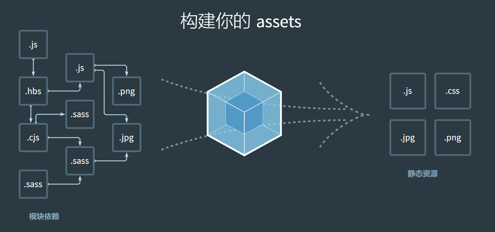
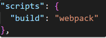
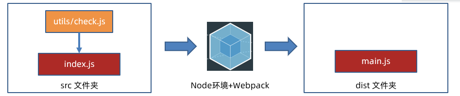
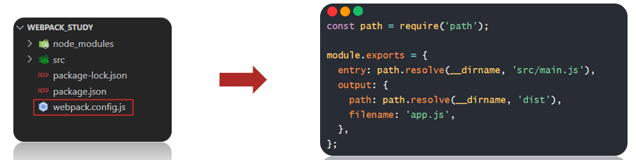
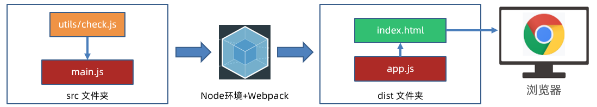
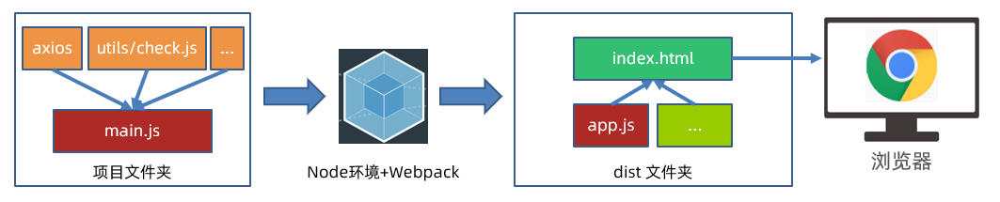
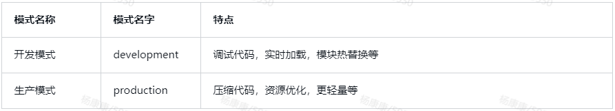

# DAY04 - Webpack 基础入门
# 1. 什么是 Webpack

📕 概念： Webpack 是一个静态模块打包工具，从入口构建依赖并打包相关模块，最后展示你的内容。

> 知识点
> • 静态模块：编译时确定的模块依赖关系，如通过 import 或 require 引入的模块；
> • 动态模块：运行时确定的模块依赖关系，如通过 import() 异步加载的模块；
> • 只有和入口有直接/间接引入关系的模块，才会被打包。




📑 需求：封装 utils 包，校验用户名和密码长度，在 index.js 中使用，使用 Webpack 打包。
🚀 步骤：

1. 新建项目文件夹 Webpack_study，通过 npm init -y 初始化包环境，得到 package.json 文件；
2. 新建 src 源代码文件夹。

```js
// src/utils/check.js
export const checkUserName = (uname) => {
  return uname.length >= 8;
};
export const checkPassWord = (pwd) => {
  return pwd.length >= 6;
};

export default {
  checkUserName,
  checkPassWord,
};
// src/index.js
import { checkUserName, checkPassWord } from "./utils/check.js";
const unameResult = checkUserName("psq3360");
const pwdResult = checkPassWord("246810");
console.log(unameResult, pwdResult);
```

1. 下载 webpack 和 webpack-cli。

```bash
npm i webpack webpack-cli --save-dev
```

> 注意
> 虽然 Webpack 是全局软件包，封装的是命令工具，但是为了保证项目之间 Webpack 版本分别独立，所以建议下载 webpack 到某个项目环境下，但是需要把 webpack 命令配置到 package.json 的 scripts 自定义命令，作为局部命令使用。




2. 项目中运行下面命令进行打包。

```bash
npm run build
```

3. 最终流程图。




# 2. 修改打包入口和出口

🚀 步骤：

1. 项目根目录，新建 webpack.config.js 配置文件；
2. 导出配置对象，配置入口（entry），出口（output）文件路径；
3. 重新打包观察。

```js
const path = require("path");

module.exports = {
  // 入口
  entry: path.resolve(__dirname, "src/main.js"),
  // 出口
  output: {
    path: path.resolve(__dirname, "dist"),
    filename: "app.js",
    clean: true, // 先清空 dist，然后再输出最新内容
  },
};
```




# 3. 案例-注册用户-长度判断

📑 需求：点击注册按钮，判断用户名和密码长度是否符合要求。

1. 新建 public/index.html 准备网页模板（方便查找标签和后期自动生成 HTML 文件做准备）；

```html
<!DOCTYPE html>
<html lang="en">
  <head>
    <meta charset="UTF-8" />
    <meta http-equiv="X-UA-Compatible" content="IE=edge" />
    <meta name="viewport" content="width=device-width, initial-scale=1.0" />
    <title>我是一个网页</title>
  </head>

  <body>
    <div class="img-wrap">
      
    </div>
    <div class="login-wrap">
      <form action="javascript:;">
        <div class="form-item">
          <span>用户名：</span>
          <input type="text" class="username" />
        </div>
        <div class="form-item">
          <span>密码：</span>
          <input type="password" class="password" />
        </div>
        <div class="form-item">
          <button class="login-btn">注 册</button>
        </div>
      </form>
    </div>
  </body>
</html>
```

2. 核心 JS 代码写在 src/main.js 打包入口文件；

```js
import { checkUserName, checkPassWord } from "./utils/check";
document.querySelector(".login-btn").addEventListener("click", () => {
  const username = document.querySelector(".username").value;
  const password = document.querySelector(".password").value;

  if (!checkUserName(username)) {
    alert("用户名长度要大于等于8位");
    return;
  } else if (!checkPassWord(password)) {
    alert("密码长度要求大于等于6位");
    return;
  }

  console.log("用户名和密码长度符合要求");
});
```

3. 运行 npm run build 命令，让 Webpack 打包 JS 代码。




# 4. html-webpack-plugin

> html-webpack-plugin
> 在 Webpack 打包时生成 HTML 文件，并引入其他打包后的资源。

1. 下载 html-webpack-plugin 本地软件包到项目中；

```js
npm i html-webpack-plugin --save-dev
```

2. 配置 webpack.config.js，指定以 public/index.html 为模板复制到 dist/index.html，并自动引入其他打包后资源；

```js
const path = require("path");
const HtmlWebpackPlugin = require("html-webpack-plugin");

module.exports = {
  // 入口
  entry: path.resolve(__dirname, "src/main.js"),
  // 出口
  output: {
    path: path.resolve(__dirname, "dist"),
    filename: "app.js",
    clean: true, // 先清空 dist，然后再输出最新内容
  },
  plugins: [
    new HtmlWebpackPlugin({
      // 以指定的 HTML 文件作为生成模板
      template: path.resolve(__dirname, "public/index.html"),
    }),
  ],
};
```

3. 运行打包命令，观察打包后 dist 文件夹下内容并运行查看效果。

# 5. 打包 CSS 代码 css-loader

> loader
> Webpack 默认只识别 JS 和 JSON 文件，所以想要让 Webpack 识别更多不同内容，需要使用 loader（加载器）。

> 介绍需要的 2 个加载器来辅助 Webpack 打包 CSS 代码
> css-loader：解析 CSS 代码；
> style-loader：把解析后的 CSS 代码插入到 DOM（style 标签之间）。

1. 准备 CSS 文件引入到 src/main.js 中；

```js
// 这里只是引入代码内容让 Webpack 处理，不需定义接收变量在 JS 代码中继续使用
import './css/index.css'
```

2. 下载 css-loader 和 style-loader 本地软件包；

```js
npm i css-loader style-loader --save-dev
```

3. 配置 webpack.config.js 让 Webpack 拥有该加载器功能;

```js
const path = require("path");
const HtmlWebpackPlugin = require("html-webpack-plugin");

module.exports = {
  // ...
  module: {
    // 加载器
    rules: [
      // 规则列表
      {
        test: /\.css$/i, // 匹配 .css 结尾的文件
        use: ["style-loader", "css-loader"], // 使用从后到前的加载器来解析 css 代码和插入到 DOM
      },
    ],
  },
};
```

4. 打包后运行 dist/index.html 观察效果，看看准备好的样式是否作用在网页上。

# 6. 打包 Less 代码 less-loader

1. 准备 less 样式引入到 src/main.js 中；

```js
import './less/index.less'
```

2. 下载 less 和 less-loader；

```bash
npm i less less-loader --save-dev
```

3. 配置 webpack.config.js；

```js
const path = require("path");
const HtmlWebpackPlugin = require("html-webpack-plugin");

module.exports = {
  // ...
  module: {
    // 加载器
    rules: [
      // ...
      {
        test: /\.less$/i,
        use: [
          // compiles Less to CSS
          "style-loader",
          "css-loader",
          "less-loader",
        ],
      },
    ],
  },
};
```

4. 打包后运行 dist/index.html 观察效果。

# 7. 打包图片资源

> 资源模块：Webpack 内置了资源模块的打包，无需下载额外 loader。

1. 准备图片素材到 src/assets 中（存放资源模块 - 图片/字体图标等）；
2. 在 index.less 中给 body 添加背景图；

```less
body{
  background: url(../assets/background.png) no-repeat center center;
}
```

3. 在 main.js 中给 img 标签添加 logo 图片；

```js
import "./less/index.less";
import imgObj from "./assets/logo.png";
document.querySelector(".logo-img").src = imgObj;
```

4. 配置 webpack.config.js 让 Webpack 拥有打包图片功能；

```js
const path = require("path");
const HtmlWebpackPlugin = require("html-webpack-plugin");

module.exports = {
  // ...
  module: {
    // 加载器
    rules: [
      // ...
      {
        // 针对资源模块（图片，字体文件，图标文件等）处理
        test: /\.(png|jpg|jpeg|gif)$/i,
        type: "asset", // 根据文件大小（8KB）小于：把文件转成 base64 打包进 js 文件中（减少网络请求次数）大于：文件复制到输出的目录下
        generator: {
          // 输出文件时，路径+名字
          filename: "assets/[hash][ext]",
        },
      },
    ],
  },
};
```

5. 打包后运行 dist/index.html 观察效果。

> 注意
> • 小于 8KB 文件会被转成 data URI（base64 字符串）打包进 JS 文件中（好处：可以减少网络请求次数，缺点：增加 30% 体积）；
> • 大于 8KB 文件会被复制到 dist 下，自动替换使用代码的图片名字。

# 8. 集成 babel 编译器 babel-loader

📕 Babel 定义：是一个 JavaScript 语法编译器，可以将 ECMAScript 2015+ 语法编写的代码转换为向后兼容的 JavaScript 语法，以便能够运行在当前和旧版本的浏览器或其他环境中。
⚒️ babel-loader：让 Webpack 可以使用 Babel 转译 JavaScript 代码。

> 各个软件包的作用
> • @babel/core：JS 编译器，分析代码；
> • @babel/preset-env：babel 预设，规则；
> • babel-loader：让 webpack 翻译 JS 代码。

1. 编写一段映射数组元素，每个数值 +1 的代码（要求用箭头函数）；

```js
const arr = [1, 2, 3];
const result = arr.map(val => val + 1);
console.log(result);
```

2. 下载 babel-loader、@babel/core、@babel/preset-env；

```bash
npm i babel-loader @babel/core @babel/preset-env -D
```

3. 配置 webpack.config.js。

```js
module.exports = {
  // ...
  module: {
    // 加载器
    rules: [
      // ...
      {
        test: /\.m?js$/,
        // 排除指定目录里的 js （不进行编译降级）
        exclude: /(node_modules|bower_components)/,
        use: {
          loader: "babel-loader",
          options: {
            presets: ["@babel/preset-env"], // 预设规则
          },
        },
      },
    ],
  },
};
```

4. 打包运行 dist/index.html 观察效果。

# 9. 案例-注册用户-完成功能

📕 需求：点击注册按钮，基于 npm 下载 axios 包，完成提交用户名和密码到服务器完成注册功能。

1. 使用 npm 下载 axios；

```bash
npm i axios
```

2. 引入到 src/main.js 中编写业务实现；

```js
import axios from "axios";
import { checkUserName, checkPassWord } from "./utils/check";
document.querySelector(".login-btn").addEventListener("click", () => {
  const username = document.querySelector(".username").value;
  const password = document.querySelector(".password").value;

  if (!checkUserName(username)) {
    alert("用户名长度要大于等于8位!!!");
    return;
  } else if (!checkPassWord(password)) {
    alert("密码长度要求大于等于6位");
    return;
  }

  console.log("用户名和密码长度符合要求");
  axios({
    url: "http://xxx/api/register",
    method: "POST",
    data: {
      username,
      password,
    },
  })
    .then((result) => {
      alert(result.data.message);
    })
    .catch((error) => {
      alert(error.response.data.message);
    });
});
```

3. 打包后运行 dist/index.html 观察效果。




# 10. 开发服务器 webpack-dev-server

⚠️ 问题：每次改动代码，都要重新打包，很麻烦，集成 webpack-dev-server 开发服务器解决问题。
⚒️ 作用：启动 Web 服务，打包输出源码在内存，并会自动检测代码变化热更新到网页。

1. 下载 webpack-dev-server 软件包到当前项目；

```bash
npm i webpack-dev-server --save-dev
```

2. 配置自定义命令，并设置打包的模式为开发模式；

```json
"scripts": {
  // ...
  "dev": "webpack serve --mode=development"
},
```

3. 使用 npm run dev 来启动开发服务器，访问提示的域名+端口号，在浏览器访问打包后的项目网页，修改代码后试试热更新效果（在 JS / CSS 文件中修改代码保存后，会实时反馈到浏览器）。

# 11. 打包模式 mode

⚒️ 打包模式：可以告知 Webpack 使用相应模式的内置优化。


方式 1：在 webpack.config.js 配置文件设置 mode 选项；

```js
// ...

module.exports = {
  // ...
  mode: 'production'
}
```

方式 2：在 package.json 命令行设置 mode 参数。

```json
"scripts": {
  "build": "webpack --mode=production",
  "dev": "webpack serve --mode=development"
},
```

🚀 注意：命令行设置的优先级高于配置文件中的，推荐用命令行设置。

# 12. 开发环境调错 source map

⚠️ 问题：打包后的代码被压缩和混淆，无法正确定位源代码位置（行数和列数）。
⚒️ source map：可以准确追踪 error 和 warning 在原始代码的位置。

1. webpack.config.js 配置 devtool 选项；

```js
// ...
module.exports = {
  // ...
  // 把源码的位置信息一起打包在 JS 文件内
  devtool: 'inline-source-map'
}
```

2. 注意：一般情况下 source map 适用于开发环境，不要在生产环境使用（防止被轻易查看源码位置）。

# 13. 设置别名路径 alias

⚒️ 解析别名：配置模块如何解析，创建 import 或 require 的别名，来确保模块引入变得更简单。

1. 原来路径如下。

```js
import { checkUsername,  checkPassword } from '../src/utils/check.js'
```

2. 配置解析别名：在 webpack.config.js 中设置。

```js
// ...

module.exports = {
  // ...
  resolve: {
    alias: {
      MyUtils: path.resolve(__dirname, 'src/utils'),
      '@': path.resolve(__dirname, 'src')
    }
  }
}
```

3. 以后再引入目标模块写的路径就更简单了。

```js
import { checkUsername,  checkPassword } from 'MyUtils/check.js'
import { checkUsername,  checkPassword } from '@/utils/check.js'
```

4. 修改代码的路径后，重新打包观察效果是否正常。
