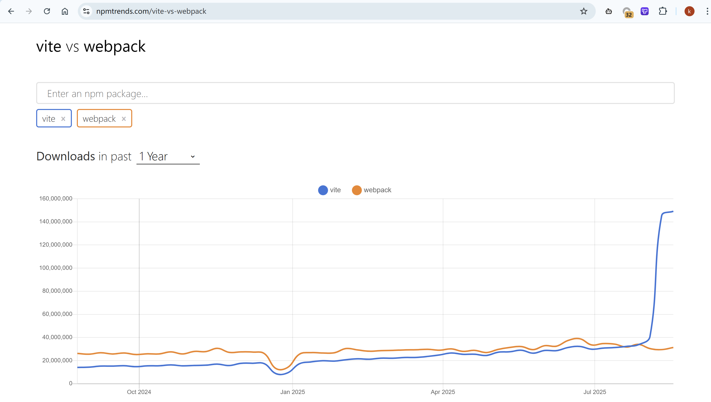

# 🎉 Vite 实践和练习

来源：

- https://365.kdocs.cn/l/coN1ilZbBh7I?from=koa

## 一、基本概述

🧶 **前端工程化解决的问题**

1. 提供模块化加载方案，兼容不同的模块化规范（ESM、CommonJS、AMD、CMD），例如 React 代码。
2. 配合 Sass、TSC、Babel 等工具链编译高级语法，支持静态资源能作为一个模块正常加载。
3. 线上代码质量：产物压缩和代码混淆（Terser）、Tree Shaking、语法降级兼容浏览器。
4. 开发效率：构建速度，项目的冷启动速度和热更新效率（HMR）。

`node_modules\react\index.js`

```js
'use strict';
if (process.env.NODE_ENV === 'production') {
  module.exports = require('./cjs/react.production.js');
} else {
  module.exports = require('./cjs/react.development.js');
}
```

市面上的打包工具有很多：Webpack、[Rspack](https://rspack.rs/zh/)（字节）、Turbopack（Webpack 作者 [Tobias Koppers](https://x.com/wSokra) 操刀）、[Farm](https://www.farmfe.org/)、[Rolldown](https://github.com/rolldown/rolldown) 等。

### 1. 为什么使用 Vite

1. [为什么使用 Vite](https://cn.vite.dev/guide/why)
2. https://npmtrends.com/vite-vs-webpack




## 二、开发环境

### 2. 集成环境

#### 2.2 Prettier

格式化代码的：例如末尾要不要分号，单引号还是双引号 ...

```bash
# prettier，代码风格
# eslint-plugin-prettier，将 Prettier 作为 ESLint 的一个规则插件，让 Prettier 的格式化能力融入 ESLint 的工作流中。当运行 ESLint 检查时，会同时执行 Prettier 的格式化检查，如果代码不符合 Prettier 的格式规则，会被当做 ESLint 错误提示出来，允许通过 ESLint 的自动修复命令同时修复格式问题
# eslint-config-prettier，ESLint 不仅检查代码质量，也有一些格式化相关的规则，该包会禁用 ESLint 中所有与 Prettier 冲突的格式化规则，确保二者协同工作时不互相干扰
pnpm install prettier eslint-plugin-prettier eslint-config-prettier -D
```

`prettier.config.js`

```js
export default {
  singleQuote: true, // 使用单引号
  semi: false, // 末尾不加分号
  tabWidth: 2,
  trailingComma: 'none',
  useTabs: false,
  endOfLine: 'auto'
};
```

现在的问题是 Prettier 不要分号，ESLint 需要分号，我们在 `main.ts` 代码的末尾都加上分号，执行：

```bash
pnpm lint
```

此时会提示我们 Delete `;`，手动删太麻烦，此时安装 Prettier 插件并添加到工作区。

VSCode 搜索配置：`Default Formatter`

再搜索 `Format On Save`

🦜 如果配置完没有生效，尝试重启编辑器。

#### 2.3 EditorConfig

编辑器配置：例如换行符，编码，空格等 ...

`EditorConfig for VS Code`

`.editorconfig`

```bash
root = true

[*]
charset = utf-8
indent_style = space
indent_size = 2
end_of_line = lf  # 不同操作系统的换行符不同（Windows 用 CRLF \r\n，Linux/macOS 用 LF \n），否则换行符差异导致 Git 提交出现大量 "无效修改"
```

#### 2.4 husky

提交代码前，先进行 ESLint 校验，校验不通过阻止提交。

```bash
git init
pnpm install husky lint-staged -D  # 安装 husky 包
npx husky init  # husky 初始化
```

### 3. 样式处理

```ts
import { defineConfig, normalizePath } from 'vite';
import react from '@vitejs/plugin-react';
import path from 'node:path';
import autoprefixer from 'autoprefixer';
import tailwindcss from '@tailwindcss/vite';

// 用 normalizePath 解决 window 下的路径问题
const variablePath = normalizePath(path.resolve('./src/variable.scss'));

export default defineConfig({
  plugins: [
    react({
      babel: {
        plugins: ['babel-plugin-styled-components']
      }
    }),
    tailwindcss()
  ],
  css: {
    modules: {
      // 其中，name 表示当前文件名，local 表示类名，hash 表示哈希值
      generateScopedName: '[name]__[local]___[hash:base64:5]'
    },
    preprocessorOptions: {
      scss: {
        api: 'modern-compiler',
        // additionalData 的内容会在每个 scss 文件的开头自动注入
        additionalData: `@use "${variablePath}" as *;`
      }
    },
    postcss: {
      plugins: [
        autoprefixer({
          overrideBrowserslist: ['Chrome > 40', 'ff > 31', 'ie 11']
        })
      ]
    }
  }
});
```

### 4. 静态资源

https://cn.vite.dev/guide/features.html#static-assets

#### 4.1 图片

```js
import avatar from './assets/avatar.jpg';
```

#### 4.2 JSON

如何引入 JSON？

```js
import pkg, { version } from '../package.json';
console.log(pkg, version);
```

#### 4.3 Web Worker

`worker.js`

```js
let i = 0;
const timedCount = () => {
  i = i + 1;
  postMessage(i);
  setTimeout(timedCount, 1000);
};
timedCount();
```

`main.jsx`

```js
import Worker from './worker?worker';

const worker = new Worker();
worker.onmessage = (event) => {
  console.log(event.data);
};
```

#### 4.4 Web Assembly

如何使用 Web Assamelly（在浏览器中可以运行的二进制），[AssemblyScript](https://www.assemblyscript.org/) 是一种类似 TypeScript 的编程语言，专门用于编译到 WebAssembly。

```js
(module
  (func (export "addTwo") (param i32 i32) (result i32)
    local.get 0
    local.get 1
    i32.add))
```

### 5. 环境变量

#### 5.1 基本内容

Vite 在特殊的 `import.meta.env` 对象下暴露了一些常量，其中内置的有 MODE、BASE_URL、PROD、DEV、SSR。

```bash
.env              # 所有情况下都会加载
.env.local        # 所有情况下都会加载，但会被 git 忽略
.env.[mode]       # 只在指定模式下加载
.env.[mode].local # 只在指定模式下加载，但会被 git 忽略
```

可以自定义环境变量（`.env`、`.env.development`、`.env.development.local`），这些环境变量将会以字符串的形式暴露在 `import.meta.env` 对象下。

```bash
# 只有以 VITE_ 为前缀的变量才能供客户端访问
VITE_DB_URL=123
```

`main.ts / App.vue`

```js
console.log(import.meta.env.VITE_DB_URL);
```

添加 TS 类型提示，`src/vite-env.d.ts`

```ts
interface ImportMetaEnv {
  // 自定义的环境变量
  readonly VITE_DB_URL: string;
}
```

`index.html` 中也可以使用

```html
<title>%VITE_SOME_KEY%</title>
```

`vite.config.mjs` 中如何使用环境变量？

```js
import { loadEnv } from 'vite';

export default defineConfig(({ mode }) => {
  // 加载环境变量
  const env = loadEnv(mode, process.cwd(), '');
  console.log('当前模式:', mode);
  console.log('环境变量示例:', env.DB_URL);
  // ...
});
```

## 四、展望未来

📌 **碎片化导致的问题**

1. 选择困难 + 复杂度爆炸；
2. 一些工具互相根本不兼容；
3. 不同工具反复 parse / 编译导致的浪费；
4. 重复却又各不相同的配置；
5. 转译 / 模块解析等行为不一致；
6. 大量时间浪费在搭配和调试工具链上。

[voidzero.dev](https://voidzero.dev/)

[oxc](https://github.com/oxc-project/oxc) 是一个用 Rust 编写的 JavaScript 工具集合，旨在构建高性能的 JavaScript 开发工具链。

👋 **核心功能**

- 🔍 AST 和解析器 - 最快且最符合规范的 JS/TS 解析器
- ⚡ Linter（oxlint）- 超高速代码检查工具
- 📦 Resolver - 模块解析器
- 🗜️ Minifier - 代码压缩器
- 💅 Formatter - 代码格式化器（开发中）
- 🔄 Transformer - 代码转换器

🏆 **性能优势**

- 解析器：比 swc 快 3 倍，比 Biome 快 5 倍
- Linter：比 ESLint 快 50-100 倍，支持多核并行
- 体积小：二进制文件仅约 5MB（vs ESLint 的 100MB+）

👥 **谁在使用**

- Rolldown - 使用 oxc 进行解析和转换
- Nova engine - 使用 oxc 解析器
- Preact, Shopify, ByteDance, Shopee - 使用 oxlint 进行代码检查

## 五、下午练习

### 项目脚手架

项目基于 [Vue CLI](https://cli.vuejs.org/zh/) 搭建，项目 Node 版本 `14.16.0`，如项目不能启动或其他异常，尝试通过 [nvm](https://github.com/coreybutler/nvm-windows/releases) 切换此版本尝试。

### 初始源代码

#### 前端代码

`shop-front.rar`

文件大小：`957.63 KB`

```bash
# npm i
npm install webpack@^4.0.0 @babel/core@^7.0.0 --save-dev
```

#### 后端服务

新建：`docker-compose.yml`，写入配置如下：

```yaml
name: shop
services:
  mysql:
    container_name: shop-mysql
    image: iferdva/shop-mysql
    environment:
      - MYSQL_ROOT_PASSWORD=123456
      - MYSQL_LOWER_CASE_TABLE_NAMES=0
    ports:
      - "3307:3306"
    volumes:
      - ./data/mysql-data:/var/lib/mysql
  node:
    container_name: shop-node
    image: iferdva/shop-node
    ports:
      - "8888:8888"
    depends_on:
      - mysql
    # 挂载宿主机当前目录到容器内的 /app 目录，方便开发时实时更新代码
    # 如果宿主机没有 node 环境，请注释掉该配置
    # volumes:
    #   - .:/app
```

启动容器：

```yaml
docker compose up -d
```

MySQL 容器启动需要导入相关数据，需要一些时间（服务成功了，数据可能还没导入成功，多观察一会）。
