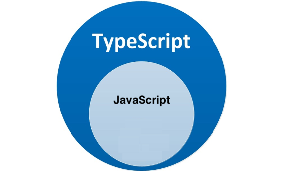
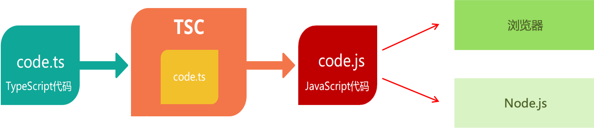

# TypeScript 参考教程
# 1. 学习目标

✔ 掌握 TypeScript 的基本使用，例如 type、interface、泛型函数等。

✔ 掌握 TypeScript 在 Vue 项目中的应用。

# 2. TypeScript 概述

## 2.1 概念



- TypeScript 是微软开发的编程语言，它是 JavaScript 的超集，可以在任何运行 JavaScript 的地方运行，[官方文档](https://www.typescriptlang.org/)，[中文文档，不再维护](https://www.tslang.cn/)。

- TypeScript = `Type` + JavaScript（在 JS 基础之上，为 JS 添加了类型支持/类型检测）。

```typescript
let age1: number = 18 // TS 代码 => 有明确的类型，即 number（数值类型）
```

## 2.2 优势

> 🔔 **背景**
> JS 的类型系统存在"先天缺陷"，是弱类型语言，而代码中的大部分错误都是类型错误（TypeError），这些经常出现的错误，导致了在使用 JS 进行项目开发时，增加了找 Bug、改 Bug 的时间，严重影响开发效率。

> 📌 **发现错误的时机更早**
> - 对于 JS 来说：需要等到代码真正去执行的时候才能发现错误（晚）；
> - 对于 TS 来说：代码编译的时候（代码执行前）就可以发现错误（早），配合 VSCode 等开发工具，发现错误的时机可以提前到在编写代码的时候，减少找 Bug、改 Bug 时间。

> 💡 **代码提示**
> 随时随地的安全感，增强了开发体验。

> 🔔 **支持最新的 ECMAScript 语法**
> 优先体验最新的语法，让你走在前端技术的最前沿。

> 💡 Vue3 源码使用 TS 重写、Angular 默认支持 TS、React 与 TS 完美配合，TypeScript 已成为大中型前端项目的首选编程语言，前端最新的开发技术栈离不开 TS，例如 React（TS + Hooks），Vue（TS + Vue3）。

```typescript
// 使用 JavaScript：在 VSCode 里面写代码；在浏览器中运行代码，发现错误【晚】。
// 使用 TypeScript：在 VSCode 里面写代码；写代码的同时，就会发现错误【早】；在浏览器中运行代码。
let num = 123
num = 'abc'
num.toFixed(2) // Uncaught TypeError: num.toFixed is not a function
```

# 3. 编译 TypeScript

## 3.1 安装编译 TS 的工具

🤔 **问题：** 为什么要安装编译 TS 的工具包？

🚀 **回答：** Node.js/浏览器，只认识 JS 代码，不认识 TS 代码，因此需要先将 TS 代码转化为 JS 代码，然后才能运行。

```bash
npm i -g typescript
tsc -v
```



## 3.2 编译并运行 TS 代码

1\. 创建 `hello.ts` 文件（注意：TS 文件的后缀名为 `.ts`）；

2\. 将 TS 编译为 JS：在终端中输入命令，`tsc hello.ts`（此时，在同级目录中会出现一个同名的 JS 文件）；

3\. 执行 JS 代码：在终端中输入命令，`node hello.js`；

4\. 说明：所有合法的 JS 代码都是 TS 代码，有 JS 基础只需要学习 TS 的类型即可；

5\. 注意：由 TS 编译生成的 JS 文件，代码中就没有类型信息了。

```bash
# 监听 index.ts 文件的变化并编译
tsc -w index.ts  # 窗口 1
# 运行编译后的代码
nodemon index.js # 窗口 2
```

# 4. TypeScript 基础

## 4.1 类型注解

> 🔔 **类型系统**
> JS 虽然也有类型（比如，number/string 等），但 JS 并不会对类型进行校验和提示，TypeScript 类型系统的主要优势：**校验和提示**。

```typescript
let age: number = 18
```

- **说明：** 代码中的 `:number` 就是类型注解。

- **作用：** 为变量添加类型约束，比如上述代码中，约定变量 age 的类型为 number 类型。

- **解释：** 约定了什么类型，就只能给变量赋值该类型的值，也会出现该类型相关的提示。

```typescript
// 错误原因：将 string 类型的值赋值给了 number 类型的变量，类型不一致
let age: number = '18'
```

## 4.2 原始类型

可以将 TS 中的常用基础类型细分为两类，分别是 JS 已有类型和 TS 新增类型，例如 JS 已有类型如下：

```typescript
// 原始类型：`number/string/boolean/null/undefined/symbol/bigint`
const age: number = 18
const myName: string = 'Ifer'
const isLoading: boolean = false
// ...
```

> 🔔 **TS 新增类型**
> - 联合类型、自定义类型（类型别名）、接口、元组、字面量类型、枚举、void、any 等；
> - 注意：TS 中的原始类型和 JS 中写法一致；TS 中的对象类型在 JS 类型基础上更加细化，每个具体的对象（比如数组、对象、函数）都有自己的类型语法。

## 4.3 数组类型

```typescript
// 写法 1
let numbers: number[] = [1, 3, 5]
```

```typescript
// 写法 2
let strings: Array<string> = ['a', 'b', 'c']
strings.push('d') // 后续 push 的数据也必须是字符串
```

## 4.4 联合类型

📕 **需求：** 数组中既有 number 类型，又有 string 类型，这个数组的类型应该如何写？

```typescript
// 定义一个数组，数组中可以有数字或者字符串, 需要注意 | 的优先级
let arr: (number | string)[] = [1, 'abc', 2]
```

🤔 **解释：** `|`（竖线）在 TS 中叫做联合类型，即由两个或多个其他类型组成的类型，表示可以是这些类型中的一种。

🚀 **注意：** 这是 TS 中联合类型的语法，只有一根竖线，不要与 JS 中的或（||）混淆了。

🌳 **场景：** 定时器的初始变量定义。

```typescript
// 有问题的代码
let timer = null
// Type 'number' is not assignable to type 'null'.
timer = setInterval(() => {})
```

```typescript
// 解决，思考除了下面方法还有其他办法吗？
let timer: number | null = null
timer = setInterval(() => {})
```

```typescript
// 忽略
// 通过 tsc --init 命令可以生成配置文件
// 通过 strictNullChecks 指定为 true 可以开启对 null 和 undefined 的检测
// 即便开启了检测，当 null 赋值给某个变量时，这个变量会被推断为 any 类型
// !通过 noImplicitAny 指定为 false 可以禁用 any 类型，此时 null 赋值给某个变量时将会是 null 类型
let timer: number | null = null
timer = setInterval(() => {}, 1000)
```

## 4.5 类型别名

🚀 **类型别名作用：** 为任意类型起别名，别名甚至可以是中文。

```typescript
type s = string
const myName: s = 'ifer'

type 字符串类型 = string
const myAddress: 字符串类型 = '河南老乡~'
```

🌳 **使用场景：** 当同一类型（复杂）且可能被多次使用时，可以通过类型别名，**简化该类型的使用**。

```typescript
type CustomArray = (number | string)[]

let arr1: CustomArray = [1, 'a', 3, 'b']
let arr2: CustomArray = ['x', 'y', 6, 7]
```

🚀 **解释说明：**

- 使用 `type` 关键字来创建自定义类型；

- 类型别名（比如，此处的 CustomArray）可以是任意合法的变量名称；

- 推荐使用大写字母开头；

- 创建类型别名后，直接使用该类型别名作为变量的类型注解即可。

## 4.6 函数类型

### 4.6.1 基本使用

函数的类型实际上指的是：`函数参数` 和 `返回值` 的类型，为函数指定类型有如下两种方式。

🌳 单独指定参数、返回值的类型。

```typescript
// 函数声明
function add(num1: number, num2: number): number {
    return num1 + num2
}

// 箭头函数
const add = (num1: number, num2: number): number => {
    return num1 + num2
}
```

🎉 同时指定参数、返回值的类型。

```typescript
// 解释：可以通过类似箭头函数形式的语法来为函数添加类型，注意这种形式只适用于函数表达式。
type AddFn = (num1: number, num2: number) => number

const add: AddFn = (num1, num2) => {
    return num1 + num2
}
```

### 4.6.2 void 类型

如果函数没有返回值，那么函数返回值类型为：`void`。

```typescript
function greet(name: string): void {
    console.log('Hello', name)
    // return undefined // 默认有这么一句
}
```

### 4.6.3 可选参数

使用函数实现某个功能时，参数可以传也可以不传，这种情况下，在给函数参数指定类型时，就用到**可选参数**了，比如数组的 slice 方法，可以 `slice()` 也可以 `slice(1)` 还可以 `slice(1, 3)`。

🌳 **可选参数语法：** 在可传可不传的参数名称后面添加 `?`（问号）。

```typescript
// start、end 可传可不传，传就传 number 类型
function mySlice(start?: number, end?: number): void {
    console.log('起始索引：', start, '结束索引：', end)
}
```

🎉 **注意：** 可选参数只能出现在参数列表的最后，也就是说可选参数后面不能再出现必选参数。

### 4.6.4 参数默认值

通过赋值符号（=）可以给参数执行默认值，注意：参数默认值和可选参数互斥的，只能指定其中一种。

```typescript
// Error: Parameter cannot have question mark and initializer
function mySlice(start: number = 0, end?: number = 0) {}
```

```typescript
// 可选参数
function mySlice(start: number = 0, end?: number) {}
```

```typescript
// 默认值
function mySlice(start: number = 0, end: number = 0) {}
```

## 4.7 对象类型

### 4.7.1 基本使用

✍️ JS 中的对象是由属性和方法构成的，而 **TS 对象的类型就是在描述数据的结构**（有什么样类型的属性和方法），基本使用：

```typescript
const person: object = {}
```

🥷 另一种使用方式。

```typescript
// 左边的 {} 表示类型（严格来说应该是对象字面量类型），右边的 {} 表示值
let person: {} = {}
```

🚀 可以精确描述对象里面具体内容的类型。

```typescript
// 要求必须指定 string 类型的 name 属性，左右两边数量保持一致
const person: { name: string } = {
    name: '同学',
}
```

```typescript
const obj = {
    name: '同学',
    age: 18,
}
// 右边是变量，在满足左边声明的前提下（右边内容可以比左边多）
const person: { name: string } = obj
```

```typescript
// 字符串比较特殊，满足左边的类型要求即可
const str: { length: number } = 'hello'
```

🌳 描述对象中方法的类型。

```typescript
// 在一行代码中指定对象的多个属性类型时，使用 `;`（分号）来分隔
// 单独制定函数的参数和返回值
// const person: { name: string; add(n1: number, n2: number): number } = {
// 可以统一指定函数的参数和返回值
const person: { name: string; add: (n1: number, n2: number) => number } = {
    name: '同学',
    add(n1, n2) {
        return n1 + n2
    },
}
```

🎉 也可以通过换行来分隔多个属性类型，去掉 `;`。

```typescript
const person: {
    name: string
    add(n1: number, n2: number): number
} = {
    name: '同学',
    add(n1, n2) {
        return n1 + n2
    },
}
```

✍️ 定义对象类型时也可以结合**类型别名**来使用。

```typescript
type Person = {
    name: string
    add(n1: number, n2: number): number
}
const person: Person = {
    name: '同学',
    add(n1, n2) {
        return n1 + n2
    },
}
```

### 4.7.2 对象的可选属性

🌳 对象的属性或方法，也可以是可选的，此时就用到**可选属性**了，比如我们在使用 `axios({ ... })` 时，如果发送 GET 请求，method 属性就可以省略，可选属性的语法与函数可选参数的语法一致，都使用 `?` 来表示。

```typescript
type Config = {
    url: string
    method?: string
}

function myAxios(config: Config) {
    console.log(config)
}
```

### 4.7.3 练习

📝 创建两个学生对象：包含姓名、性别、成绩、身高、学习、打游戏。

```typescript
type Student = {
    name: string
    gender: string
    score: number
    height: number
    study(): void
    play: (name: string) => void
}

const stu: Student = {
    name: 'xxx',
    gender: 'man',
    score: 88,
    height: 178,
    study() {
        console.log('学学学')
    },
    // play() 这里不写参数，也不会马上报错，但 stu.play() 调用的时候就知道了
    play(name) {},
}
```

### 4.7.4 接口

当一个对象类型被多次使用时，一般会使用接口（`interface`）来描述对象的类型，达到复用的目的。

- 使用 `interface` 关键字来声明接口；

- 接口名称（比如，此处的 IPerson），可以是任意合法的变量名称，推荐以 `I` 开头；

- 声明接口后，直接使用接口名称作为变量的类型；

- 因为每一行只有一个属性类型，因此，属性类型后没有 `;`（分号）。

```typescript
interface IStudent {
    name: string
    gender: string
    study(): void
}

const stu: IStudent = {
    name: 'xxx',
    gender: 'man',
    study() {
        console.log('学学学')
    },
}
```

### 4.7.5 接口继承

如果两个类型之间有相同的属性或方法，可以将**公共的属性或方法抽离出来，通过继承来实现复用**。

🌳 type 方式。

```typescript
type Point2D = {
    x: number
    y: number
}
type Point3D = {
    x: number
    y: number
    z: number
}
```

🌳 interface 方式。

```typescript
interface Point2D {
    x: number
    y: number
}
// 使用 `extends`（继承）关键字实现了接口 Point3D 继承 Point2D
// 继承后，Point3D 就有了 Point2D 的所有属性和方法（此时，Point3D 同时有 x、y、z 三个属性）
interface Point3D extends Point2D {
    z: number
}
```

### 4.7.6 interface vs type

#### 4.7.6.1 相同点

🌳 都可以描述对象或者函数。

```typescript
// interface 描述对象
interface IPerson {
    name: string
    age: number
}
const p: IPerson = { name: 'ifer', age: 18 }
```

```typescript
// interface 描述函数
interface ISetPerson {
    (name: string, age: number): void
}
const setPerson: ISetPerson = (name, age) => {}

setPerson('ifer', 18)
```

```typescript
// type 描述对象
type TPerson = {
    name: string
    age: number
}
const p: TPerson = { name: 'ifer', age: 18 }
```

```typescript
// type 描述函数
type TSetPerson = {
    (name: string, age: number): void
}
const setPerson: TSetPerson = (name, age) => {}

setPerson('ifer', 18)
```

🌳 都允许拓展，语法不一样。

```typescript
// interface extends interface
interface IName {
    name: string
}
interface IPerson extends IName {
    age: number
}

const p: IPerson = {
    name: 'ifer',
    age: 18,
}
```

```typescript
// interface extends type
type TName = { name: string }
interface IPerson extends TName {
    age: number
}

const p: IPerson = {
    name: 'ifer',
    age: 18,
}
```

```typescript
// type & type
type TName = { name: string }
type TPerson = { age: number } & TName

const p: TPerson = {
    name: 'ifer',
    age: 18,
}
```

```typescript
// type & interface
interface IName {
    name: string
}
type TPerson = { age: number } & IName

const p: TPerson = {
    name: 'ifer',
    age: 18,
}
```

#### 4.7.6.2 不同点

🥷 type 除了可以描述对象或函数，实际上可以为任意类型指定别名。

```typescript
type NumStr = number | string
```

🥷 相同的 interface 声明能够合并，相同的 type 声明会报错。

```typescript
interface IPerson {
    name: string
}
interface IPerson {
    age: number
}
const p: IPerson = {
    name: 'ifer',
    age: 18,
}
```

📕 **总结：** 一般使用 interface 来描述对象结构，用 type 来描述类型关系。

## 4.8 元组类型

使用 `number[]` 的特点：不严谨，因为该类型的数组中可以出现任意多个数字，`元组 Tuple`，元组是特殊的数组类型，**它能确定元素的个数以及特定索引对应的类型**。

```typescript
const position: [number, number] = [39.5427, 116.2317]
```

🚀 **解释说明：**

- 元组类型可以确切地标记出有多少个元素，以及每个元素的类型；

- 该示例中，元素有两个元素，每个元素的类型都是 number。

```typescript
// 可以给元组中的元素起别名
const arrTuple: [height: number, age: number, salary: number] = [170, 20, 17500]
```

## 4.9 类型推论

在 TS 中，某些没有明确指出类型的地方，**TS 的类型推论机制会帮助提供类型**，换句话说，由于类型推论的存在，这些地方，类型注解可以省略不写，常见的发生类型推论的 2 种场景：声明变量并初始化时；决定函数返回值时。

```typescript
// 变量 age 的类型被自动推断为：number
let age = 18

const obj = {
    name: 'ifer',
    age: 18,
    show() {},
}

// 函数返回值的类型被自动推断为：number
function add(num1: number, num2: number) {
    return num1 + num2
}
```

> 📌 **推荐**
> 代码写熟了之后，有类型推论的情况下可以省略类型注解，充分利用 TS 类型推论的能力，提升开发效率。

> 🔔 **技巧**
> 如果不知道类型，可以通过鼠标放在变量名称上，利用 VSCode 的提示来查看类型。

> 👋 **建议**
> 在 VSCode 中写代码的时候，多看方法、属性的类型，养成写代码看类型的习惯，例如 `const oDiv = document.createElement('div')`。

## 4.10 字面量类型

### 4.10.1 基本使用

🤔 思考以下代码，两个变量的类型分别是什么?

```typescript
let str1 = 'Hello TS'
const str2 = 'Hello TS'
```

🚀 通过 TS 类型推论机制，可以看出变量 str1 的类型为：string，变量 str2 的类型为：'Hello TS'：

- str1 是一个变量，它的值可以是任意字符串，所以类型为：string；

- str2 是一个常量，它的值不能变化只能是 'Hello TS'，所以类型为：'Hello TS'（字符串字面量）；

- **注意：** 此处的 'Hello TS'，就是一个**字符串字面量类型**，也就是说某个特定的字符串也可以作为 TS 中的类型；

- 任意的 JS 字面量都可以作为类型使用，例如 `{ name: 'jack' }`、`[]`、`18`、`'abc'`、`false`、`function() {}` 等。

### 4.10.2 基本方式和场景

🚀 **使用方式：** 字面量类型常配合联合类型一起使用。

🌳 **使用场景：** 用来表示一组明确的可选值列表，比如在贪吃蛇游戏中，游戏方向的值只能是上、下、左、右中的一个。

```typescript
type Direction = 'up' | 'down' | 'left' | 'right'
function changeDirection(direction: Direction) {
    console.log(direction)
}
changeDirection('up') // 调用函数时，会有类型提示
```

- **解释：** 参数 direction 的值只能是 up/down/left/right 中的任意一个。

- **优势：** 相比于 string 类型，使用字面量类型更加精确、严谨。

- 其他应用场景，性别和 Redux 中的 Action 等等。

```typescript
type Gender = '男' | '女'
const zs: Gender = '男'
```

```typescript
type Action = {
    type: 'TODO_ADD' | 'TODO_DEL' | 'TODO_CHANGE' | 'TODO_FIND'
}

function reducer(state, action: Action) {
    switch (action.type) {
        case 'TODO_ADD': // 这里会自动具有提示
    }
}
```

## 4.11 枚举类型

### 4.11.1 基本使用

📕 **枚举：** 定义一组命名常量，它描述一个值，该值可以是这些命名常量中的一个，类似于**字面量类型+联合类型组合**的功能，也可以表示一组明确的可选值。使用 `enum` 关键字定义枚举，约定枚举名称以大写字母开头；枚举中的多个值之间通过 `,`（逗号）分隔，定义好枚举后，使用枚举名称作为类型注解。

```typescript
// 创建枚举
enum Direction {
    Up,
    Down,
    Left,
    Right,
}

// 可以当做类型使用枚举
function changeDirection(direction: Direction) {
    console.log(direction)
}

// 也可以当做值使用枚举
// 调用函数时，需要传入：枚举 Direction 成员的任意一个，类似于 JS 中的对象，直接通过点（.）语法 访问枚举的成员
changeDirection(Direction.Up)
```

### 4.11.2 数字枚举

🤔 **问题：** 我们把枚举成员作为了函数的实参，它的值是什么呢?

🎉 **答案：** 通过将鼠标移入 Direction.Up，可以看到枚举成员 Up 的值为 0（枚举成员是有值的，默认从 0 开始自增的数值）。我们把枚举成员的值为数字的枚举称为：`数字枚举`。当然也可以通过"等号"给枚举中的成员指定初始值，如下所示：

```typescript
// Down -> 11、Left -> 12、Right -> 13
enum Direction {
    Up = 10,
    Down,
    Left,
    Right,
}

enum Direction {
    Up = 2,
    Down = 4,
    Left = 8,
    Right = 16,
}
console.log(Direction['Up']) // 2
// 也可以反向操作
console.log(Direction[2]) // Up
```

### 4.11.3 实现原理

📕 枚举类型比较特殊，不仅仅可以用作类型，还可以当做值使用，因为枚举成员都是有值的，也就是说，其他的类型会在编译为 JS 代码时自动移除，但是，**枚举类型会被编译为 JS 代码**。

> 👋 **提示**
> 枚举与前面讲到的字面量类型 + 联合类型组合的功能类似，都用来表示一组明确的可选值列表，一般推荐**字面量类型 + 联合类型**组合的方式，因为相比枚举，这种方式更加直观、简洁、高效。

```typescript
enum Direction {
    Up = 2,
    Down = 4,
    Left = 8,
    Right = 16,
}

// 会被编译为以下 JS 代码：
var Direction
;(function (Direction) {
    Direction[(Direction['Up'] = 2)] = 'Up'
    Direction[(Direction['Down'] = 4)] = 'Down'
    Direction[(Direction['Left'] = 8)] = 'Left'
    Direction[(Direction['Right'] = 16)] = 'Right'
    console.log(Direction)
})(Direction || (Direction = {}))
```

### 4.11.4 字符串枚举

📕 **定义：** 枚举成员的值是字符串称为字符串枚举。

🤔 **注意：** 字符串枚举没有自增长行为，因此，**字符串枚举的每个成员必须有初始值**。

```typescript
enum Direction {
    Up = 'UP',
    Down = 'DOWN',
    Left = 'LEFT',
    Right = 'RIGHT',
}
```

🧐 具体的使用案例。

```typescript
enum Gender {
    女,
    男,
}
type User = {
    name: string
    age: number
    // gender: '男' | '女' // 但后台需要 0 和 1
    gender: Gender
}

const user: User = {
    name: 'ifer',
    age: 18,
    gender: Gender.男,
}
```

## 4.12 类型断言

🤔 有时候你会比 TS 更加明确一个值的类型，此时可以使用类型断言来指定更具体的类型，比如根据 ID 选择 a 标签。

```typescript
// 注意 document.querySelector('a') 这种写法会自动推断出是 HTMLLinkElement 类型
const oLink = document.getElementById('link')
```

🥷 **注意：** 该方法返回的类型是 HTMLElement，该类型只包含所有标签公共的属性或方法，不包含 a 标签特有的 href 等属性，这个类型太宽泛（不具体），无法操作 href 等 a 标签特有的属性或方法。

🤔 **解决：** 这种情况下就需要使用类型断言指定更加具体的类型。

```typescript
const oLink = document.getElementById('link') as HTMLAnchorElement
```

🚀 **解释说明**

- 使用 `as` 关键字实现类型断言；

- 关键字 as 后面的类型是一个更加具体的类型（HTMLAnchorElement 是 HTMLElement 的子类型）。

- 通过类型断言，oLink 的类型变得更加具体，这样就可以访问 a 标签特有的属性或方法了。

🤔 另一种断言的语法，使用 `<>` 语法，这种语法形式不常用了解即可。

```typescript
const oLink = <HTMLAnchorElement>document.getElementById('link')
```

> 📌 **技巧**
> 打开浏览器控制台，选中标签，通过 `$0.__proto__` 可以获取 DOM 元素的类型。

> 🔔 **注意**
> 只有两个有"关系"的类型间才能进行断言，例如你可以将一个联合类型（`string|number`）断言为其中某一更加具体的类型（`number`），将一个宽泛的类型（`Element`）断言为更加具体的类型（`HTMLDivElement`）。

## 4.13 typeof

🤔 JS 中的 typeof 可以在运行时判断类型，TS 中的 typeof 可以在编译时获取类型。

```typescript
interface Person {
    name: string
    age: number
}
const person: Person = { name: 'ifer', age: 18 }

// 获取 person 的类型，得到的就是 Person 接口类型
type p = typeof person
```

🌳 TS 中 typeof 的使用场景：根据已有变量的值，获取该值的类型，来简化类型书写。

```typescript
const p = { x: 1, y: 2 }
function formatPoint(point) {} // 没有提示
function formatPoint(point: { x: number; y: number }) {} // 有提示，写法麻烦
// 使用 `typeof` 操作符来获取变量 p 的类型，结果与上面对象字面量的形式相同
function formatPoint(point: typeof p) {} // 推荐
```

🤔 注意 typeof **出现在类型注解的位置**（参数名称的冒号后面，区别于 JS 代码）。

## 4.14 keyof

🚀 **作用：** 获取接口、对象（配合 typeof）、类等的所有属性名组成的联合类型。

```typescript
// 接口
interface Person {
    name: string
    age: number
}
type K1 = keyof Person // "name" | "age"
type K2 = keyof Person[] // "length" | "toString" | "pop" | "push" | "concat" | "join"
```

```typescript
// 对象（要配合 typeof 才能使用）
const obj = { name: 'ifer', age: 18 }
/* type newobj = typeof obj
type keyofObj = keyof newobj // "name" | "age" */

// 简写
type keyofObj = keyof typeof obj // "name" | "age"
let s1: keyofObj = 'name' // ok
let s2: keyofObj = 'xxx' // error
```

🤔 下面的代码了解即可。

```typescript
// 类
class User {
    // constructor(public username: string, public age: number) {}
    public username: string
    public age: number
    constructor(username: string, age: number) {
        this.username = username
        this.age = age
    }
}

type UserInfo = keyof User // "username" | "age"
const s: UserInfo = 'username' // ok
```

```typescript
// 基本类型
type K1 = keyof boolean // 'valueOf'
type T2 = keyof number // 'toString' | 'toFixed' | ...
type T3 = keyof any // string | number | symbol

// 枚举
enum HttpMethod {
    GET,
    POST,
}
type Method = keyof typeof HttpMethod // 'GET' | 'POST'
```

## 4.15 特殊类型

### 4.15.1 any

> 💡 **原则**
> 不推荐使用 any！这会让 TypeScript 变为 "AnyScript"（失去 TS 类型保护的优势），因为当值的类型为 any 时，可以对该值进行任意操作，即使可能存在错误，并且不会有代码提示。

```typescript
let num: any = 8 // 任意类型，不对类型进行校验
num.toFixed() // 没有提示
num = 'xxx' // 可以赋任意值（即可以把任意值给 any 类型）
```

🌳 尽可能的避免使用 any 类型，除非临时使用 any 来"避免"书写很长、很复杂的类型，或者有些参数就是可以使用任何类型，例如 `console.log()`。其他隐式具有 any 类型的情况（因为不推荐使用 any，所以下面两种情况下都应该提供类型）：

- 声明变量不提供类型也不提供默认值。

- 函数参数不加类型。

### 4.15.2 unknow

🌳 unknown: 任意类型，更安全的 any 类型。

```typescript
let num: unknown = 88
num = 'abc'
console.log(num)
num() // error: 不能调用方法
console.log(num.length) // error: 不能访问属性
```

🤔 可以使用类型收窄来处理 unknown 类型。

```typescript
let num: unknown = 88
if (typeof num === 'string') {
    console.log(num.length)
} else if (typeof num === 'function') {
    num()
}
```

并不是所有的类型都可以进行收窄。

```typescript
let num = 'hello' // num 的类型已经确定就是 string 类型
if (typeof num === 'string') {
    console.log(num.length)
} else if (typeof num === 'function') {
    // 如果再等于了 function 类型，那是不可能的，所以 num 被推断为了 never 类型
    num() // Error
}
```

🚀 unknown 类型可以配合断言使用。

```typescript
let num: unknown = 88
let len = (num as string).length
console.log(len)
```

### 4.15.3 比较

🚀 任何类型可以给 any，any 也可以给任何类型。

```typescript
let temp: any = 'hello'
let str: string = temp // ok
```

🚀 任何类型可以给 unknown，unknown 只能给 unknown 或 any 类型。

```typescript
let temp: unknown = 'hello'
// 把一个不知道的类型给了 string 类型的变量 str
// let str: string = temp // error
// 解决，配合类型断言
let str: string = temp as string // ok
```

🚀 测试：如何把 string 类型的变量赋值给 number 类型？

```typescript
let temp: string = '888'
// 把 string 类型的变量给了 number 类型的变量 num，显然是有问题的
let num: number = temp
```

🌳 处理方式一。

```typescript
let temp: string = '888'
// 先断言为 any，利用 any 可以给任何类型的特点
let num: number = temp as any
```

🌳 处理方式二。

```typescript
let temp: string = '888'
// 不能直接断言 string 为 number，但可以断言 unknown 为 number
let num: number = temp as unknown as number
```

### 4.15.4 never

不可能实现的类型，例如下面的 Test 就是 never。

```typescript
type Test = number & string
```

```typescript
// 也可以当做函数的返回值，表示不会执行到头
function test(): never {
    throw new Error('Error')
}
```

### 4.15.5 null 和 undefined

```typescript
let str: string = 'ifer'

// 默认情况下，tsconfig.json 中的 strictNullChecks 的值为 false
// undefined 和 null 是其他类型的子类型，也就是可以作为其他类型的值存在

str = undefined
str = null
```

## 4.16 函数重载

```typescript
function greet(name: string): string {
    return `Hello ${name}`
}
```

🌳 **需求：** 改造上面的函数，输入 `['a', 'b', 'c']`，输出 `['Hello a', 'Hello b', 'Hello c']`。

🚀 方法 1，使用联合类型实现。

```typescript
function greet(name: string | string[]): string | string[] {
    if (typeof name === 'string') {
        return `Hello ${name}`
    } else if (Array.isArray(name)) {
        return name.map((name) => `Hello ${name}`)
    }
    throw new Error('异常')
}
const r = greet(['a', 'b', 'c'])
console.log(r) // r 是一个联合类型

// 期望是 string[] 类型，可以通过断言
// const len = (r as string[]).length
// console.log(len)

// 了解
// 泛型断言
// const len = (<string[]>r).length
// console.log(len)
// or
// const len = (<Array<string>>r).length
// console.log(len)
```

🚀 方法 2，使用函数重载实现。

```typescript
// 一个函数可以有多个重载签名
// !重载签名：包含了函数的参数类型和返回值类型，但不包含函数体
function greet(name: string): string
function greet(name: string[]): string[]

// 一个函数只能有一个实现签名
// !实现签名：参数和返回值要覆盖上面的情况（更通用），且包含了函数体
function greet(person: unknown): unknown {
    if (typeof name === 'string') {
        return `Hello ${name}`
    } else if (Array.isArray(name)) {
        return name.map((name) => `Hello ${name}`)
    }
    throw new Error('异常')
}

console.log(greet(['a', 'b', 'c']))
```

# 5. TypeScript 泛型

## 5.1 基本介绍

🚀 **泛型：** 定义时宽泛、不确定的类型，需要使用者去主动传入。

📕 **需求：** 创建一个 id 函数，传入什么数据类型就返回该类型本身（也就是说参数和返回值类型相同）。

```typescript
function id(value: number): number {
    return value
}
```

比如，`id(10)` 调用以上函数就会直接返回 10 本身，但是，该函数只接收数值类型，无法用于其他类型。为了让函数能够接受任意类型，可以将参数类型修改为 any，但是，这样就失去了 TS 的类型保护，类型不安全。

```typescript
function id(value: any): any {
    return value
}
```

## 5.2 泛型函数

🚀 **定义：**

- **语法：** 在函数名称的后面添加 `<>`（尖括号），**尖括号中添加类型变量**。

- **类型变量：** 一种特殊类型的变量，它处理类型而不是值，比如下面案例中的 Type。

- 该类型变量相当于一个容器，能够捕获用户提供的类型（具体是什么类型由用户调用时指定）。

- 因为 Type 是类型，因此可以将其作为函数参数和返回值的类型，表示参数和返回值的类型相同。

- 类型变量 Type，可以是任意合法的变量名称，一般简写为 T。

```typescript
function id<Type>(value: Type): Type {
    return value
}
```

```typescript
function id<T>(value: T): T {
    return value
}
```

🚀 **调用：**

- **语法：** 在函数名称的后面添加 `<>`（尖括号），**尖括号中指定具体的类型**，比如 number 或 string 等。

- 当传入类型 number 后，这个类型就会被函数声明时指定的类型变量 Type 捕获到。

- 此时，Type 的类型就是 number，所以，函数 id 参数和返回值的类型也都是 number，同样，如果传入类型 string，函数 id 参数和返回值的类型就都是 string，**实现了复用的同时保证了类型安全**。

```typescript
const num = id<number>(10)
const str = id<string>('a')
```

## 5.3 简化泛型函数调用

```typescript
let num = id(10) // 省略 <number> 调用函数
let str = id('a') // 省略 <string> 调用函数
```

🤔 在调用泛型函数时，**可以省略 `<类型>` 来简化泛型函数的调用**。此时 TS 内部会采用一种叫做**类型参数推断**的机制，来根据传入的实参自动推断出类型变量 Type 的类型。比如，传入实参 10，TS 会自动推断出变量 num 的类型 number，并作为 Type 的类型。

🎉 **推荐：** 使用这种简化的方式调用泛型函数，使代码更简短，更易于阅读，**当编译器无法推断类型或者推断的类型不准确时，就需要显式地传入类型参数**。

## 5.4 多个类型变量

泛型函数的类型变量 Type 可以代表任意类型，这导致访问泛型类型定义的数据属性时会没有提示，或者报错，比如，`id('a')` 调用函数时获取参数的长度。

```typescript
function id<Type>(value: Type): Type {
    console.log(value.length) // Property 'length' does not exist on type 'Type'
    return value
}

id(['a', 'b'])
```

解释：Type 可以代表任意类型，无法保证一定存在 length 属性，比如 number 类型就没有 length。

解决：需要为泛型添加约束来收缩类型（缩窄类型取值范围）。

主要有两种方式：1. 指定更加具体的类型，2. 通过 extends 关键字配合 interface 来添加约束。

### 5.4.1 指定更加具体的类型

比如，将类型修改为 `Type[]`（Type 类型的数组），因为只要是数组就一定存在 length 属性，因此就可以访问了。

```typescript
// 其实泛型 Type 约束的是数组里面的元素
function id<Type>(value: Type[]): Type[] {
    console.log(value.length)
    return value
}

id<string>(['a', 'b'])
```

### 5.4.2 添加泛型约束

- 创建描述约束的接口 ILength，该接口要求提供 length 属性。

- 通过 `extends` 关键字使用该接口，为泛型（类型变量）添加约束。

- 该约束表示：**传入的类型必须具有 length 属性**。

```typescript
interface ILength {
    length: number
}

// Type extends ILength 添加泛型约束
// 表示传入的类型必须满足 ILength 接口的要求才行，也就是得有一个 number 类型的 length 属性
function id<Type extends ILength>(value: Type): Type {
    console.log(value.length)
    return value
}

id('abc')
id(['a', 'b', 'c'])
id({ length: 8 })
```

```typescript
// T 也可以继承字面量类型
function id<T extends { length: number }>(value: T): number {
    return value.length
}
```

## 5.5 多个类型变量

🤔 泛型的类型变量可以有多个，并且**类型变量之间还可以相互约束**，**需求：** 创建一个函数来获取对象中属性的值：

1\. 添加第二个类型变量 Key，两个类型变量之间使用 `,` 逗号分隔；

2\. keyof 关键字接收一个对象类型，生成其键名称的联合类型，例如这里也就是：`'name' | 'age'`；

3\. 类型变量 Key 受 Type 约束，即 Key 只能是 Type 所有键中的任意一个，或者说只能访问对象中存在的属性。

```typescript
function getProp<Type, Key extends keyof Type>(obj: Type, key: Key) {
    return obj[key]
}
let person = { name: 'jack', age: 18 }
getProp(person, 'name')
```

🤔 思考下面写法。

```typescript
function getProp<Type, Key extends keyof { name: string; age: number }>(obj: Type, key: Key) {
    // Type 'Key' cannot be used to index type 'Type'.
    // 原因：因为 Type 是泛型，什么类型都有可能，而 'name' | 'age' 并没有和 Type 产生关系
    return obj[key]
}
let person = { name: 'jack', age: 18 }
getProp(person, 'name')
```

🎉 **了解：** 也可以对 Type 进行约束。

```typescript
// Type extends object 表示：Type 应该是一个对象类型，如果不是对象类型，就会报错
// 注意：如果要用到对象类型，应该用 object ，而不是 Object
function getProperty<Type extends object, Key extends keyof Type>(obj: Type, key: Key) {
    return obj[key]
}
```

## 5.6 泛型接口

🤔 接口也可以配合泛型来使用，以增加其灵活性，增强其复用性。

```typescript
interface User<T> {
    name: T
    age: number
}
const user: User<string> = {
    name: 'ifer',
    age: 18,
}
```

🤔 思考下面代码的意思，并写出对应的实现。

```typescript
interface IdFunc<Type> {
    id: (value: Type) => Type // 接收什么类型，返回什么类型
    ids: () => Type[] // 返回值是，根据接收到的类型组成的数组
}
```

```typescript
let obj: IdFunc<number> = {
    id(value) {
        return value
    },
    ids() {
        return [1, 3, 5]
    },
}
```

1\. 在接口名称的后面添加 `<类型变量>`，那么，这个接口就变成了泛型接口。

2\. 接口的类型变量，对接口中所有其他成员可见，也就是**接口中所有成员都可以使用类型变量**。

3\. 使用泛型接口时，**需要显式指定具体的类型**（比如，此处的 `IdFunc<number>`）。

4\. 此时，id 方法的参数和返回值类型都是 number，ids 方法的返回值类型是 `number[]`。

```typescript
// 这其实也是通过泛型接口的形式来定义的数组类型
const arr: Array<number> = [1, 2, 3]
```

```typescript
// 模拟实现
interface IArray<T> {
    [key: number]: T
}

const arr: IArray<string> = ['a', 'b']
```

## 5.7 泛型工具使用

🚀 泛型工具类型：TS 内置了一些常用的工具类型，来简化 TS 中的一些常见操作。它们都是基于泛型实现并且是内置的，可以直接在代码中使用，这些工具类型有很多，主要学习以下几个：

- `Partial<Type>`

- `Readonly<Type>`

- `Pick<Type, Keys>`

### 5.7.1 Partial

Partial 用来构造（创建）一个类型，将 Type 的所有属性设置为可选。

```typescript
type Props = {
    id: string
    children: number[]
}

// 构造出来的新类型 PartialProps 结构和 Props 相同，但所有属性都变为可选的啦
type PartialProps = Partial<Props>
```

了解 Partial 实现原理。

```typescript
// keyof 获取类，对象，接口的所有属性名组成的联合类型
// in 表示遍历，一般用于联合类型
type MyPartial<T> = {
    [P in keyof T]?: T[P]
}
```

### 5.7.2 Readonly

Readonly 用来构造一个类型，将 Type 的所有属性都设置为 readonly（只读），当我们想给 id 属性重新赋值时，就会报错：无法分配到 "id"，因为它是只读属性。

```typescript
type Props = {
    id: string
    children: number[]
}
// 构造出来的新类型 ReadonlyProps 结构和 Props 相同，但所有属性都变为只读的啦
type ReadonlyProps = Readonly<Props>

let props: ReadonlyProps = { id: '1', children: [] }
props.id = '2' // Cannot assign to 'id' because it is a read-only property
```

### 5.7.3 Pick

`Pick<Type, Keys>` 从 Type 中选择一组属性来构造新类型。Pick 工具类型有两个类型变量，1. 表示选择谁的属性，2. 表示选择哪几个属性。第二个类型变量传入的属性只能是第一个类型变量中存在的属性，例如下面构造出来的新类型 PickProps，只有 id 和 title 两个属性类型。

```typescript
interface Props {
    id: string
    title: string
    children: number[]
}
// 摘出 id 和 title
type PickProps = Pick<Props, 'id' | 'title'>
```

Omit，和 Pick 相反，表示排除的意思。

```typescript
// 排除 id 和 title
type OmitProps = Omit<Props, 'id' | 'title'>
```

# 6. TS 类型声明文件

## 6.1 基本介绍

今天几乎所有的 JavaScript 应用都会引入许多第三方库来完成任务需求，这些第三方库不管是否是用 TS 编写的，最终都要编译成 JS 代码，才能发布给开发者使用。

我们知道是 TS 提供了类型，才有了代码提示和类型保护等机制，但在项目开发中使用第三方库时，你会发现它们几乎都有相应的 TS 类型，这些类型是怎么来的呢?

答案：**类型声明文件**：用来为已存在的 JS 库提供类型信息。

🚀 **TS 中有如下两种文件类型：**

- `.ts` 文件

  - 既包含类型信息又可执行代码，可以被编译为 `.js` 文件，然后，执行代码。

  - 用途：编写程序代码的地方。

- `.d.ts` 文件

  - `只包含类型信息`的类型声明文件，专门为 JS 提供类型信息。

  - 类型声明文件不会生成 `.js` 文件，仅用于提供类型信息，在 `.d.ts` 文件中不允许出现可执行的 JS 代码，只用于提供类型。

> 📌 **总结**
> `.ts` 是 `implementation`（代码实现文件）；`.d.ts` 是 declaration（类型声明文件），如果要为已有的 JS 库提供类型信息，可以使用 `.d.ts` 文件。

## 6.2 内置类型声明文件

🚀 TS 为 JS 中所有的标准化内置 API 都提供了声明文件。比如，在使用数组时，数组所有方法都会有相应的代码提示以及类型信息。

```typescript
const strs = ['a', 'b', 'c']
// 鼠标放在 forEach 上查看类型
strs.forEach
```

实际上这都是 TS 提供的内置类型声明文件。可以通过 Ctrl + 鼠标左键（Mac：Command + 鼠标左键）来查看内置类型声明文件内容。比如，查看 forEach 方法的类型声明，在 VSCode 中会自动跳转到 `lib.es5.d.ts` 类型声明文件中。当然，像 window、document 等 BOM、DOM API 也都有相应的类型声明（`lib.dom.d.ts`）。

## 6.3 第三方库类型声明文件

🚀 目前，几乎所有常用的第三方库都有相应的类型声明文件，第三方库的类型声明有两种存在形式：

- 库自带类型声明文件

  - 比如 axios，通过查看 `node_modules/axios` 目录可以看到。

  - 这种情况下，正常导入该库，**TS 就会自动加载库自己的类型声明文件**，以提供该库的类型声明。

- 由 DefinitelyTyped 提供

  - [DefinitelyTyped](https://github.com/DefinitelyTyped/DefinitelyTyped/) 是一个 Github 仓库，用来提供高质量 TypeScript 类型声明。

  - 可以通过 npm/yarn 来下载该仓库提供的 TS 类型声明包，这些包的名称格式为:`@types/*`。

  - 比如，@types/react、@types/lodash 等。在实际项目开发时，如果你使用的第三方库没有自带的声明文件，VSCode 会给出明确的提示。

```typescript
import _ from 'lodash'

// 在 VSCode 中，查看 'lodash' 前面的提示
```

> 📌 **提示**
> 当安装 `@types/*` 类型声明包后，**TS 也会自动加载该类声明包**，以提供该库的类型声明。TS 官方文档提供了一个页面，可以来查询 [@types/* 库](https://www.typescriptlang.org/dt)。

## 6.4 自定义类型声明文件

🤔 如果多个 `.ts` 文件中都用到同一个类型，此时可以创建 `.d.ts` 文件提供该类型，实现类型共享。为已有 JS 文件提供类型声明：

1\. 创建 `index.d.ts` 类型声明文件。

2\. 创建需要共享的类型，并使用 export 导出（TS 中的类型也可以使用 import/export 实现模块化）。

3\. 在需要使用共享类型的 .ts 文件中，通过 import 导入即可（.d.ts 后缀导入时，直接省略）。

TS 项目中也可以使用 `.js` 文件，在导入 `.js` 文件时，TS 会自动加载与 `.js` 同名的 `.d.ts` 文件，以提供类型声明。declare 关键字，用于类型声明，为 .js 文件中已存在的变量声明类型，而不是创建一个新的变量。对于 type、interface 等这些明确就是 TS 类型的（只能在 TS 中使用的），可以省略 declare 关键字。对于 let、function 等具有双重含义（在 JS、TS 中都能用），应该使用 declare 关键字，明确指定此处用于类型声明。

`utils/index.js`

```typescript
const count = 10
const songName = '痴心绝对'
const position = {
    x: 0,
    y: 0,
}

function add(x, y) {
    return x + y
}

function changeDirection(direction) {
    console.log(direction)
}

const fomartPoint = (point) => {
    console.log('当前坐标：', point)
}

export { count, songName, position, add, changeDirection, fomartPoint }
```

🤔 定义类型声明文件，`utils/index.d.ts`。

```typescript
declare let count: number

declare let songName: string

interface Position {
    x: number
    y: number
}

declare let position: Position

declare function add(x: number, y: number): number

type Direction = 'left' | 'right' | 'top' | 'bottom'

declare function changeDirection(direction: Direction): void

type FomartPoint = (point: Position) => void

declare const fomartPoint: FomartPoint

export { count, songName, position, add, changeDirection, FomartPoint, fomartPoint }
```

# 7. 在 Vue3 中的实践

## 7.1 搭建学习环境

Node 版本 `18.16.0`，pnpm 版本 `8.10.3`，使用 [Vite](https://cn.vitejs.dev/guide/) 创建项目。

```bash
pnpm create vite
cd vite-project
pnpm i
pnpm dev
```

## 7.2 学习相关语法

### 7.2.1 defineProps

使用：当父组件（`Parent.vue`）给子组件（`Child.vue`）传递数据时，可以通过 `defineProps` 进行接受并定义相关的类型。

`Parent.vue`

```xml
<script lang="ts" setup>
import Child from './Child.vue';
</script>
<template>
  Parent.vue
  <hr/>
  <Child company="金山办公软件" address="新发展国际中心"/>
</template>
```

`Child.vue`

```xml
<script lang="ts" setup>
const props = defineProps<{
  company: string
  address?: string
}>()
props.company
</script>
<template>
  Child.vue
  <p>company: {{company}} address: {{address || '未知'}}</p>
</template>
```

也可以把 `Child.vue` 中的类型定义提取为 `interface`，如下。

```xml
<script lang="ts" setup>
interface IProps {
  company: string
  address?: string
}
defineProps<IProps>()
</script>
<template>
  Child.vue
  <p>company: {{company}} address: {{address || '未知'}}</p>
</template>
```

### 7.2.2 withDefaults

如何给上面的 `address` 指定默认值呢？答案是 `withDefaults`，可以通过 `withDefaults` 函数的第二个参数来指定默认值，写法如下。

`Child.vue`

```xml
<script lang="ts" setup>
interface IProps {
  company: string
  address?: string
}
withDefaults(defineProps<IProps>(), {
  address: '新发展国际'
})
</script>
<template>
  Child.vue
  <p>company: {{company}} address: {{address || '未知'}}</p>
</template>
```

也可以使用解构 + `defineProps` 这种响应式语法糖来指定默认值，改写如下。

`Child.vue`

```xml
<script lang="ts" setup>
interface IProps {
  company: string
  address?: string
}
const { address = '新发展国际' } = defineProps<IProps>()
</script>
<template>
  Child.vue
  <p>company: {{company}} address: {{address || '未知'}}</p>
</template>
```

❗注意：上面写法还是实现性的，需要在 `vite.config.ts` 中配置如下。

```typescript
import { defineConfig } from 'vite'
import vue from '@vitejs/plugin-vue'

// https://vitejs.dev/config/
export default defineConfig({
  plugins: [vue({
    reactivityTransform: true
  })],
})
```

### 7.2.3 defineEmits

`Parent.vue`

```xml
<script lang="ts" setup>
import { ref } from 'vue';
import Child from './Child.vue';

const company = ref('金山办公软件')
</script>
<template>
  Parent.vue
  <hr/>
  <Child :company="company" @update-compay="company = $event"/>
</template>
```

`Child.vue`

```xml
<script lang="ts" setup>
defineProps<{
  company: string;
}>();

const emits = defineEmits<{
  (e: "updateCompay", money: string): void;
}>();

const updateCompany = () => {
  emits("updateCompay", "小米");
};
</script>
<template>
  Child.vue {{ company }}
  <div>
    <button @click="updateCompany">update company</button>
  </div>
</template>
```

### 7.2.4 ref 函数

通过泛型指定 value 的值类型，如果是简单值，该类型可以省略，例如。

```typescript
const money = ref<number>(10)
// 利用 TS 类型推断的能力，可以省略
const money = ref(10)
```

如果是复杂类型，可以通过泛型来配合 type 或 interface 来指定初始值的类型，代码如下。

`App.vue`

```xml
<script setup lang="ts">
import { ref } from "vue";

/* type Todo = {
  id: number
  name: string
  done: boolean
} */
interface Todo {
  id: number;
  name: string;
  done: boolean;
}
const list = ref<Todo[]>([]);
const loading = ref(true)

setTimeout(() => {
  loading.value = false
  list.value = [
    {
      id: 1,
      name: "Vue",
      done: false,
    },
    {
      id: 2,
      name: "React",
      done: true,
    },
    {
      id: 3,
      name: 'Angular',
      done: true
    }
  ];
}, 1000);
</script>
<template>
  <div v-if="loading">loading...</div>
  <ul v-else>
    <li v-for="item in list" :key="item.id">{{ item.name }}</li>
  </ul>
</template>
```

也可以通过 Vue 提供的 Ref 泛型工具直接给声明的变量添加类型，例如上面代码可以改写如下。

```typescript
import { Ref } from 'vue'
// ...
// const list = ref<Todo[]>([]);
const list: Ref<Todo[]> = ref([]);
```

### 7.2.5 reactive

1\. 直接给变量添加类型或者使用默认的类型推导。

```xml
<script setup lang="ts">
import { reactive } from "vue";

interface IPerson {
  name: string;
  age: number | string;
}
const p: IPerson = reactive({
  name: "ifer",
  age: 18,
});
</script>

<template>
  <div>
    <p>name: {{ p.name }}</p>
    <p>age: {{ p.age }}</p>
  </div>
</template>
```

2\. 通过泛型参数的形式增加类型。

```xml
<script setup lang="ts">
import { reactive } from "vue";

interface IPerson {
  name: string;
  age: number | string;
}
const p = reactive<IPerson>({
  name: "ifer",
  age: 18,
});
</script>

<template>
  <div>
    <p>name: {{ p.name }}</p>
    <p>age: {{ p.age }}</p>
  </div>
</template>
```

### 7.2.6 computed

1\. 利用 TS 类型推导的能力（推荐）。

```typescript
import { ref, computed } from 'vue'

const count = ref(100);
const doubleCount = computed(() => count.value * 2);
```

2\. 通过泛型可以指定 computed 计算属性的类型。

```typescript
import { ref, computed } from 'vue'
const count = ref(100);

const doubleMoney = computed<string>(() => (count.value * 2).toFixed(2));
```

3\. 或者通过 ComputedRef 泛型工具指定类型。

```typescript
import { ref, computed, ComputedRef } from "vue";

const count = ref(100);
const doubleCount: ComputedRef<number> = computed(() => count.value * 2);
```

### 7.2.7 事件处理

需求：鼠标在盒子上滑动的时候，展示鼠标相对于盒子边缘的位置。

```xml
<script setup lang="ts">
import { ref } from "vue";

const oDiv = ref<HTMLDivElement | null>(null)

const mouse = ref({
  x: 0,
  y: 0,
});
const move = (e: MouseEvent) => {
  mouse.value.x = e.pageX - oDiv.value!.offsetLeft;
  mouse.value.y = e.pageY - oDiv.value!.offsetTop;
};
</script>

<template>
  <div ref="oDiv" class="box" @mousemove="move">x: {{mouse.x}} y: {{mouse.y}}</div>
</template>

<style scoped>
.box {
  width: 300px;
  height: 300px;
  background-color: teal;
  margin: 0 auto;
}
</style>
```

### 7.2.8 ref 属性

1\. 获取 DOM。

获取图片的 src 属性值，代码如下。

```xml
<script setup lang="ts">
import { onMounted, ref } from "vue";
const imgRef = ref<HTMLImageElement | null>(null);

onMounted(() => {
  console.log(imgRef.value?.src);
});
</script>
<template>
  
</template>
```

💡 如何查看第一个 DOM 的类型？

```typescript
document.createElement('img').__proto__
```

2\. 获取组件实例。

通过内置的泛型工具 `InstanceType` 可以获取构造函数类型的实例类型。

需求：点击父组件中的按钮时，希望调用子组件的 `logHello` 方法，代码如下。

`Parent.vue`

```xml
<script setup lang="ts">
import { ref } from "vue";
import Child from "./components/Child.vue";

const childCmp = ref<InstanceType<typeof Child> | null>(null);

const handleClick = () => {
  childCmp.value?.logHello();
};
</script>
<template>
  <section>
    <button @click="handleClick">click</button>
    <hr />
    <Child ref="childCmp" />
  </section>
</template>
```

`Child.vue`

```xml
<script setup lang="ts">
const logHello = () => {
  console.log("🤣");
};
defineExpose({
  logHello,
});
</script>
<template>
  <div>Child</div>
</template>
```

## 7.3 综合案例练习


### 7.3.1 创建项目

最终的关键目录文件说明如下：

```bash
 ┣ mock                    # 模拟数据的目录
 ┃ ┗ channel.ts           # 包含了获取频道的接口和根据频道 ID 获取列表的接口
 ┣ public
 ┃ ┗ vite.svg
 ┣ src                     
 ┃ ┣ components
 ┃ ┃ ┣ channel.vue       # 频道组件
 ┃ ┃ ┗ channelList.vue   # 频道列表组件
 ┃ ┣ styles
 ┃ ┃ ┗ index.css         # 样式文件
 ┃ ┣ types
 ┃ ┃ ┗ data.d.ts         # 公有的类型定义文件
 ┃ ┣ utils
 ┃ ┃ ┗ request.ts        # 请求文件放在
 ┃ ┣ App.vue
 ┃ ┣ main.ts              # 入口文件
 ┃ ┣ mockProdServer.ts    # 生产环境需要打包进 mock 代码的话需要此文件
 ┃ ┗ vite-env.d.ts
 ┣ index.html
 ┣ package-lock.json
 ┣ package.json
 ┣ README.md
 ┣ tsconfig.json
 ┣ tsconfig.node.json
 ┗ vite.config.ts          # 包含了 vite-plugin-mock 的配置
```

### 7.3.2 静态结构

`main.ts`

```typescript
import './styles/index.css'
```

`styles/index.css`

```css
body {
    margin: 0;
    padding: 0;
}

*,
*:before,
*:after {
    box-sizing: inherit;
}

li {
    list-style: none;
}

dl,
dd,
dt,
ul,
li {
    margin: 0;
    padding: 0;
}

.no-padding {
    padding: 0px !important;
}

.padding-content {
    padding: 4px 0;
}

a:focus,
a:active {
    outline: none;
}

a,
a:focus,
a:hover {
    cursor: pointer;
    color: inherit;
    text-decoration: none;
}

b {
    font-weight: normal;
}

div:focus {
    outline: none;
}

.fr {
    float: right;
}

.fl {
    float: left;
}

.pr-5 {
    padding-right: 5px;
}

.pl-5 {
    padding-left: 5px;
}

.block {
    display: block;
}

.pointer {
    cursor: pointer;
}

.inlineBlock {
    display: block;
}

.catagtory {
    display: flex;
    overflow: hidden;
    overflow-x: scroll;
    background-color: #f4f5f6;
    width: 100%;
    position: fixed;
    top: 0;
    left: 0;
    z-index: 999;
}

.catagtory li {
    padding: 0 15px;
    text-align: center;
    line-height: 40px;
    color: #505050;
    cursor: pointer;
    z-index: 99;
    white-space: nowrap;
}

.catagtory li.select {
    color: #f85959;
}

.list {
    margin-top: 60px;
}

.article_item {
    padding: 0 10px;
}

.article_item .img_box {
    display: flex;
    justify-content: space-between;
}

.article_item .img_box .w33 {
    width: 33%;
    height: 90px;
    display: inline-block;
}

.article_item .img_box .w100 {
    width: 100%;
    height: 180px;
    display: inline-block;
}

.article_item h3 {
    font-weight: normal;
    line-height: 2;
}

.article_item .info_box {
    color: #999;
    line-height: 2;
    position: relative;
    font-size: 12px;
}

.article_item .info_box span {
    padding-right: 10px;
}

.article_item .info_box span.close {
    border: 1px solid #ddd;
    border-radius: 2px;
    line-height: 15px;
    height: 12px;
    width: 16px;
    text-align: center;
    padding-right: 0;
    font-size: 8px;
    position: absolute;
    right: 0;
    top: 7px;
}
```

`components/channel.vue`

```xml
<template>
  <ul class="catagtory">
    <li class="select">开发者资讯</li>
    <li>ios</li>
    <li>c++</li>
    <li>android</li>
    <li>css</li>
    <li>数据库</li>
    <li>区块链</li>
    <li>go</li>
  </ul>
</template>
```

`components/channelList.vue`

```xml
<template>
    <div className="list">
        <div className="article_item">
            <h3 className="van-ellipsis">python数据预处理 ：数据标准化</h3>
            <div className="img_box">
                
            </div>
            <div className="info_box">
                <span>13552285417</span>
                <span>0评论</span>
                <span>2018-11-29T17:02:09</span>
            </div>
        </div>
    </div>
</template>
```

`App.vue`

```xml
<script setup lang="ts">
import Channel from "./components/channel.vue";
import ChannelList from "./components/channelList.vue";
</script>

<template>
  <Channel />
  <ChannelList />
</template>
```

### 7.3.3 数据模拟

```bash
pnpm add @faker-js/faker vite-plugin-mock -D
```

`vite.config.ts`

```typescript
import { defineConfig } from 'vite'
import vue from '@vitejs/plugin-vue'
import { viteMockServe } from 'vite-plugin-mock';  

// https://vitejs.dev/config/
export default defineConfig({
  base: './',
  plugins: [vue({
    reactivityTransform: true
  }),viteMockServe({
    supportTs: true,
    mockPath: 'mock',
    prodEnabled: true, // 打包的时候启用 mock
    injectCode: `import { setupProdMockServer } from './mockProdServer'; setupProdMockServer();`, // 打包的时候注入 mock 代码
  })],
})
```

`mock/channel.ts`

```typescript
import { faker } from "@faker-js/faker";
import { ChannelItem, ChannelDetail } from '../src/types/data'

const createChannels = () => {
  const channels: ChannelItem[] = [];
  for (let i = 0; i < 10; i++) {
    channels.push({
      id: `${i + 1}`,
      name: faker.music.songName(),
    });
  }
  return channels;
};

const createChannelDetailById = (channelId: string) => {
  const infoList: { channel: string; data: ChannelDetail[] }[] = [];
  for (let i = 0; i < 10; i++) {
    const result: ChannelDetail[] = [];
    for (let j = 0; j < 50; j++) {
      result.push({
        id: faker.string.uuid(),
        username: faker.internet.userName(),
        email: faker.internet.email(),
        avatar: faker.image.avatar(),
        password: faker.internet.password(),
        birthdate: faker.date.birthdate(),
        registeredAt: faker.date.past(),
      });
    }
    infoList.push({
      channel: i + '',
      data: result
    })
  }
  return infoList.find(item => item.channel === channelId)?.data;
};

export default [
  {
    url: "/api/channels",
    method: "get",
    response: () => {
      return { data: createChannels(), message: "ok" };
    },
  },
  {
    url: "/api/channel/:id",
    method: "get",
    response: (params: { query: { id: string } }) => {
      const id = params.query.id || (Math.floor(Math.random() * 10) + '');
      return { data: createChannelDetailById(id), message: "ok" };
    },
  },
];
```

### 7.3.4 Axios 和 TypeScript

`utils/request.ts`

```typescript
import axios, { Method } from "axios";
import { ApiResponse } from "../types/data";

const instance = axios.create({
  baseURL: "/api",
  timeout: 5000,
});

instance.interceptors.request.use(
  (config) => {
    return config;
  },
  (error) => {
    return Promise.reject(error);
  }
);

instance.interceptors.response.use(
  (response) => {
    return response.data;
  },
  (error) => {
    return Promise.reject(error);
  }
);

const request = <T>(
  url: string,
  method: Method = "get",
  submitData?: object
) => {
  return instance.request<T, ApiResponse<T>>({
    url,
    method,
    [method.toLowerCase() === "get" ? "params" : "data"]: submitData,
  });
};

export default request;
```

`App.vue` 中测试如下。

`types/data.d.ts`

```typescript
export type ApiResponse<T> = {
  data: T
  message: string
}

export type ChannelItem = {
  id: string;
  name: string
}

export type ChannelDetail = {
  id: string;
  username: string;
  email: string;
  avatar: string;
  password: string;
  birthdate: Date;
  registeredAt: Date;
}

export type ChannelList = ChannelDetail[]
```

```xml
<script setup lang="ts">
import type { ChannelItem, ChannelList } from "./types/data";
import request from "./utils/request";

// 获取所有频道
const getChannels = async () => {
  const r = await request<ChannelItem[]>("/channels");
  console.log(r.data)
};
getChannels()

// 根据频道 ID 获取列表
const getChannelList = async (newChannelId: string) => {
  const r = await request<ChannelList>(`/channel/${newChannelId}`)
  console.log(r.data)
}
getChannelList('0')
</script>
```

### 7.3.5 频道渲染

`components/channel.vue`

```xml
<script lang="ts" setup>
import { ref } from "vue";
import request from "../utils/request";
import type { ChannelItem } from "../types/data";
const channels = ref<ChannelItem[]>([]);

const getChannels = async () => {
  const r = await request<ChannelItem[]>("/channels");
  channels.value = r.data;
};
getChannels();
</script>

<template>
  <ul class="catagtory">
    <li
      class="select"
      v-for="channel in channels"
      :key="channel.id"
    >
      {{ channel.name }}
    </li>
  </ul>
</template>
```

### 7.3.6 导航切换

`App.vue`

```xml
<script setup lang="ts">
import { ref } from "vue";
import Channel from "./components/channel.vue";
import ChannelList from "./components/channelList.vue";

const channelId = ref('0')
</script>

<template>
  <Channel @changeChannelId="channelId = $event" :channelId="channelId" />
  <ChannelList />
</template>
```

`components/channel.vue`

```xml
<script lang="ts" setup>
import { ref } from "vue";
import request from "../utils/request";
import type { ChannelItem } from "../types/data";
const channels = ref<ChannelItem[]>([]);

defineProps<{
  channelId: string;
}>();

const emits = defineEmits<{
  (e: "changeChannelId", channelId: string): void;
}>();

const getChannels = async () => {
  const r = await request<ChannelItem[]>("/channels");
  channels.value = r.data;
  // !初始的 channelId
  emits("changeChannelId", channels.value[0].id);
};
getChannels();
</script>

<template>
  <ul class="catagtory">
    <li
      :class="{
        select: channelId === channel.id,
      }"
      v-for="channel in channels"
      :key="channel.id"
      @click="emits('changeChannelId', channel.id)"
    >
      {{ channel.name }}
    </li>
  </ul>
</template>
```

### 7.3.7 列表渲染

`App.vue`

```xml
<script setup lang="ts">
import { ref } from "vue";
import Channel from "./components/channel.vue";
import ChannelList from "./components/channelList.vue";

const channelId = ref('0')
</script>

<template>
  <Channel @changeChannelId="channelId = $event" :channelId="channelId" />
  <ChannelList :channelId="channelId" />
</template>
```

`components/channelList.vue`

```xml
<script lang="ts" setup>
import request from '../utils/request';
import type { ChannelList } from '../types/data'
import { ref, watch } from 'vue';

const props = defineProps<{
  channelId: string
}>()

const channelList = ref<ChannelList>([])
const getChannelList = async (newChannelId: string) => {
  const r = await request<ChannelList>(`/channel/${newChannelId}`)
  channelList.value = r.data
}
watch(() => props.channelId, (newChannelId) => {
  newChannelId && getChannelList(newChannelId)
})
</script>

<template>
  <div className="list">
    <div className="article_item" v-for="channel in channelList" :key="channel.id">
      <h3 className="van-ellipsis">{{channel.username}}</h3>
      <div className="img_box">
        
      </div>
      <div className="info_box">
        <span>{{channel.email}}</span>
        <span>{{channel.password}}</span>
        <span>{{channel.birthdate}}</span>
      </div>
    </div>
  </div>
</template>
```
