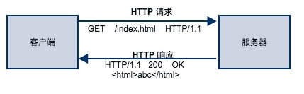
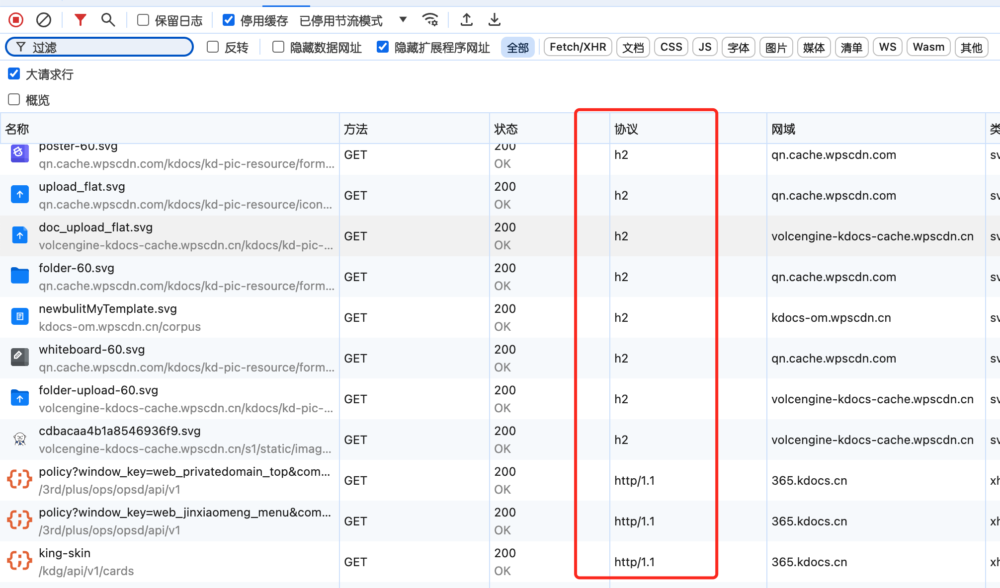
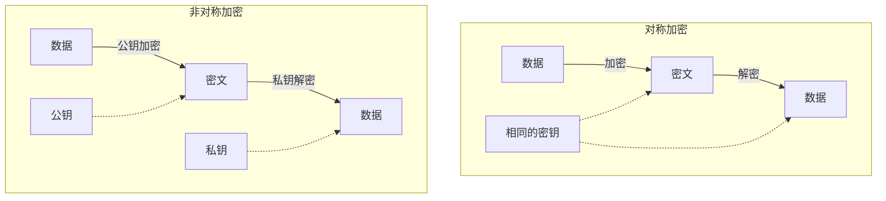
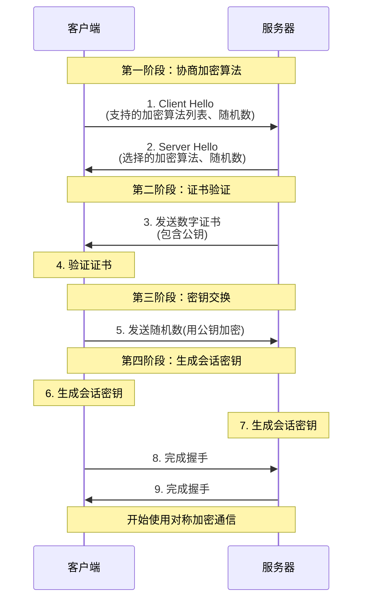
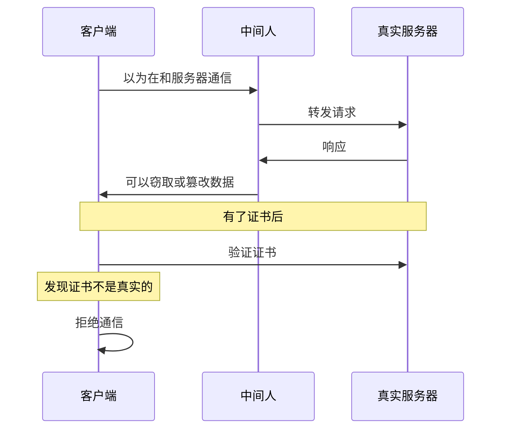

# http&https协议
> 课前说明：本次课程包括比较多的实操，光靠文档是不够的，需要认真听讲。
> 前端开发，理解http协议非常重要。学好本课，有利于后续工作中的代理使用，前后端联调及问题排查，api mock,webpack-dev-server，nginx，甚至是全栈开发等有很大的帮助。
> 课程开始前，可以思考几个问题
> 1. 目前大家用过哪些工具/模块来启动过web服务？他们的应用场景是什么？主要是为了解决什么问题？


课程扩展学习：[前端代理工具的使用](https://campus.wps.cn/contentpreview/f4876c64-57d4-4641-baf6-939db1886870)

# 1. HTTP协议概述
## 1.1 定义与历史背景
HTTP（Hypertext Transfer Protocol）是一种用于从网络传输超文本到本地浏览器的传输协议，是互联网上应用最为广泛的协议之一。它定义了客户端与服务器之间请求和响应的格式。




  

## 1.2 协议的主要特点
HTTP协议具有以下主要特点：

- **简单性**：协议格式简单，易于实现和理解。
- **无状态性**：服务器不会保存关于客户端请求的任何信息，每个请求都是独立的（**注意：理解这个非常重要**）。
- **可扩展性**：通过定义新的HTTP方法和头部，可以不断扩展协议的功能。
- **应用层协议**：HTTP运行在TCP/IP协议栈的应用层，使用明文传输数据，因此易于调试。

# 2. HTTP消息结构
## 2.1 请求消息
HTTP请求由以下几部分组成：

- **请求行**：包含请求方法（如GET、POST）、请求资源的URI和HTTP版本。
- **请求头部**：包含客户端环境信息，如`User-Agent`、`Accept-Language`等。
- **空行**：请求头部和请求体之间的分隔符。
- **请求体**：（可选）POST或PUT请求中携带的数据。

示例：
以下是一个GET示例：
```
GET /index.html HTTP/1.1
Host: www.example.com
User-Agent: Mozilla/5.0

```


## 2.2 响应消息
HTTP响应同样由以下几部分组成：

- **状态行**：包含HTTP版本、状态码和状态信息。
- **响应头部**：包含服务器信息，如`Server`、`Content-Type`等。
- **空行**：响应头部和响应体之间的分隔符。
- **响应体**：服务器返回的内容，如HTML页面、图片等。

示例：
```
HTTP/1.1 200 OK
Content-Type: text/html; charset=UTF-8
Content-Length: 1024

<!DOCTYPE html>
<html>
<head>
    <title>Example Page</title>
</head>
<body>
    <h1>Hello, World!</h1>
</body>
</html>
```

>注意：使用whistle等代理工具，查看HTTP请求可以了解更多细节（实操）。

# 3. HTTP方法
HTTP协议定义了多种请求方法，用于不同的操作：

- **GET**：请求获取资源。
- **POST**：提交数据到服务器，常用于表单提交。
- **PUT**：更新服务器上的资源。
- **DELETE**：删除服务器上的资源。
- **HEAD**：请求获取资源的元数据。
- **OPTIONS**：查询服务器支持的HTTP方法。
  >注意： 有的服务的API并不是基于RESTFUL风格，只有GET/POST，这是正常的。
  >例如：删除用户 `POST /api/deleteuser`，而不是 `DELETE /api/user/123`

# 4. 状态码
HTTP状态码用于表示服务器对请求的处理结果：

- **1xx**：信息性状态码，表示请求已接收，继续处理。
- **2xx**：成功状态码，表示请求已成功处理。
- **3xx**：重定向状态码，表示需要进一步操作以完成请求。
- **4xx**：客户端错误状态码，表示请求包含错误。
- **5xx**：服务器错误状态码，表示服务器处理请求出错。

>注意：上图也是正常的。


# 3. HTTP消息格式
## 3.1 请求消息
请求消息是客户端发送给服务器的HTTP消息，它由请求行、请求头部、空行和请求体四个部分组成。

- **请求行**：包含HTTP方法、请求的资源路径和HTTP版本。例如：`GET /index.html HTTP/1.1`
- **请求头部**：包含请求的附加信息，如`Host`、`User-Agent`、`Accept`等字段。
  - `Host`：请求的服务器地址，如`www.example.com`
  - `User-Agent`：发起请求的浏览器或客户端信息
  - `Accept`：客户端能够接收的媒体类型
- **空行**：请求头部和请求体之间的分隔符，通常是一个回车符和一个换行符。
- **请求体**：可选部分，包含发送给服务器的数据，如表单提交的数据。
  >对于请求体的解析，可以结合koa的body-parser功能理解。


## 3.2 响应消息
响应消息是服务器返回给客户端的HTTP消息，它由状态行、响应头部、空行和响应体四个部分组成。

- **状态行**：包含HTTP版本、状态码和状态信息。例如：`HTTP/1.1 200 OK`
- **响应头部**：包含响应的附加信息，如`Content-Type`、`Content-Length`、`Set-Cookie`等字段。
  - `Content-Type`：响应体的媒体类型，如`text/html`
  - `Content-Length`：响应体的长度
  - `Set-Cookie`：设置客户端的Cookie
- **空行**：响应头部和响应体之间的分隔符。
- **响应体**：服务器返回的数据，如HTML页面、图片、JSON数据等。

### 示例
```
HTTP/1.1 200 OK
Content-Type: text/html; charset=UTF-8
Content-Length: 1024
Set-Cookie: session_id=abc123; Path=/

<!DOCTYPE html>
<html>
<head>
    <title>Example Page</title>
</head>
<body>
    <h1>Welcome to Example.com</h1>
    <p>This is an example page.</p>
</body>
</html>
```
HTTP缓存是前端性能优化中的一个重要概念，它通过减少服务器请求次数来加快页面加载速度。以下是一份详细的HTTP缓存教程，包括原理、分类、设置方法和示例。

## 4. HTTP缓存
HTTP缓存基于HTTP协议的头部信息来控制数据的存储和验证。主要分为两种类型：强制缓存和协商缓存。

### 4.1 强制缓存
- **Expires**: HTTP/1.0中使用，设置资源的过期时间。如果时间未到，直接使用缓存，不与服务器通信。
- **Cache-Control**: HTTP/1.1中使用，提供了更多的控制选项，如`max-age`、`no-store`、`no-cache`等。

### 4.2 协商缓存
- **Last-Modified / If-Modified-Since**: 服务器通过`Last-Modified`头部告知资源最后修改时间，浏览器在再次请求时带上`If-Modified-Since`头部，服务器比较时间判断资源是否更新。
- **ETag / If-None-Match**: 服务器通过`ETag`头部提供资源的唯一标识，浏览器在请求时带上`If-None-Match`头部，服务器根据`ETag`判断资源是否更改。
>也就是上面的两个是成对出现的

### 4.5 示例
以下是使用Node.js设置HTTP缓存的示例：

```javascript
const http = require('http');
const fs = require('fs');
const url = require('url');
const etag = require('etag');

const server = http.createServer((req, res) => {
  const { pathname } = url.parse(req.url);

  if (pathname === '/') {
    const data = fs.readFileSync('./index.html');
    res.setHeader('Cache-Control', 'max-age=31536000'); // 缓存1年
    res.end(data);
  } else if (pathname === '/img/image.png') {
    const data = fs.readFileSync('./img/image.png');
    const etagValue = etag(data);
    res.setHeader('ETag', etagValue);
    if (req.headers['if-none-match'] === etagValue) {
      res.writeHead(304);
      res.end();
    } else {
      res.setHeader('Cache-Control', 'no-cache');
      res.end(data);
    }
  } else {
    res.writeHead(404);
    res.end();
  }
});

server.listen(3000, () => {
  console.log('Server is running on http://localhost:3000');
});
```


# HTTPS
## HTTPS 是什么？

为什么我们需要 HTTPS？想象一下，你正在网上购物，输入了信用卡信息。如果使用普通的 HTTP 协议，这些敏感信息就像是写在明信片上，任何中间人都可以轻易地看到。这就是为什么我们需要 HTTPS！

---

## HTTPS 和 HTTP 的区别

HTTPS = HTTP + SSL/TLS

- HTTP：超文本传输协议，负责传输数据
- SSL/TLS：安全层，负责加密数据

主要区别：

- 安全性：HTTPS 对传输的数据进行加密
- 端口：HTTP 使用 80 端口，HTTPS 使用 443 端口
- URL：HTTP 以 "http://" 开头，HTTPS 以 "https://" 开头
- 证书：HTTPS 需要 SSL 证书

---

## HTTPS 的工作原理

HTTPS 通过 SSL/TLS 协议来保证通信安全，主要解决以下问题：

1. 信息加密：防止信息被窃取
2. 校验机制：防止信息被篡改
3. 身份证书：防止身份被冒充

在了解握手过程之前，我们先来理解两种基本的加密方式：

#### 对称加密和非对称加密的对比



#### 对称加密

- 使用相同的密钥进行加密和解密
- 优点：速度快，适合大量数据传输
- 缺点：密钥分发困难，如何安全地把密钥给对方？

#### 非对称加密

- 使用公钥加密，私钥解密
- 优点：安全性高，解决了密钥分发问题
- 缺点：计算速度慢，不适合大量数据加密

HTTPS 巧妙地结合了这两种加密方式：

- 使用非对称加密传输对称加密的密钥
- 使用对称加密传输实际数据

让我们通过一个形象的例子来理解这个过程：

---

## HTTPS 握手过程

让我们详细了解一下 HTTPS 的握手过程（也称为 SSL/TLS 握手）：



#### 第一阶段：协商加密算法

1. 客户端发送 "Client Hello" 消息

   - 支持的加密算法列表
   - 随机数（Client Random）
   - SSL/TLS 版本号

2. 服务器回应 "Server Hello" 消息
   - 选择使用的加密算法
   - 随机数（Server Random）
   - 确认 SSL/TLS 版本

#### 第二阶段：证书验证

3. 服务器发送数字证书

   - 包含服务器的公钥
   - 证书包含域名、有效期等信息
   - 由可信的证书颁发机构（CA）签名

4. 客户端验证证书
   - 检查证书是否由可信的 CA 签发
   - 验证证书的有效期
   - 验证域名是否匹配

#### 第三阶段：密钥交换

5. 客户端生成随机数（Pre-master secret）
   - 使用服务器的公钥加密
   - 发送给服务器

#### 第四阶段：生成会话密钥

6. 客户端生成会话密钥

   - 使用三个随机数：
     - Client Random
     - Server Random
     - Pre-master secret

7. 服务器生成会话密钥

   - 使用相同的三个随机数
   - 生成相同的会话密钥

8. 双方互相发送 "Finished" 消息
   - 使用会话密钥加密
   - 确认握手完成

---

## 为什么要这么复杂？

小明问："为什么不直接使用非对称加密（公钥加密）进行通信呢？"

这是因为：

1. 性能考虑：非对称加密计算量大，速度慢
2. 安全考虑：使用多个随机数生成密钥，提高安全性
3. 灵活性：可以定期更换会话密钥

#### 防范中间人攻击

想象一下没有证书的情况：

1. 黑客可以冒充服务器
2. 客户端无法确认服务器身份
3. 黑客可以窃取或篡改数据



这就是为什么我们需要证书：

- 证书由可信的第三方（CA）签发
- 包含服务器的公钥和域名信息
- 客户端可以验证证书的真实性

---

## HTTPS 的特点

优点：

- 数据加密：防止被窃听
- 数据完整：防止被篡改
- 身份认证：防止冒充

缺点：

- 需要购买证书
- 加解密会消耗更多服务器资源
- 首次握手时间略长

---

## 实践：如何部署 HTTPS？

1. 获取 SSL 证书

   - 付费证书：适合商业网站
   - 免费证书：Let's Encrypt

2. 安装证书

```shell
## Nginx配置示例
server {
    listen 443 ssl;
    server_name example.com;

    ssl_certificate /path/to/certificate.crt;
    ssl_certificate_key /path/to/private.key;
}
```

3. 配置强制 HTTPS

```shell
server {
    listen 80;
    server_name example.com;
    return 301 https://$server_name$request_uri;
}
```

---

## 小练习

1. 访问一个 HTTPS 网站（如 https://www.github.com）
2. 点击浏览器地址栏的锁标志
3. 查看证书信息
   - 谁签发的证书？
   - 证书有效期是多久？
   - 使用了什么加密算法？

---

### 总结

HTTPS 通过以下方式保证安全：

- 使用数字证书验证身份
- 使用非对称加密交换密钥
- 使用对称加密传输数据
