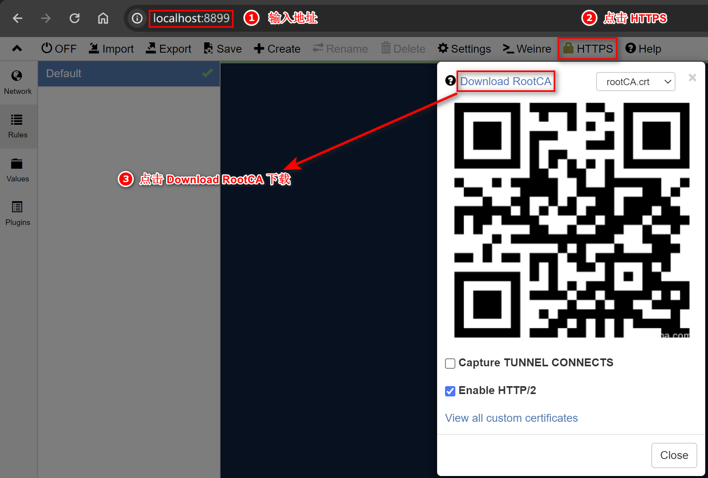
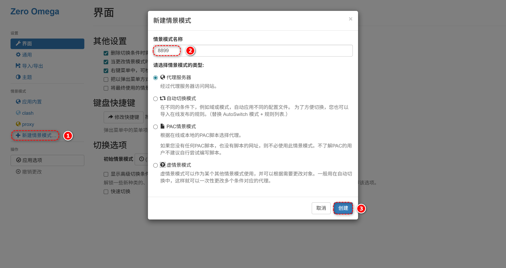

# Whistle 和 Postman 使用

来源：

- https://365.kdocs.cn/l/cv1kSuuEihXc

# 如何安装和使用 Whistle

## 安装视频

- 链接：[https://pan.baidu.com/s/1NyG1ynmNVLBfXK_aKwzG7Q](https://pan.baidu.com/s/1NyG1ynmNVLBfXK_aKwzG7Q)
- 提取码：`xm37`

因为本地使用 Live Server 启动 `127.0.0.1` 服务，浏览器中要向 [https://api.juejin.cn](https://api.juejin.cn/) 发请求的话，会有跨域限制，可以使用代理工具进行处理跨域，这里介绍 [whistle](https://wproxy.org/whistle/) 的使用。

## 1. 安装和启动 whistle

```bash
# 全局安装
npm i whistle -g

# 启动
w2 start

# 或者，公司里面要用下面方式启动并设置复杂密码
w2 start -n username -w x8#Xq2$kP!9zY&3wR*5vB
```

## 2. 安装配置 whistle 证书



## 3. 安装配置 ZeroOmega

3. 安装配置 [ZeroOmega](https://github.com/zero-peak/ZeroOmega)

Chrome 中安装此插件需要科学上网，若不能，可通过[这儿](https://chrome.zzzmh.cn/info/pfnededegaaopdmhkdmcofjmoldfiped)下载。



## 说明

- 该条目在课程总目录中的显示名称为“Whistle 和 Postman 使用”。
- WPS 页面标题为“如何安装和使用 Whistle”。
- 这篇文档的正文文字很少，主体内容本身就是“短说明 + 命令 + 操作图”，所以我保留了原文字并把页面中的原图放到了本地 `assets/`。
