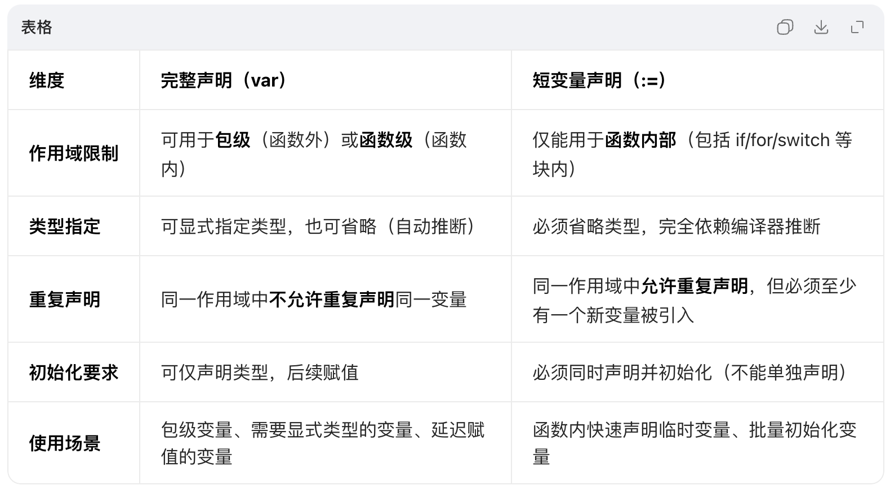

# 语言特性：变量、常量的声明与使用，命令规则

来源：
- https://campus.wps.cn/contentpreview/7c70cc86-94ca-439b-b089-278ba3d6d311

# Go语言基础：语言特性、语法基础与数据类型

教学仓库：<https://git.wpsit.cn/web/go-demos>

# 1. Go语言的主要特征

Go语言（Golang）由Google于2009年推出，设计目标是解决大规模系统开发中的效率与复杂度问题。其核心特征可概括为**简洁、高效、并发友好**，具体表现为：

## 1.1 简洁性

- **语法精炼**：仅包含25个关键字，去除传统语言中的冗余特性（如类继承、构造函数）
- **强制代码格式化**：内置`gofmt`工具统一代码风格，减少团队协作中的格式争议
- **极简依赖管理**：通过`go mod`实现模块化，无需复杂配置

```
// 对比Java的Hello World，Go的简洁性一目了然
package main

import "fmt"

func main() {
    fmt.Println("Hello, World!") // 一行完成输出，无需类定义
}
```

## 1.2 原生并发支持

- **Goroutine轻量级线程**：由Go运行时管理，初始栈大小仅2KB，可创建数十万并发任务
- **Channel通信机制**：通过`<-`操作符实现goroutine间安全通信，避免共享内存冲突
- **Select多路复用**：同时监听多个channel操作，实现高效I/O多路复用

```
// 并发示例：启动1000个goroutine并行执行
package main

import (
    "fmt"
    "time"
)

func task(id int, ch chan<- string) {
    time.Sleep(100 * time.Millisecond)
    ch <- fmt.Sprintf("任务%d完成", id)
}

func main() {
    ch := make(chan string, 1000)
    for i := 0; i < 1000; i++ {
        go task(i, ch) // 启动goroutine
    }
    
    for i := 0; i < 1000; i++ {
        fmt.Println(<-ch) // 接收结果
    }
}
```

## 1.3 内存安全与性能

- **自动垃圾回收**：基于三色标记法的并发GC，延迟低至微秒级
- **静态类型检查**：编译期捕获类型错误，避免运行时异常
- **编译速度快**：采用单遍编译，大型项目编译时间通常在秒级

## 1.4 跨平台与标准库

- **一次编译，到处运行**：支持Windows/macOS/Linux等10+操作系统架构
- **丰富标准库**：内置HTTP服务器、JSON解析、加密算法等实用模块，开箱即用

# 2. 内置类型和函数

## 2.1 内置基础类型

Go语言提供**19种内置基础类型**，可分为四大类：

| 类型类别 | 具体类型 | 占用空间 | 说明 |
| --- | --- | --- | --- |
| **整数类型** | `int8`, `int16`, `int32`, `int64` | 1, 2, 4, 8字节 | 有符号整数 |
|  | `uint8`, `uint16`, `uint32`, `uint64` | 1, 2, 4, 8字节 | 无符号整数 |
|  | `int`, `uint` | 与系统位数一致 | 通常为64位（现代系统） |
|  | `byte` (uint8别名), `rune` (int32别名) | 1, 4字节 | 字节类型，Unicode码点 |
| **浮点数类型** | `float32`, `float64` | 4, 8字节 | IEEE 754标准浮点数 |
|  | `complex64`, `complex128` | 8, 16字节 | 复数类型（实部+虚部） |
| **布尔类型** | `bool` | 1字节 | 取值`true`/`false`，不可参与算术运算 |
| **字符串类型** | `string` | 动态长度 | UTF-8编码的不可变字节序列 |

## 2.2 常用内置函数

Go提供**15个内置函数**，无需导入即可使用，核心函数包括：

| 函数名 | 功能描述 | 示例 |
| --- | --- | --- |
| `len()` | 返回集合/字符串长度 | `len("hello") → 5` |
| `cap()` | 返回切片/通道容量 | `cap(make([]int, 2, 5)) → 5` |
| `make()` | 创建切片、映射、通道 | `make(map[string]int) → 空map` |
| `new()` | 分配内存并返回指针 | `new(int) → *int` |
| `append()` | 向切片追加元素 | `append([]int{1}, 2) → [1,2]` |
| `panic()` | 触发运行时错误 | `panic("invalid input")` |
| `recover()` | 捕获panic异常 | `defer func(){ recover() }()` |

> ⚠️ 注意：内置函数不能被重定义，且部分函数（如`append`）的行为因参数类型不同而变化

# 3. Init函数和main函数

Go程序的执行入口是`main`包中的`main()`函数，但在`main()`执行前会先执行所有`init()`函数。

## 3.1 init函数特性

- **无参数无返回值**：`func init() {}`
- **自动执行**：无需显式调用，由Go运行时自动调用
- **执行顺序**：
  1. 同包内多个init函数按**出现顺序**执行
  2. 不同包按**导入依赖顺序**执行（被依赖包先执行）
  3. 所有init函数执行完毕后，才执行`main()`函数

```
// 包初始化示例（文件名：demo.go）
package main

import "fmt"

// 第一个init函数
func init() {
    fmt.Println("init 1 executed")
}

// 第二个init函数
func init() {
    fmt.Println("init 2 executed")
}

func main() {
    fmt.Println("main executed")
}

// 输出顺序：
// init 1 executed
// init 2 executed
// main executed
```

## 3.2 main函数规则

- 必须声明在`main`包中：`package main`
- 无参数无返回值：`func main() {}`
- 程序入口唯一：一个项目只能有一个`main()`函数
- 命令行参数通过`os.Args`获取：

```
package main

import (
    "fmt"
    "os"
)

func main() {
    fmt.Println("命令行参数：", os.Args) // os.Args[0]为程序名
}
```

# 4. 运算符与下划线

## 4.1 运算符分类

Go语言支持**5类运算符**，优先级从高到低为：

| 类别 | 运算符示例 | 说明 |
| --- | --- | --- |
| 算术运算符 | `+`, `-`, `*`, `/`, `%` | 取余运算结果符号与被除数一致 |
| 比较运算符 | `==`, `!=`, `<`, `>`, `<=`, `>=` | 返回布尔值 |
| 逻辑运算符 | `&&`, ` |  |
| 位运算符 | `&`, ` | `,` ^`, `<<`, `>>` |
| 赋值运算符 | `=`, `+=`, `-=`, `*=` | 复合赋值 |

> 💡 技巧：不确定优先级时，使用括号明确运算顺序，如`(a + b) * c`

## 4.2 下划线（空白标识符）

下划线`_`是Go的特殊标识符，用于**忽略不需要的值**，主要场景：

1. **忽略函数返回值**：

```
_, err := os.Open("file.txt") // 只关心错误，忽略文件句柄
if err != nil { /* 处理错误 */ }
```

2. **导入包仅执行init**：

```
import _ "github.com/lib/pq" // 执行pq包的init函数，注册数据库驱动
```

3. **忽略循环索引**：

```
for _, v := range []string{"a", "b"} { // 只需要值，不需要索引
    fmt.Println(v)
}
```

> ⚠️ 注意：下划线不能作为变量使用，如`_ = 10`是合法的（忽略值），但`_++`会报错

# 5. 代码注释

良好的注释是代码可维护性的关键，Go支持两种注释风格：

## 5.1 单行注释

使用`//`标记，适用于单行说明：

```
// calculateSum 计算两个整数的和
func calculateSum(a, b int) int {
    return a + b // 返回求和结果
}
```

## 5.2 多行注释

使用`/* */`包裹，适用于多行说明或临时注释代码块：

```
/*
  User 表示系统用户
  - ID: 用户唯一标识
  - Name: 用户名（非空）
*/
type User struct {
    ID   int
    Name string
}

/* 调试用代码，生产环境注释掉
fmt.Println("临时调试信息")
*/
```

## 5.3 文档注释规范

为包、函数、类型编写的注释会被`godoc`工具提取为文档，需遵循：

- 包注释放在`package`声明前，使用多行注释
- 函数/类型注释以**名称开头**，使用单行注释

```
// Package math 提供基本数学运算函数
package math

// Add 计算a和b的和
// 参数：
//   a: 第一个加数
//   b: 第二个加数
// 返回值：a与b的算术和
func Add(a, b int) int {
    return a + b
}
```

# 6. 变量与常量

## 6.1 变量声明与使用

变量是程序运行时可修改的存储单元，Go提供**四种声明方式**：

## 完整声明（显式类型）

```
var age int       // 声明变量，默认值0
var name string   // 默认值""（空字符串）
var isActive bool // 默认值false
```

## 初始化声明（类型推断）

```
var score = 95.5  // 自动推断为float64类型
var username = "alice" // 自动推断为string类型
```

## 短变量声明（函数内使用）

```
func main() {
    count := 10      // 等价于 var count int = 10
    message := "ok"  // 仅能在函数内部使用
}
```

## 多变量声明

```
// 批量声明
var (
    a int     = 1
    b string  = "hello"
    c bool    = true
)

// 平行赋值
x, y := 10, 20
x, y = y, x // 交换变量值，无需临时变量
```



## 6.2 常量声明与iota

常量是编译期确定的不可变值，使用`const`声明：

## 基本常量

```
const Pi = 3.1415926
const MaxSize = 1024
const Enabled = true
```

## iota枚举

`iota`是特殊常量生成器，从0开始自动递增，用于创建枚举：

```
const (
    Sunday    = iota // 0
    Monday           // 1（自动递增）
    Tuesday          // 2
    Wednesday        // 3
)

// 带表达式的iota
const (
    _  = iota             // 0，忽略
    KB = 1 << (10 * iota) // 1 << 10 = 1024 (2^10)
    MB                    // 1 << 20 = 1048576 (2^20)
    GB                    // 1 << 30 = 1073741824 (2^30)
)
```

# 7. 基本类型详解

[数据类型：整型与浮点型](https://go.sixue.work/golang/c01/c01_03.html)

## 7.1 整数类型

Go提供丰富的整数类型，选择原则：

- 明确大小需求时使用固定长度类型（如`int32`）
- 不确定时使用`int`（与系统位数匹配，性能最优）

```
var a int8 = 127   // 范围：-128~127
var b uint8 = 255  // 范围：0~255
var c int = 9223372036854775807 // 64位系统下int的最大值
```

> ⚠️ 整数溢出：Go不会自动处理溢出，需手动确保值在类型范围内

## 7.2 浮点数类型

- `float32`：精度约6位小数，适合内存受限场景
- `float64`：精度约15位小数，默认浮点类型，推荐优先使用

```
var f1 float32 = 3.14
var f2 float64 = 2.71828
var f3 = 0.5 // 自动推断为float64
```

> 💡 注意：浮点数比较需谨慎，因精度问题应避免直接使用`==`，建议比较差值绝对值

## 7.3 字符串类型

[数据类型：byte、rune与字符串](https://go.sixue.work/golang/c01/c01_04.html)

字符串是**不可变的UTF-8字节序列**，支持多种操作：

```
s1 := "hello"
s2 := `多行
字符串` // 原始字符串，保留换行和空格

// 常用操作
len(s1)        // 5（字节长度）
s1[0]          // 'h'（获取字节）
s1 + s2        // 字符串拼接
"a" == "b"     // false（比较内容）
```

> 🔤 Unicode处理：`rune`类型用于表示UTF-8字符，`[]rune(s)`可将字符串转为Unicode码点切片  
> Emoji 是 Unicode 字符集的一部分，每个 Emoji 都有一个唯一的 Unicode 码点。

[ASCII、Unicode 和 UTF-8 详解](https://www.ruanyifeng.com/blog/2007/10/ascii_unicode_and_utf-8.html)

```
package main

import (
	"fmt"
)

func main() {
	// 示例字符串，包含英文字符和中文字符
	str := "Hello, 世界！Go 是 UTF-8 编码的示例。😀 🌍 ❤️"

	// 遍历字符串中的每个字符（rune）
	for _, char := range str {
		// 打印字符的 Unicode 码点（十进制和十六进制表示）
		fmt.Printf("字符: '%c', Unicode 码点: U+%04X (十进制: %d)\n", char, char, char)
	}
}
```

## 7.4 布尔类型

[数据类型：布尔类型 (Boolean)](https://go.sixue.work/golang/c01/c01_07.html)

布尔值仅能为`true`或`false`，**不能参与算术运算**：

```
var valid bool = true
if valid {
    // 条件执行
}

// 错误示例：布尔值不能与整数混用
// result := true + 1 // 编译错误
```

# 8. 总结与实践建议

本章介绍了Go语言的核心特性和基础语法，重点包括：

1. Go通过简洁设计、原生并发和高效性能成为系统开发利器
2. 内置类型和函数提供基础构建块，需熟练掌握其特性
3. init/main函数控制程序启动流程，理解执行顺序至关重要
4. 变量/常量管理内存数据，iota简化枚举定义
5. 代码注释不仅是说明，更是文档的重要组成部分

**实践建议**：

- 使用`go vet`检查代码规范问题
- 通过`godoc -http=:6060`查看标准库文档
- 编写代码时遵循"简洁优先"原则，避免过度设计

下一章将深入探讨函数、控制结构和标准库的使用，为构建实际应用打下基础。

# 其他教程

<https://www.topgoer.com/go%E5%9F%BA%E7%A1%80/>
