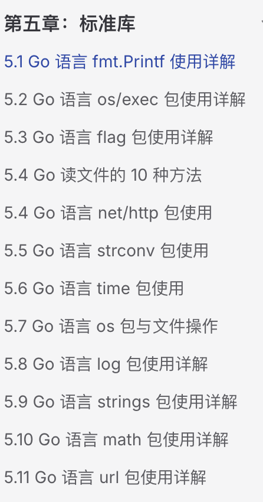

# 常用标准库（fmt，time，flag，io）

来源：
- https://campus.wps.cn/contentpreview/8ab76a10-921c-4d05-84a2-46457236cd78

# 常用标准库

[go编程时光](https://go.sixue.work/)  


# fmt 标准库 - 格式化输入输出

## 常用函数

- `fmt.Println()`: 打印内容并换行
- `fmt.Printf()`: 格式化打印
- `fmt.Sprintf()`: 格式化字符串并返回
- `fmt.Scanf()`: 格式化输入

## 实例

```
package main

import "fmt"

func main() {
    // 基本打印
    fmt.Println("Hello, Go!") // 输出: Hello, Go!

    // 格式化打印
    name := "张三"
    age := 25
    fmt.Printf("姓名: %s, 年龄: %d\n", name, age) // 输出: 姓名: 张三, 年龄: 25

    // 格式化字符串并返回
    s := fmt.Sprintf("姓名: %s, 年龄: %d", name, age)
    fmt.Println(s) // 输出: 姓名: 张三, 年龄: 25

    // 结构体打印
    type Person struct {
        Name string
        Age  int
    }
    p := Person{Name: "李四", Age: 30}
    fmt.Printf("%v\n", p)   // 输出: {李四 30}
    fmt.Printf("%+v\n", p)  // 输出: {Name:李四 Age:30}
    fmt.Printf("%#v\n", p)  // 输出: main.Person{Name:"李四", Age:30}
    fmt.Printf("%T\n", p)   // 输出: main.Person
}
```

## 小练习

1. 编写一个程序，使用 fmt 包格式化输出包含姓名、年龄、身高的个人信息，身高使用浮点数表示。
2. 尝试使用 fmt.Scanf()函数从控制台读取用户输入的个人信息。

# time 标准库 - 时间处理

## 常用函数与类型

- `time.Now()`: 获取当前时间
- `time.Date()`: 创建指定时间
- `time.Parse()`: 解析时间字符串
- `time.Format()`: 格式化时间为字符串
- `time.Sleep()`: 休眠指定时间

## 时间格式化模板

## 实例

```
package main

import (
    "fmt"
    "time"
)

func main() {
    // 获取当前时间
    now := time.Now()
    fmt.Println("当前时间:", now)

    // 创建指定时间
    t := time.Date(2023, time.October, 1, 10, 30, 0, 0, time.Local)
    fmt.Println("指定时间:", t)

    // 时间格式化
    fmt.Println("格式化时间(yyyy-MM-dd):", now.Format("2006-01-02"))
    fmt.Println("格式化时间(yyyy-MM-dd HH:mm:ss):", now.Format("2006-01-02 15:04:05"))

    // 时间解析
    timeStr := "2023-10-01 10:30:00"
    parsedTime, err := time.Parse("2006-01-02 15:04:05", timeStr)
    if err == nil {
        fmt.Println("解析的时间:", parsedTime)
    }

    // 时间计算
    tomorrow := now.Add(24 * time.Hour)
    fmt.Println("明天:", tomorrow.Format("2006-01-02"))

    // 时间间隔
    duration := tomorrow.Sub(now)
    fmt.Printf("距离明天还有: %.2f 小时\n", duration.Hours())

    // 休眠示例
    fmt.Println("休眠前:", time.Now().Format("15:04:05"))
    time.Sleep(2 * time.Second) // 休眠2秒
    fmt.Println("休眠后:", time.Now().Format("15:04:05"))
}
```

## 小练习

1. 编写一个程序，计算你的确切年龄（精确到天）。
2. 创建一个简单的倒计时程序，从 10 秒开始倒计时。

# flag 标准库 - 命令行参数解析

## 常用函数

- `flag.String()`, `flag.Int()`, `flag.Bool()`: 定义命令行参数
- `flag.Parse()`: 解析命令行参数
- `flag.Args()`: 获取非选项参数
- `flag.Usage()`: 打印使用说明

## 实例

```
package main

import (
    "flag"
    "fmt"
)

func main() {
    // 定义命令行参数
    name := flag.String("name", "世界", "姓名")
    age := flag.Int("age", 0, "年龄")
    married := flag.Bool("married", false, "是否已婚")

    // 解析命令行参数
    flag.Parse()

    // 使用参数
    fmt.Printf("你好, %s!\n", *name)

    if *age > 0 {
        fmt.Printf("你的年龄是: %d\n", *age)
    }

    if *married {
        fmt.Println("你已婚")
    } else {
        fmt.Println("你未婚")
    }

    // 获取非选项参数
    fmt.Println("其他参数:", flag.Args())
}
```

## 运行方式

```
go run main.go -name=张三 -age=25 -married 其他参数1 其他参数2
```

## 小练习

1. 编写一个计算器程序，通过命令行参数接收两个数字和一个操作符，然后输出计算结果。
2. 增强上面的程序，添加一个帮助选项，当用户使用 `-help` 参数时，显示程序的使用说明。

# io 标准库 - 输入输出接口

## 基本概念

### 什么是 I/O？

I/O 是 Input/Output 的缩写，即输入/输出。在计算机中，I/O 是指计算机与外部世界进行数据交换的过程。

### 输入 (Input)

- 数据从外部设备流向计算机
- 例如：键盘输入、鼠标点击、文件读取、网络数据接收等

### 输出 (Output)

- 数据从计算机流向外部设备
- 例如：屏幕显示、文件写入、网络数据发送、打印机输出等

## I/O 的重要性

### 人机交互的基础

- 通过输入设备获取用户指令
- 通过输出设备展示结果

### 数据持久化的关键

- 将数据保存到文件或数据库中
- 从存储设备读取数据

### 网络通信的核心

- 通过网络接口发送和接收数据
- 实现分布式系统间的通信

## Go 语言中的 I/O

Go 语言通过 io 包提供了统一的 I/O 接口，使得我们可以用相同的方式处理不同的 I/O 操作，例如：

- 文件读写
- 网络通信
- 内存缓冲区操作
- 字符串处理

这种设计遵循了 Go 语言的接口设计哲学：通过小接口组合实现复杂功能。

## 主要接口

- `io.Reader`: 读取接口
- `io.Writer`: 写入接口
- `io.Closer`: 关闭接口
- `io.ReadWriter`: 读写接口
- `io.ReadCloser`: 读取并关闭接口
- `io.WriteCloser`: 写入并关闭接口

## 实例

```
package main

// 导入需要使用的包
import (
    "fmt"     // 用于格式化输入输出
    "io"      // 提供I/O原语的基本接口
    "os"      // 提供操作系统功能
    "strings" // 提供字符串操作相关功能
)

func main() {
    // 创建一个字符串Reader
    // strings.NewReader 将字符串转换为一个实现了 io.Reader 接口的对象
    // 这样我们就可以像读取文件一样读取字符串
    r := strings.NewReader("Hello, Go I/O!")

    // 创建一个字节切片作为缓冲区
    // 大小为8字节，用于存储每次读取的数据
    // 缓冲区大小的选择会影响读取效率
    buf := make([]byte, 8)

    // 使用无限循环读取数据
    // 每次读取最多8个字节（缓冲区的大小）
    for {
        // r.Read 返回读取的字节数和可能的错误
        // n 表示实际读取的字节数
        n, err := r.Read(buf)

        // io.EOF（End Of File）表示已经读到数据末尾
        if err == io.EOF {
            break // 结束循环
        }

        // 处理其他可能的错误
        if err != nil {
            fmt.Println("读取错误:", err)
            break
        }

        // 打印读取的内容
        // buf[:n] 表示只取实际读取的字节数量
        fmt.Printf("读取了 %d 字节: %s\n", n, buf[:n])
    }

    // 获取标准输出的Writer
    // os.Stdout 是一个 *File 类型，实现了 io.Writer 接口
    w := os.Stdout

    // 直接写入字节切片到标准输出
    // Write 方法接收一个字节切片作为参数
    w.Write([]byte("这是写入到标准输出的内容\n"))

    // 演示使用 io.Copy 进行数据复制
    fmt.Println("\n使用io.Copy复制数据:")
    // 重新创建一个新的Reader
    r = strings.NewReader("这是使用io.Copy复制的数据!")
    // io.Copy 会自动处理数据复制，直到遇到EOF
    // 它内部会自动处理缓冲，比手动循环更方便
    io.Copy(w, r)
    fmt.Println() // 添加最后的换行
}
```

## io/ioutil 包的废弃说明

从 Go 1.16 版本开始，io/ioutil 包已被废弃。原 io/ioutil 包中的功能已经移到了 io 包和 os 包中。在编写新代码时，应该使用以下替代方案：

- ioutil.ReadAll -> io.ReadAll
- ioutil.ReadFile -> os.ReadFile
- ioutil.WriteFile -> os.WriteFile
- ioutil.ReadDir -> os.ReadDir
- ioutil.NopCloser -> io.NopCloser
- ioutil.TempDir -> os.MkdirTemp
- ioutil.TempFile -> os.CreateTemp

这个变更是为了让 Go 标准库的组织更加合理，将文件操作相关的功能都放在 os 包中，将通用的 I/O 操作放在 io 包中。

以下是使用新包的示例代码：

```
package main

import (
    "fmt"
    "io"
    "os"
)

func main() {
    // 读取整个文件
    content, err := os.ReadFile("example.txt")
    if err != nil {
        fmt.Println("读取文件错误:", err)
        return
    }
    fmt.Println("文件内容:", string(content))

    // 写入整个文件
    err = os.WriteFile("output.txt", []byte("Hello, Go I/O!"), 0644)
    if err != nil {
        fmt.Println("写入文件错误:", err)
        return
    }

    // 创建临时文件
    tempFile, err := os.CreateTemp("", "example")
    if err != nil {
        fmt.Println("创建临时文件错误:", err)
        return
    }
    defer os.Remove(tempFile.Name()) // 确保删除临时文件

    fmt.Println("创建的临时文件:", tempFile.Name())

    // 从文件中读取所有内容
    f, err := os.Open("example.txt")
    if err != nil {
        fmt.Println("打开文件错误:", err)
        return
    }
    defer f.Close()

    // 使用io.ReadAll替代ioutil.ReadAll
    data, err := io.ReadAll(f)
    if err != nil {
        fmt.Println("读取文件错误:", err)
        return
    }
    fmt.Println("文件内容:", string(data))
}
```

## 小练习

1. 编写一个程序，从一个文本文件中读取内容，并计算文本中的字符数、单词数和行数。
2. 编写一个程序，将一个文本文件的内容复制到另一个文件，但所有字母都转为大写。

# os 标准库 - 操作系统功能与文件处理

## 常用函数与常量

- `os.Create()`: 创建文件
- `os.Open()`: 打开文件
- `os.OpenFile()`: 以更多选项打开文件
- `os.Remove()`: 删除文件
- `os.Mkdir()`, `os.MkdirAll()`: 创建目录
- `os.Getwd()`, `os.Chdir()`: 获取/更改当前工作目录
- `os.Stat()`: 获取文件信息
- `os.Rename()`: 重命名文件
- `os.Chmod()`: 更改文件权限

## 文件操作实例

```
package main

import (
    "fmt"
    "io/ioutil"
    "os"
)

func main() {
    // 创建文件
    file, err := os.Create("example.txt")
    if err != nil {
        fmt.Println("创建文件错误:", err)
        return
    }

    // 确保文件关闭
    defer file.Close()

    // 写入文件
    data := []byte("你好，这是一个示例文件！\n这是第二行内容。")
    n, err := file.Write(data)
    if err != nil {
        fmt.Println("写入文件错误:", err)
        return
    }
    fmt.Printf("成功写入 %d 字节到文件\n", n)

    // 打开文件进行读取
    readFile, err := os.Open("example.txt")
    if err != nil {
        fmt.Println("打开文件错误:", err)
        return
    }
    defer readFile.Close()

    // 读取文件内容
    content, err := ioutil.ReadAll(readFile)
    if err != nil {
        fmt.Println("读取文件错误:", err)
        return
    }
    fmt.Println("文件内容:")
    fmt.Println(string(content))

    // 获取文件信息
    fileInfo, err := os.Stat("example.txt")
    if err != nil {
        fmt.Println("获取文件信息错误:", err)
        return
    }
    fmt.Printf("文件名: %s\n", fileInfo.Name())
    fmt.Printf("文件大小: %d 字节\n", fileInfo.Size())
    fmt.Printf("文件权限: %v\n", fileInfo.Mode())
    fmt.Printf("最后修改时间: %v\n", fileInfo.ModTime())

    // 重命名文件
    err = os.Rename("example.txt", "renamed.txt")
    if err != nil {
        fmt.Println("重命名文件错误:", err)
        return
    }
    fmt.Println("文件已重命名为 renamed.txt")

    // 最后删除文件
    err = os.Remove("renamed.txt")
    if err != nil {
        fmt.Println("删除文件错误:", err)
        return
    }
    fmt.Println("文件已删除")
}
```

## 目录操作实例

```
package main

import (
    "fmt"
    "os"
    "path/filepath"
)

func main() {
    // 创建目录
    err := os.Mkdir("testdir", 0755)
    if err != nil {
        fmt.Println("创建目录错误:", err)
        return
    }
    fmt.Println("目录已创建")

    // 创建嵌套目录
    err = os.MkdirAll("testdir/subdir/subsubdir", 0755)
    if err != nil {
        fmt.Println("创建嵌套目录错误:", err)
        return
    }
    fmt.Println("嵌套目录已创建")

    // 创建文件到子目录
    file, err := os.Create("testdir/subdir/test.txt")
    if err != nil {
        fmt.Println("创建文件错误:", err)
        return
    }
    file.WriteString("测试内容")
    file.Close()

    // 获取当前工作目录
    currentDir, err := os.Getwd()
    if err != nil {
        fmt.Println("获取当前目录错误:", err)
        return
    }
    fmt.Println("当前工作目录:", currentDir)

    // 遍历目录
    fmt.Println("遍历目录:")
    err = filepath.Walk("testdir", func(path string, info os.FileInfo, err error) error {
        if err != nil {
            return err
        }
        fmt.Printf("%-40s %-10v %8d 字节\n", path, info.IsDir(), info.Size())
        return nil
    })
    if err != nil {
        fmt.Println("遍历目录错误:", err)
    }

    // 读取目录内容
    fmt.Println("\n读取顶层目录内容:")
    entries, err := os.ReadDir("testdir")
    if err != nil {
        fmt.Println("读取目录错误:", err)
        return
    }

    for _, entry := range entries {
        info, _ := entry.Info()
        fmt.Printf("%-20s %-10v %8d 字节\n", entry.Name(), entry.IsDir(), info.Size())
    }

    // 清理：删除目录及其内容
    err = os.RemoveAll("testdir")
    if err != nil {
        fmt.Println("删除目录错误:", err)
        return
    }
    fmt.Println("\n目录及其内容已删除")
}
```

## 文件权限与环境变量

```
package main

import (
    "fmt"
    "os"
)

func main() {
    // 创建文件并设置权限
    file, err := os.OpenFile("permission.txt", os.O_CREATE|os.O_WRONLY, 0644)
    if err != nil {
        fmt.Println("创建文件错误:", err)
        return
    }
    file.Close()

    // 修改文件权限
    err = os.Chmod("permission.txt", 0755)
    if err != nil {
        fmt.Println("修改权限错误:", err)
        return
    }
    fmt.Println("文件权限已修改为 0755")

    // 获取环境变量
    home := os.Getenv("HOME")
    fmt.Println("HOME 环境变量:", home)

    // 设置环境变量
    err = os.Setenv("MY_VARIABLE", "hello")
    if err != nil {
        fmt.Println("设置环境变量错误:", err)
        return
    }

    // 读取环境变量
    value := os.Getenv("MY_VARIABLE")
    fmt.Println("MY_VARIABLE 环境变量:", value)

    // 获取所有环境变量
    fmt.Println("\n部分环境变量:")
    count := 0
    for _, env := range os.Environ() {
        if count < 5 { // 只显示前5个，避免输出过多
            fmt.Println(env)
            count++
        } else {
            break
        }
    }

    // 清理
    os.Remove("permission.txt")
}
```

## os 与 io/ioutil 的区别

- os.OpenFile() 可以指定更多的选项，如读写模式、权限等。
- ioutil.ReadFile() 和 ioutil.WriteFile() 是 ioutil 包提供的便捷函数，用于简化文件操作。

## 小练习

1. 编写一个程序，递归地列出指定目录下的所有文件和子目录，并显示每个文件的大小和修改时间。
2. 创建一个简单的文件备份工具，接受一个文件路径作为参数，创建该文件的备份（添加时间戳到文件名）。
3. 编写一个程序，读取一个目录中的所有文本文件，并统计每个文件中出现的单词频率。

# strconv 标准库 - 字符串转换

## 常用函数

- `strconv.Itoa()`: 整数转字符串
- `strconv.Atoi()`: 字符串转整数
- `strconv.ParseBool()`: 解析布尔值
- `strconv.ParseFloat()`: 解析浮点数
- `strconv.ParseInt()`: 解析整数
- `strconv.FormatBool()`: 格式化布尔值
- `strconv.FormatFloat()`: 格式化浮点数
- `strconv.FormatInt()`: 格式化整数

## 实例

```
package main

import (
    "fmt"
    "strconv"
)

func main() {
    // 整数与字符串转换
    i := 42
    s := strconv.Itoa(i) // 整数转字符串
    fmt.Printf("整数 %d 转字符串: %s\n", i, s)

    s = "42"
    i, err := strconv.Atoi(s) // 字符串转整数
    if err == nil {
        fmt.Printf("字符串 %s 转整数: %d\n", s, i)
    }

    // 解析布尔值
    b, err := strconv.ParseBool("true")
    if err == nil {
        fmt.Printf("解析的布尔值: %t\n", b)
    }

    // 解析浮点数
    f, err := strconv.ParseFloat("3.14159", 64)
    if err == nil {
        fmt.Printf("解析的浮点数: %f\n", f)
    }

    // 解析整数(带基数)
    i, err = strconv.ParseInt("1010", 2, 64) // 二进制解析
    if err == nil {
        fmt.Printf("二进制 1010 解析为: %d\n", i)
    }

    i, err = strconv.ParseInt("FF", 16, 64) // 十六进制解析
    if err == nil {
        fmt.Printf("十六进制 FF 解析为: %d\n", i)
    }

    // 格式化布尔值
    s = strconv.FormatBool(true)
    fmt.Printf("格式化布尔值 true: %s\n", s)

    // 格式化浮点数
    s = strconv.FormatFloat(3.14159, 'f', 2, 64)
    fmt.Printf("格式化浮点数 3.14159 (保留2位小数): %s\n", s)

    // 格式化整数
    s = strconv.FormatInt(255, 16)
    fmt.Printf("格式化整数 255 为十六进制: %s\n", s)
}
```

## 小练习

1. 编写一个程序，接受用户输入的多个数字字符串，将它们转换为整数后计算总和。
2. 编写一个程序，将一个十进制数转换为二进制、八进制和十六进制字符串表示。

# 综合练习

## 练习 1：命令行工具

目录`week02/practice/library_01/main.go`

创建一个命令行工具，可以接受以下参数：

- `-file`: 指定要处理的文件路径
- `-operation`: 指定操作类型（如：count、convert、upper 等）
- `-output`: 指定输出文件路径

根据不同的操作类型，执行不同的功能，如统计文件字符数、转换数字格式、将文本转为大写等。

## 练习 2：日志记录器

目录`week02/practice/library_02/main.go`

编写一个简单的日志记录器，具有以下功能：

- 可以记录不同级别的日志（INFO、WARNING、ERROR 等）
- 每条日志包含时间戳
- 日志可以写入文件或输出到控制台
- 可以通过命令行参数配置日志级别和输出位置

这些练习将帮助你综合运用本章学习的各个标准库。
