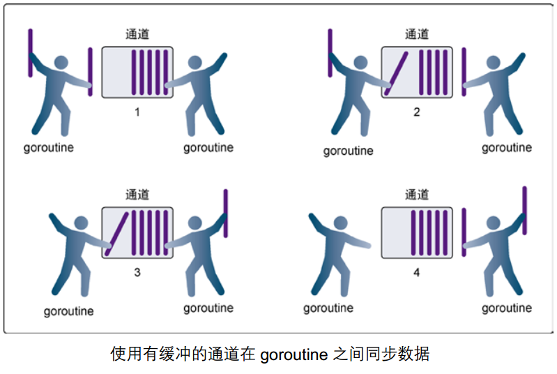

# Goroutine，Channel，Waitgroup

来源：
- https://campus.wps.cn/contentpreview/57de79bf-8ffd-4a47-ba3d-4a8391936712

# 并发编程基础

# 并发与并行的区别

并发和并行是两个常常被混淆的概念，让我们通过一个生动的例子来理解：

**并发执行**

假设有任务 A 和任务 B，在并发环境下，系统可能先执行任务 A 一段时间，然后暂停 A，切换到任务 B 执行一段时间，接着又回到任务 A 继续执行，如此反复。这种切换可能非常频繁，以至于用户感觉两个任务是同时进行的。例如，在单核 CPU 的计算机上运行多个程序，操作系统会通过时间片轮转的方式，让每个程序轮流使用 CPU 资源，从而实现并发执行。

**并行执行**

还是以任务 A 和任务 B 为例，在并行环境下，如果有两个 CPU 核心，任务 A 可以在一个核心上执行，任务 B 可以在另一个核心上同时执行，它们实实在在地在同一时刻运行。

想象你是一个人在煮火锅：

- 并发：你一个人同时照看着煮肉、煮菜、和准备蘸料，在这些任务之间来回切换
- 并行：你和两个朋友(相当于计算机的两个核心)分别负责煮肉、煮菜和准备蘸料，真正的同时进行

Go 语言的并发主要是通过 Goroutine 实现的，它可以在单核心上实现并发，在多核心上实现并行。

# Goroutine 基础

## 什么是 Goroutine？

Goroutine 是 Go 语言中最基本的并发执行单元。它比传统的线程更轻量级，我们可以轻松创建成千上万个 Goroutine。

```
// 创建goroutine非常简单
go func() {
    fmt.Println("这是一个新的goroutine")
}()
```

```
package main

import (
	"fmt"
	"time"
)

func hello() {
	fmt.Println("Hello Goroutine!")
}
func main() {
	go hello()
	fmt.Println("main goroutine done!")
	time.Sleep(time.Second)
}
```

> 注意：main 函数也是一个 goroutine，当 main 函数执行完毕，程序就结束了。

**案例：斐波那契数列**

```
func main() {
	go spinner(100 * time.Millisecond)
	const n = 45
	fibN := fib(n) // slow
	fmt.Printf("\rFibonacci(%d) = %d\n", n, fibN)
}

func spinner(delay time.Duration) {
	for {
		for _, r := range `-\|/` {
			fmt.Printf("\r%c", r)
			time.Sleep(delay)
		}
	}
}

func fib(x int) int {
	if x < 2 {
		return x
	}
	return fib(x-1) + fib(x-2)
}
```

## Goroutine 的特点

1. **轻量级**

   - 只占用 2KB 左右的内存空间
   - 可以轻松创建成千上万个
2. **易于使用**

   - 使用 `go` 关键字即可创建
   - 不需要手动管理线程池
3. **自动调度**

   - Go 运行时自动处理调度
   - 具有内置的垃圾回收机制

# Channel 基础

## 什么是 Channel？

> 单纯地将函数并发执行是没有意义的。函数与函数间需要交换数据才能体现并发执行函数的意义。

- Channel（通道）是 Go 语言中的一个核心类型，它提供了 goroutine 之间的通信机制。

> Go 语言的设计理念是：**"不要通过共享内存来通信，而要通过通信来共享内存"**

- Go 语言的并发模型是 CSP（Communicating Sequential Processes），提倡通过通信共享内存而不是通过共享内存而实现通信。
- 如果说 goroutine 是 Go 程序并发的执行体，channel 就是它们之间的连接。channel 是可以让一个 goroutine 发送特定值到另一个 goroutine 的通信机制。
- Go 语言中的通道（channel）是一种特殊的类型。通道像一个传送带或者队列，总是遵循先入先出（First In First Out）的规则，保证收发数据的顺序。每一个通道都是一个具体类型的导管，也就是声明 channel 的时候需要为其指定元素类型。

想象一个自动售货机的传送带：

- 工人在一端放入商品（发送数据）
- 顾客在另一端取走商品（接收数据）
- 传送带有固定方向（数据流向）
- 传送带可能有长度限制（缓冲区大小）

## Channel 的基本操作

channel（通道） 是一种类型，一种引用类型。  
通道有发送（send）、接收(receive）和关闭（close）三种操作,发送和接收都使用<-符号（务必好好理解这个箭头的方向）。

声明通道的方式是：`var 变量 chan 元素类型`,例如：

```
var ch chan int // ch has type 'chan int'
```

一个示例：

```
package main

import "fmt"

func recv(c chan int) {
    // 这里会阻塞，直到有数据从c中接收
    ret := <-c
    fmt.Println("接收成功", ret)
}
func main() {
    ch := make(chan int)
    go recv(ch) // 启用goroutine从通道接收值
    // 这里会阻塞，直到有数据从c中接收
    ch <- 10
    fmt.Println("发送成功")
}
```

## 通道与阻塞的理解

在 Go 语言中，通道（Channel）的阻塞行为是并发编程中非常重要的概念。理解通道的阻塞机制可以帮助我们更好地设计并发程序。

> 以以下代码，作出思考：
>
> 1. 如何让代码表现出无缓冲通道是阻塞的？
> 2. 如果不接收通道中的数据，会发生什么？
> 3. 如果不发送数据到通道中，会发生什么？

```
package main

import "fmt"

func recv(c chan int) {
    ret := <-c
    fmt.Println("接收成功", ret)
}
func main() {
    ch := make(chan int)
    go recv(ch) // 启用goroutine从通道接收值
    ch <- 10
    fmt.Println("发送成功")
}
```

### 通道的两种类型

**无缓冲的通道（unbuffered channel）**

无缓冲的通道又称为阻塞的通道，无缓冲的通道必须有接收才能发送。使用无缓冲通道进行通信将导致发送和接收的 goroutine 同步化。因此，无缓冲通道也被称为同步通道。


**有缓冲的通道（buffered channel）**

有缓冲的通道可以存储一定数量的数据，当缓冲区满时，发送操作会阻塞，直到有接收方准备好接收。  


### 通道阻塞的三种情况

1. **发送阻塞**

   - 当向无缓冲通道发送数据时，如果没有接收方准备好接收，发送操作会阻塞
   - 对于有缓冲通道，当缓冲区满时，发送操作也会阻塞

示例：

```
package main

import (
    "fmt"
    "time"
)

func main() {
    // 创建一个无缓冲的通道
    ch := make(chan int)

    fmt.Println("开始时间:", time.Now().Format("15:04:05"))

    // 尝试发送数据到通道
    fmt.Println("准备发送数据...")
    go func() {
        time.Sleep(2 * time.Second) // 延迟2秒接收
        fmt.Println("准备接收数据...")
        value := <-ch
        fmt.Println("接收到数据:", value)
    }()

    ch <- 42 // 这里会阻塞，直到有人接收数据
    fmt.Println("数据发送成功")
    fmt.Println("结束时间:", time.Now().Format("15:04:05"))
}
```

2. **接收阻塞**

   - 当从通道接收数据时，如果通道中没有数据，接收操作会阻塞
   - 这种阻塞会一直持续，直到有数据被发送到通道

无缓冲的通道阻塞示例：

```
package main

import (
  "fmt"
  "time"
)

func main() {
  // 创建一个无缓冲的通道
  ch := make(chan string)

  fmt.Println("开始时间:", time.Now().Format("15:04:05"))

  // 启动一个goroutine在2秒后发送数据
  go func() {
      fmt.Println("准备发送数据...")
      time.Sleep(2 * time.Second)
      ch <- "你好，通道！"
      fmt.Println("数据发送成功")
  }()

  fmt.Println("准备接收数据...")
  msg := <-ch // 这里会阻塞，直到有数据可接收
  fmt.Println("接收到消息:", msg)
  fmt.Println("结束时间:", time.Now().Format("15:04:05"))
}
```

带缓冲的通道阻塞示例：

```
package main

import (
    "fmt"
    "time"
)

func main() {
    // 创建一个容量为2的缓冲通道
    ch := make(chan int, 2)

    fmt.Println("开始时间:", time.Now().Format("15:04:05"))

    // 发送3个数据到通道
    fmt.Println("开始发送数据...")
    ch <- 1
    fmt.Println("第1个数据发送成功")
    ch <- 2
    fmt.Println("第2个数据发送成功")

    go func() {
        time.Sleep(2 * time.Second)
        fmt.Println("准备从通道接收数据")
        <-ch // 接收一个数据，为第三个数据腾出空间
        fmt.Println("成功接收数据")
    }()

    fmt.Println("准备发送第3个数据...")
    ch <- 3 // 这里会阻塞，因为缓冲区已满
    fmt.Println("第3个数据发送成功")
    fmt.Println("结束时间:", time.Now().Format("15:04:05"))
}
```

这些示例展示了通道在不同情况下的阻塞行为：

- 无缓冲通道的发送操作会阻塞，直到有接收方准备好
- 接收操作会阻塞，直到有数据可以接收
- 有缓冲通道在缓冲区满时的发送操作会阻塞

## 通道的关闭

### 通道关闭基本概念

- 发送方在发送完毕后，可以关闭通道
- 接收方在接收完毕后，可以关闭通道
- 关闭通道后，不能向通道发送数据，但可以继续接收数据
- 关闭通道后，继续接收操作不会阻塞，而是会**立即返回零值**

**一个示例：**

```
package main

import "fmt"

func main() {
	// 创建一个整数类型的通道
	ch := make(chan int)

	// 启动一个goroutine来关闭通道
	go func() {
		ch <- 1   // 先发送一个数据
		close(ch) // 然后关闭通道
	}()

	// 测试从已关闭的通道接收数据，ok1如果为false，表示通道已关闭
	val1, ok1 := <-ch // 第一次接收
	fmt.Printf("第一次接收: 值=%v, ok=%v\n", val1, ok1)

	val2, ok2 := <-ch // 第二次接收（通道已关闭）
	fmt.Printf("第二次接收: 值=%v, ok=%v\n", val2, ok2)

	// 测试向已关闭的通道发送数据
	defer func() {
		if r := recover(); r != nil {
			fmt.Println("捕获到panic:", r)
		}
	}()

	ch <- 2 // 尝试向已关闭的通道发送数据，触发panic
}
```

**关闭缓冲通道时，通道中剩余的数据仍然可以被读取**

```
package main

import (
    "fmt"
)

func main() {
    ch := make(chan int, 3)
    ch <- 1
    ch <- 2
    ch <- 3
    close(ch)
    for value := range ch {
        fmt.Println("Received:", value)
    }
}
```

## 使用 range 遍历 Channel

### Channel 遍历场景

在 Go 中，我们经常需要遍历从 channel 接收到的数据。使用 `range` 关键字可以优雅地实现这一点。

```
// 发送方
go func() {
    for i := 1; i <= 5; i++ {
        ch <- i
    }
    close(ch)  // 记得关闭channel
}()

// 接收方
for num := range ch {
    fmt.Printf("接收到数据: %d\n", num)
}
```

### 如何优雅的从通道循环取值

当通过通道发送有限的数据时，我们可以通过 close 函数关闭通道来告知从该通道接收值的 goroutine 停止等待。当通道被关闭时，往该通道发送值会引发 panic，从该通道里接收的值一直都是类型零值。  
以下示例展示如何优雅的从通道循环取值,来计算 100 以内的平方。

```
package main

import "fmt"

func main() {
	ch1 := make(chan int)
	ch2 := make(chan int)
	// 开启 goroutine 将 0~100 的数发送到 ch1 中
	go func() {
		for i := 0; i < 100; i++ {
			ch1 <- i
		}
		close(ch1)
	}()
	// 开启 goroutine 从 ch1 中接收值，并将该值的平方发送到 ch2 中
	go func() {
		for {
			i, ok := <-ch1 // 通道关闭后再取值 ok=false
			if !ok {
				break
			}
			ch2 <- i * i
		}
		close(ch2)
	}()
	// 在主 goroutine 中从 ch2 中接收值打印
	for i := range ch2 { // 通道关闭后会退出 for range 循环
		fmt.Println(i)
	}
}
```

从上面的例子中我们看到有两种方式在接收值的时候判断通道是否被关闭，我们通常使用的是 for range 的方式。

### 必须关闭 Channel 的情况

1. **生产者完成生产任务时**

   - 当生产者 goroutine 完成所有数据的发送后，应该关闭 channel，以通知消费者不再有新的数据到来
   - 示例：日志收集系统中，当日志收集完成时关闭 channel
2. **防止 goroutine 泄漏**

   - 如果 channel 未被关闭，接收方可能会一直等待，导致 goroutine 无法退出
   - 示例：任务分发系统中，当所有任务完成后关闭 channel
3. **需要通知多个接收者时**

   - 关闭 channel 可以向所有接收者广播"结束"信号
   - 示例：事件通知系统中，当事件处理完成时关闭 channel
4. **使用 range 遍历 channel 时**

   - range 会一直从 channel 接收数据，直到 channel 被关闭
   - 示例：数据处理流水线中，当数据处理完成时关闭 channel

```
package main

import (
	"fmt"
)

func main() {
	ch := make(chan int)
	go func() {
		for i := 0; i < 5; i++ {
			ch <- i
		}
		close(ch) // 必须关闭以退出 range 循环
	}()
	for v := range ch {
		fmt.Println(v)
	}
}
```

**注意：**

- 关闭 channel 不是必须的，只有在需要通知接收方"没有更多数据"时才需要关闭
- 重复关闭 channel 会导致 panic，因此要确保 channel 只被关闭一次

## 一些小案例

### 一个无缓冲的咖啡店示例

```
// 无缓冲channel的咖啡店示例
func coffeeShopUnbuffered() {
    // 创建一个无缓冲的订单通道
    orders := make(chan string)

    // 咖啡师goroutine
    go func() {
        for order := range orders {
            fmt.Printf("正在制作: %s\n", order)
            time.Sleep(2 * time.Second) // 模拟制作时间
            fmt.Printf("%s 制作完成\n", order)
        }
        fmt.Println("所有订单已完成")
    }()

    // 顾客点单（必须等待咖啡师接单）
    go func() {
        orders <- "拿铁"
        fmt.Println("拿铁订单已接收")
        //打印时间
        fmt.Println("拿铁订单接收时间", time.Now().Format("2006-01-02 15:04:05"))
        orders <- "美式"
        fmt.Println("美式订单已接收")
        //打印时间
        fmt.Println("美式订单接收时间", time.Now().Format("2006-01-02 15:04:05"))
        orders <- "卡布奇诺"
        fmt.Println("卡布奇诺订单已接收")
        //打印时间
        fmt.Println("卡布奇诺订单接收时间", time.Now().Format("2006-01-02 15:04:05"))
        close(orders)
    }()

    // 给咖啡师时间完成所有订单
    time.Sleep(4 * time.Second)
}

func main() {
    coffeeShopUnbuffered()
}
```

### 有缓冲的咖啡店示例

```
package main

import (
	"fmt"
	"time"
)

// 有缓冲channel的咖啡店示例
func coffeeShopBuffered() {
	// 创建一个有缓冲的订单通道，缓冲区大小为2
	orders := make(chan string, 3)

	// 咖啡师goroutine
	go func() {
		for order := range orders {
			fmt.Printf("正在制作: %s\n", order)
			time.Sleep(2 * time.Second) // 模拟制作时间
			fmt.Printf("%s 制作完成\n", order)
		}
		fmt.Println("所有订单已完成")
	}()

	// 顾客点单（有缓冲区，可以快速下单）
	fmt.Println("=== 有缓冲的咖啡店开始营业 ===")

	// 前三个订单可以立即放入缓冲区
	orders <- "拿铁"
	fmt.Println("拿铁订单接收时间:", time.Now().Format("2006-01-02 15:04:05"))

	orders <- "美式"
	fmt.Println("美式订单接收时间:", time.Now().Format("2006-01-02 15:04:05"))

	orders <- "卡布奇诺"
	fmt.Println("卡布奇诺订单接收时间:", time.Now().Format("2006-01-02 15:04:05"))

	// 在放入第四个订单前，打印缓冲区状态
	fmt.Printf("当前channel中的订单数量: %d\n", len(orders))
	fmt.Println("准备点摩卡...这里会阻塞，直到缓冲区有空位")
	orders <- "摩卡" // 这里会阻塞，直到之前的某个订单被处理
	fmt.Println("摩卡订单接收时间:", time.Now().Format("2006-01-02 15:04:05"))

	// 关闭订单通道
	close(orders)

	// 给咖啡师时间完成所有订单
	time.Sleep(10 * time.Second)
	fmt.Println("=== 咖啡店打烊 ===")
}

func main() {

	fmt.Println("\n=== 有缓冲咖啡店示例 ===")
	coffeeShopBuffered()
}
```

运行这个示例，你会看到：

1. 在有缓冲的咖啡店中：

   - 前三个订单（拿铁、美式、卡布奇诺）会立即被接收
   - 第四个订单（摩卡）会等待，直到缓冲区有空位
   - 时间戳会显示前三个订单几乎是同时接收的
2. 对比无缓冲的咖啡店：

   - 每个订单都需要等待咖啡师准备好才能接收
   - 时间戳会显示订单之间有明显的时间间隔

这个例子很好地展示了有缓冲 channel 的特点：

- 可以暂存一定数量的数据
- 只有当缓冲区满时才会阻塞
- 适合处理突发的请求

## 无缓冲 Channel 和 有缓冲 Channel 的区别

### 无缓冲 Channel

**解决的问题：**

- 确保通信双方严格同步
- 防止数据丢失或重复处理
- 实现精确的 goroutine 间协调

**使用场景：**

1. 需要严格同步的通信
   - 例如：任务分发与结果收集
2. 实现 goroutine 间的信号传递
   - 例如：通知某个事件已完成
3. 控制并发流程
   - 例如：限制同时运行的 goroutine 数量

### 有缓冲 Channel

**解决的问题：**

- 提高系统吞吐量
- 缓解生产者和消费者速度不匹配的问题
- 减少 goroutine 阻塞时间

**使用场景：**

1. 生产者-消费者模式
   - 例如：日志收集系统
2. 批量任务处理
   - 例如：图片处理流水线
3. 流量控制
   - 例如：限制最大并发请求数

### 选择建议

| 特性 | 无缓冲 Channel | 有缓冲 Channel |
| --- | --- | --- |
| 同步 | 严格同步 | 异步 |
| 性能 | 可能阻塞 | 吞吐量更高 |
| 内存 | 占用更少 | 需要预分配缓冲区 |
| 复杂度 | 更简单 | 需要管理缓冲区 |
| 适用场景 | 精确控制 | 提高效率 |

**经验法则：**

- 当不确定时，先使用无缓冲 Channel
- 当需要提高性能时，考虑有缓冲 Channel
- 缓冲区大小应根据实际场景测试确定

### 典型使用场景

1. **生产者-消费者模式**

   - 生产者持续向 channel 发送数据
   - 消费者使用 range 循环接收数据
   - 当 channel 关闭时，range 循环自动结束
2. **任务分发与收集**

   - 主 goroutine 向 channel 发送任务
   - 工作 goroutine 使用 range 接收任务
   - 所有任务完成后关闭 channel

## 案例：并发下载器

让我们实现一个简单的并发下载器，使用 channel 来管理下载任务和结果：

```
// 声明包名为main，表示这是一个可执行程序
package main

// 导入需要使用的包
import (
	"fmt"  // fmt包提供格式化输入输出功能
	"time" // time包提供时间相关的功能
)

// Downloader 结构体定义了一个下载器
// urls通道用于接收待下载的URL
// results通道用于存储下载结果
type Downloader struct {
	urls    chan string
	results chan string
}

// Download方法用于下载指定URL的内容
// 参数url是要下载的地址
func (d *Downloader) Download(url string) {
	// 这里使用time.Sleep模拟下载过程
	// 实际应用中，这里应该是真实的下载逻辑
	time.Sleep(2 * time.Second)
	// 将下载结果发送到results通道
	d.results <- fmt.Sprintf("下载 %s 完成", url)
}

// Start方法用于启动下载器
// 它会持续监听urls通道，一旦有新的URL就开始下载
func (d *Downloader) Start() {
	// 使用for range循环从urls通道中读取URL
	// 这个循环会一直运行，直到urls通道被关闭
	for url := range d.urls {
		d.Download(url)
	}
}

// Collect方法用于收集下载结果
// 它会持续监听results通道，并打印下载结果
func (d *Downloader) Collect() {
	// 使用for range循环从results通道中读取结果
	// 这个循环会一直运行，直到results通道被关闭
	for result := range d.results {
		fmt.Println(result)
	}
}

func main() {
	// 创建一个新的Downloader实例
	// 初始化urls和results通道
	d := &Downloader{
		urls:    make(chan string), // 创建一个无缓冲的字符串通道
		results: make(chan string), // 创建一个无缓冲的字符串通道
	}

	// 启动两个goroutine，分别用于下载和收集结果
	// go关键字表示在新的goroutine中运行函数
	go d.Start()   // 启动下载器
	go d.Collect() // 启动结果收集器

	// 发送下载任务到urls通道
	// 因为使用的是无缓冲通道，发送操作会阻塞直到有接收方准备好
	fmt.Println("发送下载任务1", time.Now().Format("2006-01-02 15:04:05"))
	d.urls <- "https://www.baidu.com"
	fmt.Println("发送下载任务2", time.Now().Format("2006-01-02 15:04:05"))
	d.urls <- "https://www.qq.com"
	fmt.Println("发送下载任务3", time.Now().Format("2006-01-02 15:04:05"))
	d.urls <- "https://www.taobao.com"
	fmt.Println("发送下载任务4", time.Now().Format("2006-01-02 15:04:05"))

	// 等待5秒钟，让下载任务有足够时间完成
	time.Sleep(5 * time.Second)

	// 关闭通道，表示不会再有新的URL需要下载
	close(d.urls)
	// 关闭results通道
	close(d.results)

	// 打印完成信息
	fmt.Println("所有下载任务完成")
}
```

3. **流式数据处理**

   - 数据源持续向 channel 发送数据
   - 处理程序使用 range 循环处理数据
   - 当数据源结束时关闭 channel

## 注意事项

1. **必须关闭 channel**

   - 只有关闭 channel 后，range 循环才会结束
   - 否则会导致 goroutine 泄漏
2. **发送方负责关闭**

   - 通常由发送方在完成发送后关闭 channel
   - 不要在接收方关闭 channel
3. **处理错误**

   - 在 range 循环中要处理可能的错误
   - 可以使用 select 实现超时控制

## Channel 的类型（双向与单向）

在 Go 语言中，`channel` 既可以是单向的，也可以是双向的。

### 双向 Channel

双向 `channel` 是最常见的类型，它允许在 `channel` 上进行数据的发送和接收操作。以下是一个简单的示例：

```
package main

import (
 "fmt"
)

func main() {
 ch := make(chan int)

 // 启动一个goroutine向channel发送数据
 go func() {
     for i := 0; i < 5; i++ {
         ch <- i
     }
     close(ch)
 }()

 // 在主goroutine中从channel接收数据
 for num := range ch {
     fmt.Println(num)
 }
}
```

在这个例子中，`ch` 是一个双向 `channel`，既可以发送数据（`ch <- i`），也可以接收数据（`num := <- ch`）。

### 单向 Channel

单向 `channel` 限制了数据的流动方向，要么只能发送数据（`chan<-`），要么只能接收数据（`<-chan`）。这在函数参数传递时非常有用，可以明确限制 `channel` 的使用方式，增强代码的可读性和安全性。

#### 只发送的单向 Channel

```
package main

import (
    "fmt"
)

// 该函数接受一个只发送的channel
func sender(ch chan<- int) {
    for i := 0; i < 5; i++ {
        ch <- i
    }
    close(ch)
}

func main() {
    ch := make(chan int)
    go sender(ch)

    for num := range ch {
        fmt.Println(num)
    }
}
```

在 `sender` 函数中，参数 `ch` 是一个只发送的单向 `channel`（`chan<- int`），这意味着在该函数内只能向 `ch` 发送数据，不能接收数据。

# Channel 进阶用法

## select 多路复用

在某些场景下我们需要同时从多个通道接收数据。通道在接收数据时，如果没有数据可以接收将会发生阻塞。

```
for{
    // 尝试从ch1接收值
    data, ok := <-ch1
    // 尝试从ch2接收值
    data, ok := <-ch2
    …
}
```

这种方式虽然可以实现从多个通道接收值的需求，但是运行性能会差很多。为了应对这种场景，Go 内置了 select 关键字，可以同时响应多个通道的操作。

select 语句让我们可以同时等待多个 channel 的操作，类似于在多个窗口排队，哪个窗口先空闲就去哪个窗口办理。  
select 的使用类似于 switch 语句，它有一系列 case 分支和一个默认的分支。每个 case 会对应一个通道的通信（**接收或发送**）过程。select 会一直等待，直到某个 case 的通信操作完成时，就会执行 case 分支对应的语句。具体格式如下：

```
 select {
    case <-chan1:
       // 如果chan1成功读到数据，则进行该case处理语句
    case chan2 <- 1:
       // 如果成功向chan2写入数据，则进行该case处理语句
    default:
       // 如果上面都没有成功，则进入default处理流程
    }
```

一个案例

```
func main() {
    ch1 := make(chan string)
    ch2 := make(chan string)

    // 启动两个goroutine发送数据
    go func() {
        time.Sleep(2 * time.Second)
        ch1 <- "来自频道1的消息"
    }()

    go func() {
        time.Sleep(1 * time.Second)
        ch2 <- "来自频道2的消息"
    }()

    // 使用select接收数据
    select {
    case msg1 := <-ch1:
        fmt.Println(msg1)
    case msg2 := <-ch2:
        fmt.Println(msg2)
    case <-time.After(3 * time.Second):
        fmt.Println("超时了！")
    }
}
```

> 如果多个 channel 同时 ready，则随机选择一个执行

## Channel 的常见使用模式

### 1. 信号通知

```
func worker(done chan bool) {
    fmt.Println("工作中...")
    time.Sleep(time.Second)
    fmt.Println("工作完成")
    done <- true
}

func main() {
    done := make(chan bool)
    go worker(done)
    <-done  // 等待工作完成
}
```

### 2. 超时控制

```
select {
case result := <-ch:
    fmt.Println("收到结果:", result)
case <-time.After(2 * time.Second):
    fmt.Println("操作超时！")
}
```

# sync.WaitGroup

## 什么是 sync.WaitGroup

sync.WaitGroup 是一个用于等待一组 goroutine 执行完毕的工具。它提供了一种机制，可以让主 goroutine 等待其他 goroutine 完成工作。

## sync.WaitGroup 的常用方法

- Add(delta int)：增加 WaitGroup 的计数器
- Done()：减少 WaitGroup 的计数器
- Wait()：等待 WaitGroup 的计数器为 0。只要计数器不为 0，**Wait 方法会阻塞**。

> 重要：Wait 的执行时机是当 WaitGroup 的计数器为 0 时，Wait 方法会返回。

**示例1**

```
package main

import (
	"fmt"
	"sync"
	"time"
)

// 计算函数
func calculate(a, b int, op string, wg *sync.WaitGroup) {
	defer wg.Done()

	fmt.Printf("计算: %d %s %d\n", a, op, b)
	// 模拟计算耗时
	time.Sleep(time.Second)

	var result int
	switch op {
	case "+":
		result = a + b
	case "-":
		result = a - b
	case "*":
		result = a * b
	case "/":
		if b != 0 {
			result = a / b
		} else {
			fmt.Println("错误: 除数不能为0")
			return
		}
	}

	fmt.Printf("%d %s %d = %d\n", a, op, b, result)
}

func main() {
	// 定义计算任务
	type Task struct {
		a, b int
		op   string
	}

	tasks := []Task{
		{10, 5, "+"},
		{20, 10, "-"},
		{5, 7, "*"},
		{100, 5, "/"},
		{8, 8, "+"},
	}

	var wg sync.WaitGroup

	// 启动所有计算任务
	for _, task := range tasks {
		wg.Add(1)
		go calculate(task.a, task.b, task.op, &wg)
	}

	// 等待所有计算完成
	wg.Wait()
	fmt.Println("所有计算任务完成！")
}
```

**示例2**

```
package main

import (
    "fmt"
    "sync"
)

// 模拟从文件读取数据的函数
func readFile(fileName string, resultChan chan string, wg *sync.WaitGroup) {
    defer wg.Done()
    // 这里简单模拟读取文件，实际应用中应使用文件读取操作
    var data string
    switch fileName {
    case "file1.txt":
        data = "Content of file1"
    case "file2.txt":
        data = "Content of file2"
    case "file3.txt":
        data = "Content of file3"
    }
    resultChan <- fmt.Sprintf("Read data from %s: %s", fileName, data)
}

func main() {
    fileNames := []string{"file1.txt", "file2.txt", "file3.txt"}
    var wg sync.WaitGroup
    resultChan := make(chan string)

    for _, fileName := range fileNames {
        wg.Add(1)
        go readFile(fileName, resultChan, &wg)
    }

    go func() {
        wg.Wait()
        close(resultChan)
    }()

    for result := range resultChan {
        fmt.Println(result)
    }

    fmt.Println("All files have been read.")
}
```

## sync.WaitGroup 异常的场景

在 Go 语言中，`sync.WaitGroup` 是一个用于等待一组 goroutine 完成的同步原语。虽然它设计得很精巧，但在一些不当使用的场景下会出现异常情况：

### 1. 忘记调用 `Add` 方法

如果在启动 goroutine 之前忘记调用 `wg.Add(1)`（或适当的数量），`WaitGroup` 将不会知道需要等待多少个 goroutine 完成。当调用 `wg.Wait()` 时，它可能会立即返回，而不会等待预期的 goroutine 完成。

```
package main

import (
    "fmt"
    "sync"
)

func main() {
    var wg sync.WaitGroup
    go func() {
        fmt.Println("Goroutine is running")
    }()
    wg.Wait() // 这里会立即返回，因为没有调用wg.Add(1)
    fmt.Println("Main function finished")
}
```

在上述代码中，goroutine 启动后没有调用 `wg.Add(1)`，`wg.Wait()` 会立即返回，导致主函数可能在 goroutine 还未执行完时就结束。

### 2. 调用 `Add` 的时机不当

在 goroutine 已经开始执行后再调用 `Add` 方法可能会导致竞争条件。例如：

```
package main

import (
    "fmt"
    "sync"
    "time"
)

func main() {
    var wg sync.WaitGroup
    go func() {
        time.Sleep(100 * time.Millisecond)
        fmt.Println("Goroutine is running")
        wg.Done()
    }()
    wg.Add(1) // 在goroutine开始执行一段时间后才调用Add，可能导致竞争条件
    wg.Wait()
    fmt.Println("Main function finished")
}
```

这里 `wg.Add(1)` 在 goroutine 开始执行一段时间后才调用，有可能在 `wg.Add(1)` 执行之前，`wg.Done()` 已经被调用，导致 `WaitGroup` 的计数出现异常，`wg.Wait()` 可能不会按预期等待。

### 3. 重复调用 `Done`

如果一个 goroutine 多次调用 `wg.Done()`，会导致 `WaitGroup` 的计数异常减少。例如：

```
package main

import (
    "fmt"
    "sync"
)

func main() {
    var wg sync.WaitGroup
    wg.Add(1)
    go func() {
        fmt.Println("Goroutine is running")
        wg.Done()
        wg.Done() // 重复调用Done，导致计数异常，会触发panic
    }()
    wg.Wait()
    fmt.Println("Main function finished")
}
```

重复调用 `wg.Done()` 会使 `WaitGroup` 的**计数变为负数**，这可能导致 `wg.Wait()` 的行为不可预测。

### 5. 跨函数边界的不正确使用

当 `WaitGroup` 在不同函数之间传递和使用时，如果没有正确管理其生命周期，也可能出现问题。例如：

```
package main

import (
    "fmt"
    "sync"
)

func startGoroutine(wg *sync.WaitGroup) {
    wg.Add(1)
    go func() {
        fmt.Println("Goroutine is running")
        wg.Done()
    }()
}

func main() {
    var wg sync.WaitGroup
    startGoroutine(&wg)
    // 这里没有对wg.Wait()进行调用，可能导致主函数提前结束
    fmt.Println("Main function finished")
}
```

在这个例子中，`startGoroutine` 函数启动了一个 goroutine 并管理 `WaitGroup`，但主函数没有调用 `wg.Wait()`，可能导致主函数在 goroutine 完成之前就结束。

为了避免这些异常情况，使用 `sync.WaitGroup` 时需要确保正确调用 `Add`、`Done` 和 `Wait` 方法，并且在合适的时机进行调用，同时要注意避免在 `Wait` 之后对 `WaitGroup` 进行修改。

## 小练习

编写一个程序，使用 goroutine 和 channel 实现一个生产者-消费者模式。  
一个数组，有 100 个元素，每个元素是["1,2","3,4"]这种格式，表示两个数字，请使用 goroutine 和 channel 来计算每个元素的和，并打印出来。  
注意：先思考，再动手。

# 其他教程

[学习 Go 协程：goroutine](https://go.sixue.work/golang/c04/c04_03.html)  
[学习 Go 协程：详解信道/通道](https://go.sixue.work/golang/c04/c04_04.html)  
[学习 Go WaitGroup](https://go.sixue.work/golang/c04/c04_05.html)  
[学习 Go 互斥锁和读写锁](https://go.sixue.work/golang/c04/c04_06.html)  
[学习 Go 信道死锁经典错误案例](https://go.sixue.work/golang/c04/c04_07.html)

[流程控制：理解 select 用法](https://go.sixue.work/golang/c01/c01_14.html)

[https://www.topgoer.com/并发编程](https://www.topgoer.com/%E5%B9%B6%E5%8F%91%E7%BC%96%E7%A8%8B/)

[第3章第5节：Go语言高并发进阶](https://campus.wps.cn/contentpreview/5f6bf8a6-15b2-4743-bf96-edd78b02139a)
