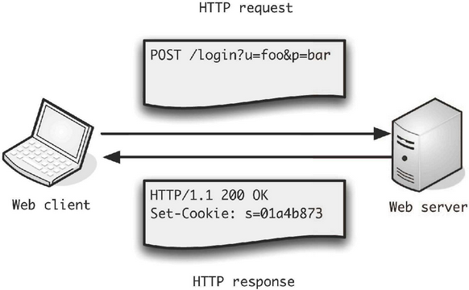
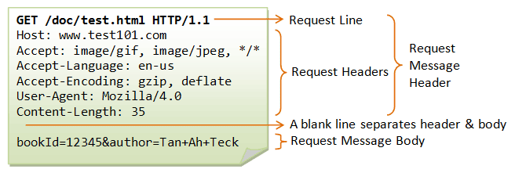
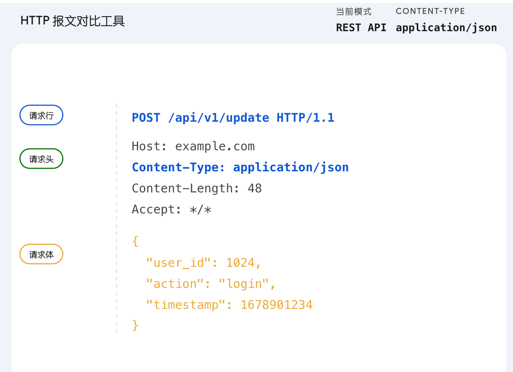
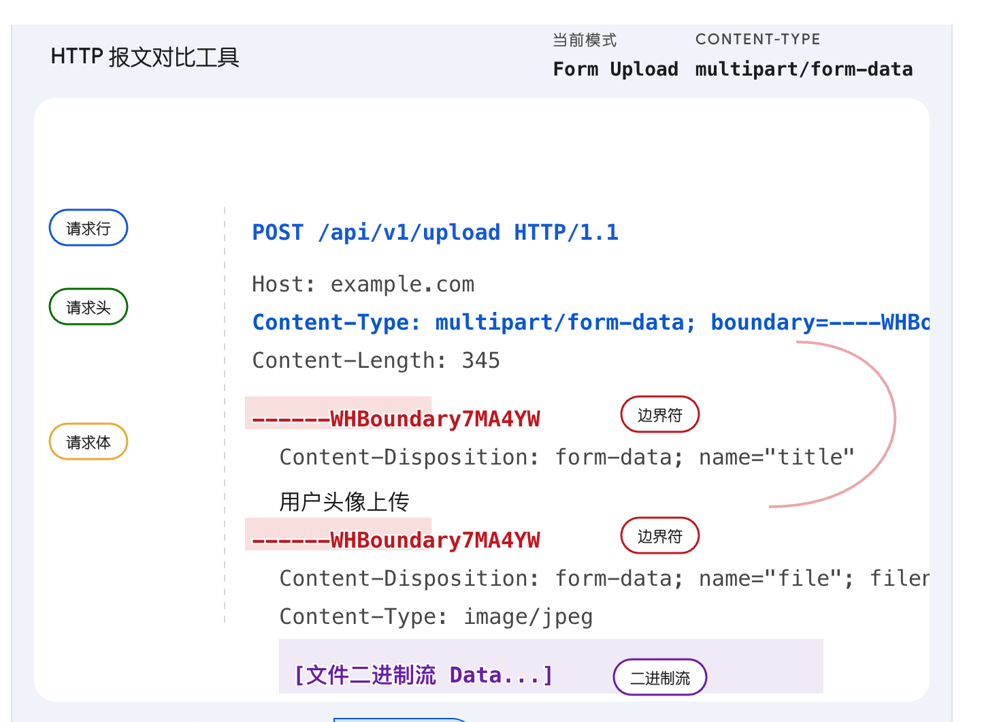
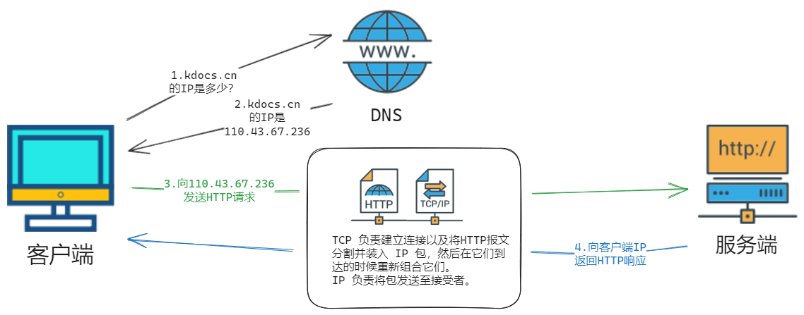
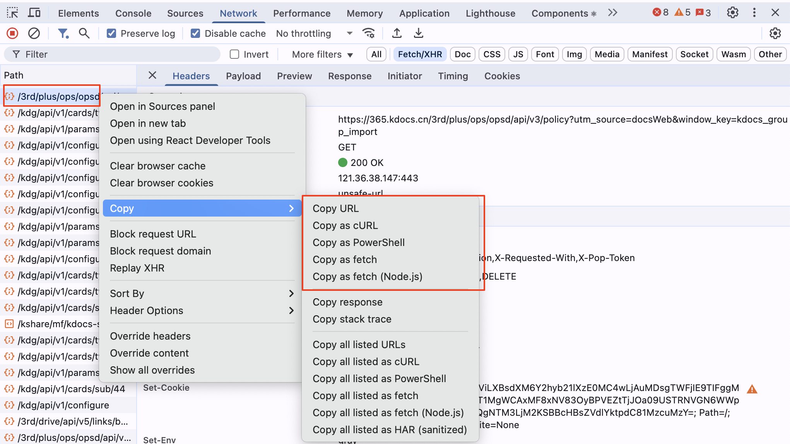
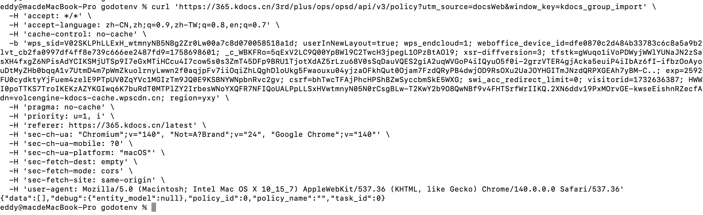
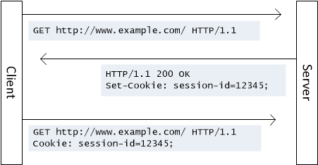

# HTTP 协议概述

来源：
- https://campus.wps.cn/contentpreview/1a080602-ce48-43a5-8e80-12ba8d90b326

# HTTP 协议概述

# 1. HTTP 协议概述

## 1.1 定义与历史背景

HTTP（Hypertext Transfer Protocol）是一种用于从网络传输超文本到本地浏览器的传输协议，是互联网上应用最为广泛的协议之一。它定义了客户端与服务器之间请求和响应的格式。


## HTTP 协议的主要特点

HTTP 协议具有以下主要特点：

- **简单性**：协议格式简单，易于实现和理解。
- **无状态性**：服务器不会保存关于客户端请求的任何信息，每个请求都是独立的（**注意：理解这个非常重要**）。但是服务端会存储和客户端相关的信息，比如 cookie。
- **可扩展性**：通过定义新的 HTTP 方法和头部，可以不断扩展协议的功能。
- **应用层协议**：HTTP 运行在 TCP/IP 协议栈的应用层，使用明文传输数据，因此易于调试。

## 请求方法 method

HTTP 协议定义了多种请求方法，用于不同的操作：

- **GET**：请求获取资源。
- **POST**：提交数据到服务器，常用于表单提交。
- **PUT**：更新服务器上的资源。
- **DELETE**：删除服务器上的资源。
- **HEAD**：请求获取资源的元数据。
- **OPTIONS**：查询服务器支持的 HTTP 方法。

# HTTP 消息格式

## http url的组成

http url 的组成：

例如：<http://www.example.com:80/index.html?name=gopher#section1>

`协议:` http  
`域名:` [www.example.com](http://www.example.com)  
`端口:` 80  
`路径:` /index.html  
`查询参数:` name=gopher  
`锚点:` #section1

> 思考  
> 服务器会收到锚点吗？锚点用来做什么？  
> 服务器会收到查询参数吗？查询参数用来做什么？  
> 服务器会收到路径吗？路径用来做什么？

## 请求消息



请求消息是客户端发送给服务器的 HTTP 消息，它由请求行、请求头部、空行和请求体四个部分组成。

- **请求行**：包含 HTTP 方法、请求的资源路径和 HTTP 版本。例如：`GET /index.html HTTP/1.1`
- **请求头部**：包含请求的附加信息，如`Host`、`User-Agent`、`Accept`等字段。

  - `Host`：请求的服务器地址，如`www.example.com`
  - `User-Agent`：发起请求的浏览器或客户端信息
  - `Accept`：客户端能够接收的媒体类型
- **空行**：请求头部和请求体之间的分隔符，通常是一个回车符和一个换行符。
- **请求体**：可选部分（GET 请求没有请求体），包含发送给服务器的数据，如表单提交的数据。

  
  > 注意：请求行和请求头部的区别。  
  > content-length 是请求头部的字段，表示请求体的长度。

以下是一个 GET 示例：

```
GET /index.html HTTP/1.1
Host: www.example.com
User-Agent: Mozilla/5.0
```

以下是一个 POST 示例：

```
POST /api/user HTTP/1.1
Host: www.example.com
User-Agent: Mozilla/5.0
Content-Type: application/json

{
  "name": "张三",
  "age": 18
}
```

> 注意：body 其实是二进制数据，服务端需要根据 content-type 进行解析。  
> 理解 content-type 和 body 的关系非常重要。当前这个案例，是告诉服务器，请求体是一个 json 对象。因此，服务端先要把二进制数据转换为字符串，然后根据 content-type 进行解析。




## HTTP与TCP/IP，DNS



## 响应消息

响应消息是服务器返回给客户端的 HTTP 消息，它由状态行、响应头部、空行和响应体四个部分组成。

- **状态行**：包含 HTTP 版本、状态码和状态信息。例如：`HTTP/1.1 200 OK`
- **响应头部**：包含响应的附加信息，如`Content-Type`、`Content-Length`、`Set-Cookie`等字段。
  - `Content-Type`：响应体的媒体类型，如`text/html`
  - `Content-Length`：响应体的长度
  - `Set-Cookie`：设置客户端的 Cookie
- **空行**：响应头部和响应体之间的分隔符。
- **响应体**：服务器返回的数据，如 HTML 页面、图片、JSON 数据等。

### 示例

```
HTTP/1.1 200 OK
Content-Type: text/html; charset=UTF-8
Content-Length: 1024
Set-Cookie: session_id=abc123; Path=/

<!DOCTYPE html>
<html>
<head>
    <title>Example Page</title>
</head>
<body>
    <h1>Welcome to Example.com</h1>
    <p>This is an example page.</p>
</body>
</html>
```

> 同样，和请求消息一样，响应消息也是二进制数据，客户端(主要指浏览器)需要根据 content-type 进行解析。  
> 实操：使用 chrome 浏览器，打开开发者工具，查看网络请求，可以看到请求和响应的消息。或者使用 whistle 等代理工具.同时，可以复制请求为 curl 命令。

### 使用 curl 或者 postman 发送 http 请求

```
# -X 指定请求方法
curl -X GET http://www.baidu.com

# -d 指定请求体
curl -X POST http://www.baidu.com -d "name=gopher"

# -I 只显示响应头
curl -I http://www.baidu.com

# -v 显示详细信息
curl -v http://www.baidu.com

# -H 指定请求头
curl -H "Content-Type: application/json" http://www.baidu.com -d '{"name": "gopher"}'
```

在浏览器的控制台，Network列表中，在“请求”中 **右键Copy请求** 的内容：



然后在终端模拟请求发送：



### 代理工具使用

[代理工具使用](https://campus.wps.cn/contentpreview/f4876c64-57d4-4641-baf6-939db1886870)

# 状态码

## 状态码分类

HTTP 状态码用于表示服务器对请求的处理结果：

- **1xx**：信息性状态码，表示请求已接收，继续处理。
- **2xx**：成功状态码，表示请求已成功处理。
- **3xx**：重定向状态码，表示需要进一步操作以完成请求。注意 301 与 302 的区别。
- **4xx**：客户端错误状态码，表示请求包含错误。
- **5xx**：服务器错误状态码，表示服务器处理请求出错。  
  
  > 注意：上图也是正常的。

## HTTP 缓存

HTTP 缓存是性能优化中的一个重要概念，它通过减少服务器请求次数来加快页面加载速度。以下是一份详细的 HTTP 缓存教程，包括原理、分类、设置方法和示例。

HTTP 缓存基于 HTTP 协议的头部信息来控制数据的存储和验证。主要分为两种类型：强制缓存和协商缓存。

### 强制缓存

- **Expires**: HTTP/1.0 中使用，设置资源的过期时间。如果时间未到，直接使用缓存，不与服务器通信。
- **Cache-Control**: HTTP/1.1 中使用，提供了更多的控制选项，如`max-age`、`no-store`、`no-cache`等。

### 协商缓存

协商缓存是一种服务器与客户端协商后决定是否使用缓存的机制。当浏览器对某个资源的请求没有命中强制缓存时，会发送请求到服务器，服务器根据请求头中的条件判断是否使用缓存。

### 什么是协商缓存？

想象一下：

- 小明每天都要查看一个网站的最新内容
- 这个网站的内容并不是每时每刻都在更新
- 如果每次访问都重新下载完整内容，会浪费带宽和时间
- 那么如何既能获取最新内容，又能节省资源呢？

这就是协商缓存要解决的问题。它允许浏览器和服务器"商量"一下资源是否发生了变化，如果没变化，就直接使用本地缓存。

### 协商缓存的工作流程

1. 浏览器发起请求，携带上次响应中的某些特殊头部信息
2. 服务器根据这些信息判断资源是否有变化
3. 如果资源没有变化，返回 304 状态码，不返回资源内容
4. 如果资源有变化，返回 200 状态码和完整的资源内容

### 与协商缓存相关的 HTTP 头部

**Last-Modified/If-Modified-Since**

这对头部基于资源的最后修改时间进行协商：

- **Last-Modified**：服务器在响应中添加，表示资源的最后修改时间
- **If-Modified-Since**：客户端在后续请求中携带，值为上次收到的 Last-Modified 值

```
# 服务器响应
HTTP/1.1 200 OK
Last-Modified: Wed, 21 Oct 2023 07:28:00 GMT
Content-Type: text/html

# 客户端后续请求
GET /index.html HTTP/1.1
Host: www.example.com
If-Modified-Since: Wed, 21 Oct 2023 07:28:00 GMT
```

**ETag/If-None-Match**

这对头部基于资源内容的唯一标识符进行协商：

- **ETag**：服务器在响应中添加，是资源内容的唯一标识（通常是内容的哈希值）
- **If-None-Match**：客户端在后续请求中携带，值为上次收到的 ETag 值

```
# 服务器响应
HTTP/1.1 200 OK
ETag: "33a64df551425fcc55e4d42a148795d9f25f89d4"
Content-Type: text/html

# 客户端后续请求
GET /index.html HTTP/1.1
Host: www.example.com
If-None-Match: "33a64df551425fcc55e4d42a148795d9f25f89d4"
```

### Last-Modified 与 ETag 的对比

| 特性 | Last-Modified | ETag |
| --- | --- | --- |
| 精确度 | 秒级，无法识别 1 秒内多次修改 | 基于内容，可以精确识别任何变化 |
| 性能开销 | 较小，只需记录时间 | 较大，需要计算内容哈希值 |
| 应对场景 | 适合内容变化较慢的资源 | 适合内容频繁变化或需要精确控制缓存的资源 |
| 应对特殊情况 | 无法处理资源周期性变化但内容不变的情况 | 可以应对时间变化但内容不变的情况 |

### 304 状态码

当服务器收到带有条件请求头的请求，判断资源未发生变化时，会返回 304 Not Modified 状态码：

```
HTTP/1.1 304 Not Modified
ETag: "33a64df551425fcc55e4d42a148795d9f25f89d4"
Cache-Control: max-age=0, must-revalidate
Date: Thu, 22 Oct 2023 07:28:00 GMT
```

### 实际应用建议

1. 对于不经常变化的静态资源（如 logo、库文件等），使用强制缓存。前端资源一般带 hash，hash 是根据内容生成的，内容不变，hash 不变。
2. 对于可能变化的资源（如 HTML、API 数据等），使用协商缓存
3. 对于 ETag 和 Last-Modified，优先使用 ETag，因为它更精确
4. 在实际项目中，通常两种缓存机制结合使用

# Cookie 与 Session

## Cookie

Cookie 是服务器发送到用户浏览器并保存在本地的一小块数据，它会在浏览器下次向同一服务器再发起请求时被携带并发送到服务器上。



### Cookie 的特点

- **客户端存储**：Cookie 存储在用户的浏览器中，而不是服务器上
- **容量限制**：单个 Cookie 的大小通常不超过 4KB
- **数量限制**：每个域名下的 Cookie 数量有限制（通常为 20-50 个）
- **有效期**：可以设置过期时间，也可以是会话期 Cookie（关闭浏览器即失效）
- **域名限制**：只能被特定域名的页面访问

### Cookie 的常用属性

Cookie 有以下几个重要属性：

- **name/value**：Cookie 的名称和值
- **domain**：指定 Cookie 对于哪个域是有效的
- **path**：指定 Cookie 在哪个路径下有效
- **expires/max-age**：设置 Cookie 的过期时间
- **secure**：只在 HTTPS 连接中传输 Cookie
- **httpOnly**：防止 JavaScript 访问 Cookie，只能通过 HTTP 请求携带
- **sameSite**：控制 Cookie 在跨站请求时是否被发送

### 设置与获取 Cookie

服务端通过设置响应头 `Set-Cookie` 来创建 Cookie：

```
HTTP/1.1 200 OK
Content-Type: text/html
Set-Cookie: username=张三; expires=Wed, 21 Oct 2023 07:28:00 GMT; path=/; domain=example.com
Set-Cookie: sessionId=abc123; HttpOnly; Secure
```

浏览器发送请求时会自动在请求头中携带 Cookie：

```
GET /index.html HTTP/1.1
Host: www.example.com
Cookie: username=张三; sessionId=abc123
```

### Cookie 的应用场景

1. **用户认证**：存储登录状态和用户标识
2. **个性化设置**：保存用户偏好，如网站主题、字体大小等
3. **追踪与分析**：记录用户行为，如购物车、浏览历史等
4. **广告定向投放**：基于用户兴趣的广告推送

## Session

Session 是在服务端保持的一个状态，用来跟踪用户状态的机制，可以理解为服务器端的"会话"。

### Session 的工作原理

1. 用户首次访问服务器时，服务器创建一个 Session 并生成一个唯一的 Session ID
2. 服务器将 Session ID 通过 Cookie 发送给浏览器
3. 浏览器后续的请求会携带这个 Session ID
4. 服务器通过 Session ID 识别用户并检索对应的 Session 数据

### Session 的特点

- **服务端存储**：Session 数据存储在服务器端，不存在客户端容量限制
- **安全性更高**：敏感数据保存在服务器，不暴露给客户端
- **存储方式多样**：可以存储在内存、文件系统、数据库或分布式缓存中
- **有效期**：通常有超时机制，一段时间不活动后自动失效
- **依赖标识符**：通常依赖 Cookie 中的 Session ID 来识别用户

### Session 的实现方式

服务端创建 Session 并通过 Cookie 传递 Session ID：

```
// Go语言的简单Session实现示例
func handleLogin(w http.ResponseWriter, r *http.Request) {
	// 验证用户身份
	username := r.FormValue("username")
	password := r.FormValue("password")

	if authenticateUser(username, password) {
		// 创建Session
		sessionID := generateSessionID()
		sessions[sessionID] = &Session{
			UserID:   getUserID(username),
			Username: username,
			Created:  time.Now(),
		}

		// 设置Cookie
		cookie := &http.Cookie{
			Name:     "sessionid",
			Value:    sessionID,
			Path:     "/",
			HttpOnly: true,
			MaxAge:   3600, // 1小时
		}
		http.SetCookie(w, cookie)

		// 重定向到用户页面
		http.Redirect(w, r, "/user", http.StatusFound)
	} else {
		http.Error(w, "Invalid credentials", http.StatusUnauthorized)
	}
}
```

### Cookie 与 Session 的区别

| 特性 | Cookie | Session |
| --- | --- | --- |
| 存储位置 | 客户端（浏览器） | 服务端 |
| 安全性 | 较低，可被客户端查看和修改 | 较高，数据存储在服务器 |
| 存储容量 | 有限制（通常 4KB 以内） | 理论上无限制 |
| 生命周期 | 可长期保存 | 通常随会话结束而清除 |
| 对服务器负担 | 较小 | 较大 |
| 跨域支持 | 有限制 | 默认不支持跨域 |

### 安全最佳实践

1. **使用 HttpOnly 标志**：防止 JavaScript 访问 Cookie，减少 XSS 攻击风险
2. **使用 Secure 标志**：确保 Cookie 只通过 HTTPS 传输
3. **设置合理的过期时间**：减少 Cookie 被盗用的风险
4. **加密敏感数据**：不在 Cookie 中存储明文的敏感信息
5. **使用 SameSite 属性**：防止 CSRF 攻击
6. **定期更新 Session ID**：尤其是在用户权限变更后

# 关于RESTFUL

扩展阅读：[阮一峰：RESTful API 设计指南](https://www.ruanyifeng.com/blog/2014/05/restful_api.html)

> 注意： 有的服务的 API 并不是基于 RESTFUL 风格，只有 GET/POST，这是正常的。  
> 例如：删除用户 `POST /api/deleteuser`，而不是 `DELETE /api/user/123`  
> 基于老项目开发新接口，如果老项目是基于 RESTFUL 风格，那么新接口也尽量保持一致。

# 其它需要了解的

- 什么是长连接，一般用于什么场景？
- websocket 是基于 http 协议的吗?主要用于什么场景？
- 什么是 auth2.0，主要用于什么场景？
- 什么是 JWT，主要用于什么场景？
- http 鉴权方案有哪些？

# 其他教程

[HTTP协议详解](https://www.cnblogs.com/TankXiao/archive/2012/02/13/2342672.html)
