# PPT-课程-GORM的使用

来源：
- https://365.kdocs.cn/l/cgb2fD9LhjQa

说明：
- 该条目为在线 PDF 预览，已按页面逐页截图导出为离线图片。

## 页面截图

### 第 1 页

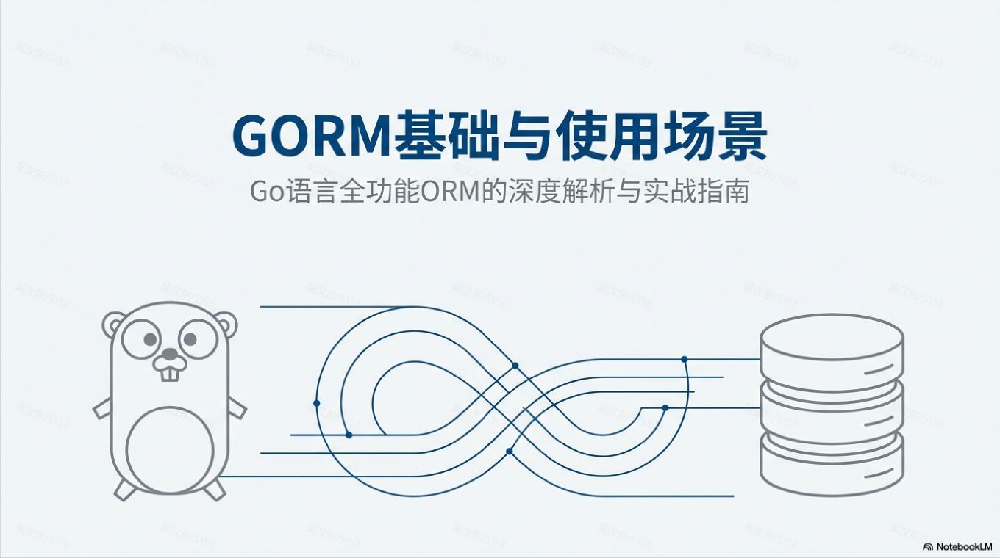

### 第 2 页

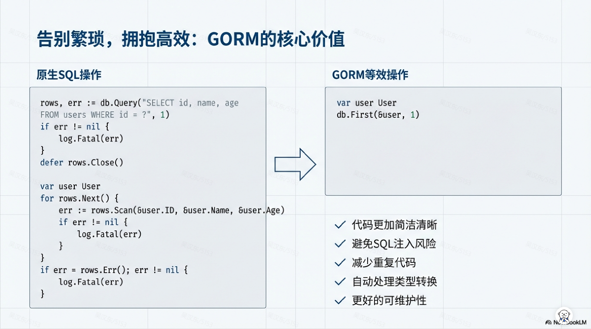

### 第 3 页

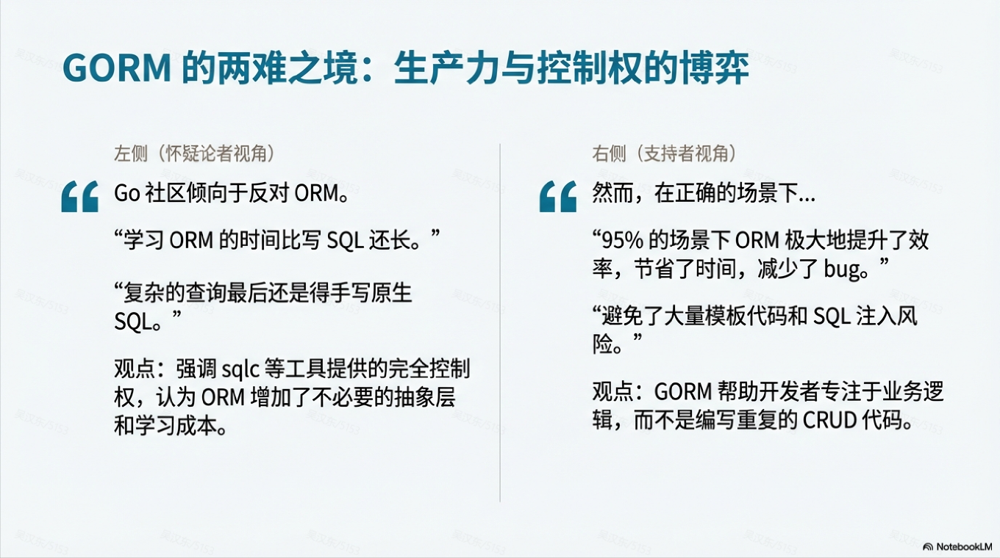

### 第 4 页

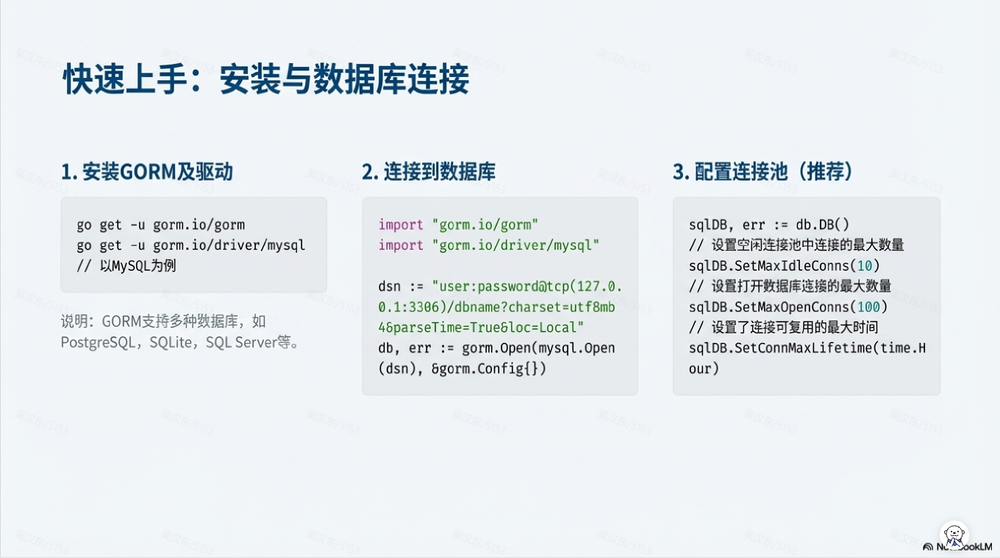

### 第 5 页

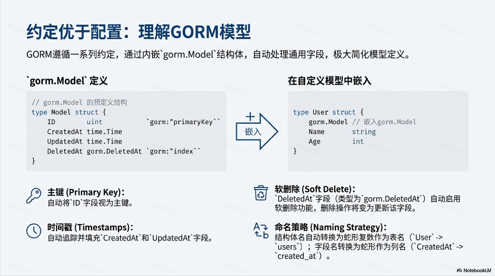

### 第 6 页

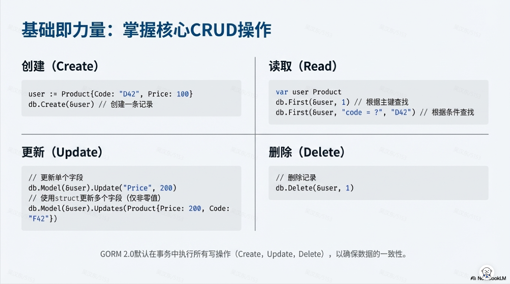

### 第 7 页

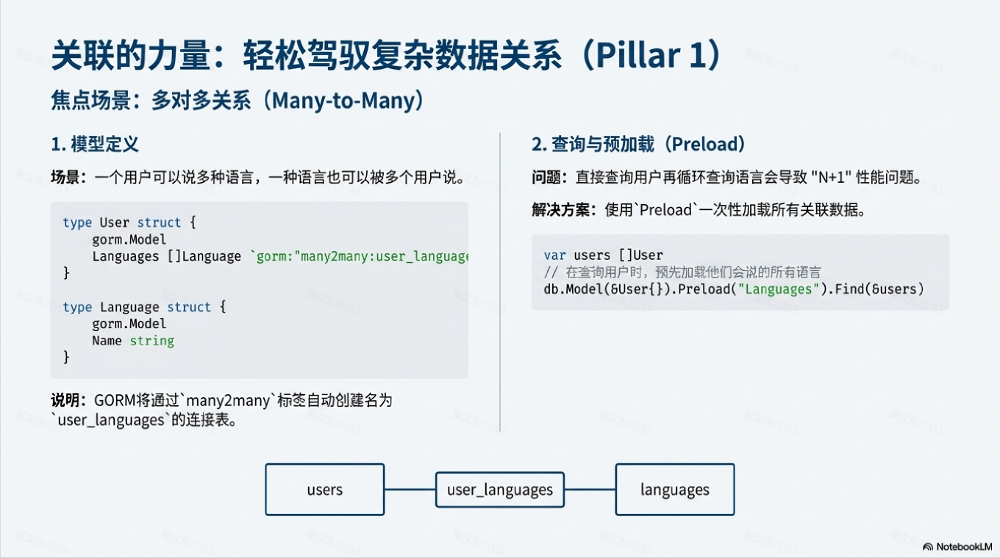

### 第 8 页

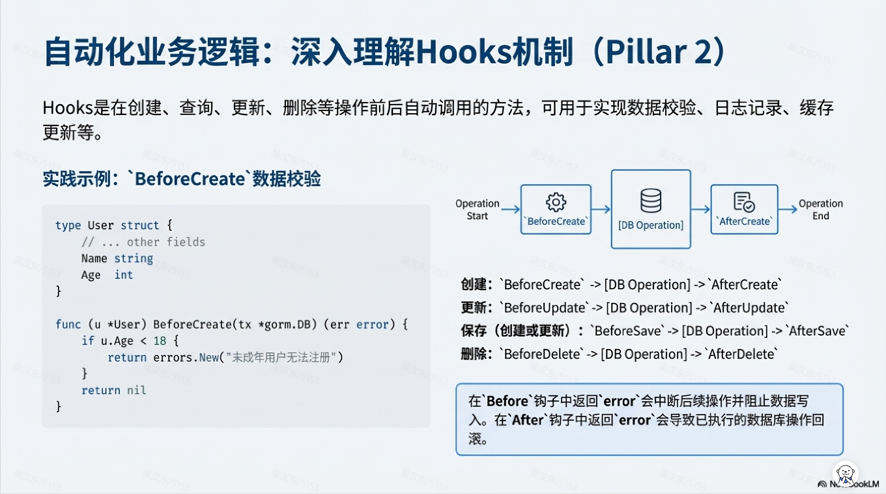

### 第 9 页

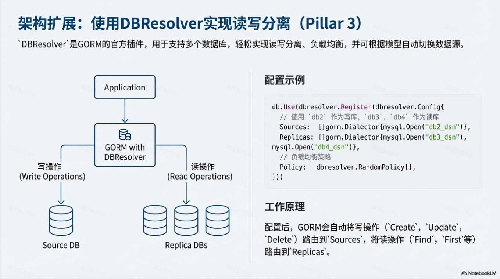

### 第 10 页

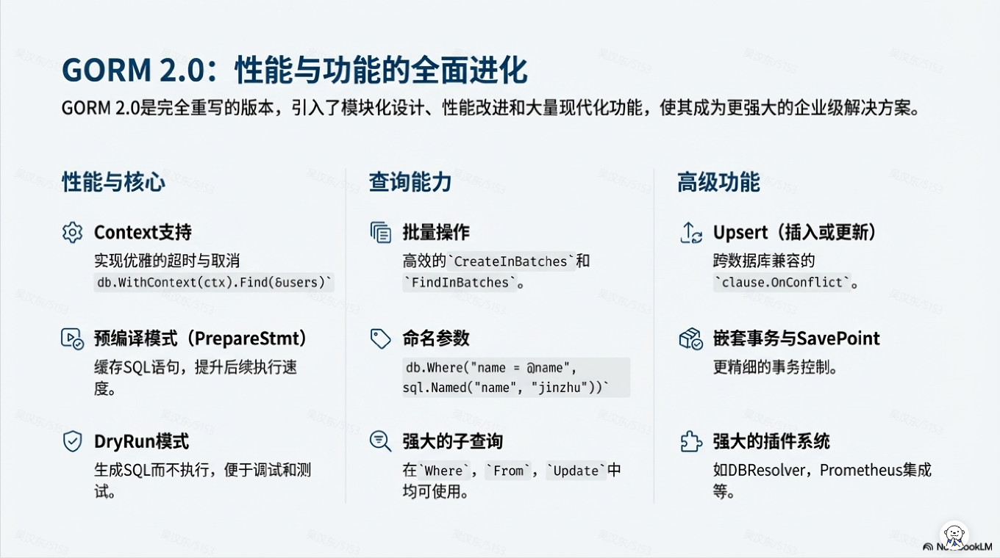

### 第 11 页

### 第 12 页

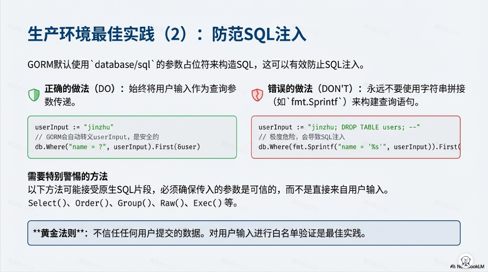

### 第 13 页

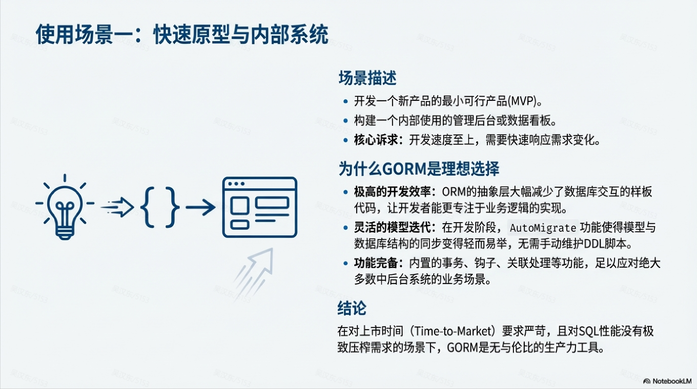

### 第 14 页

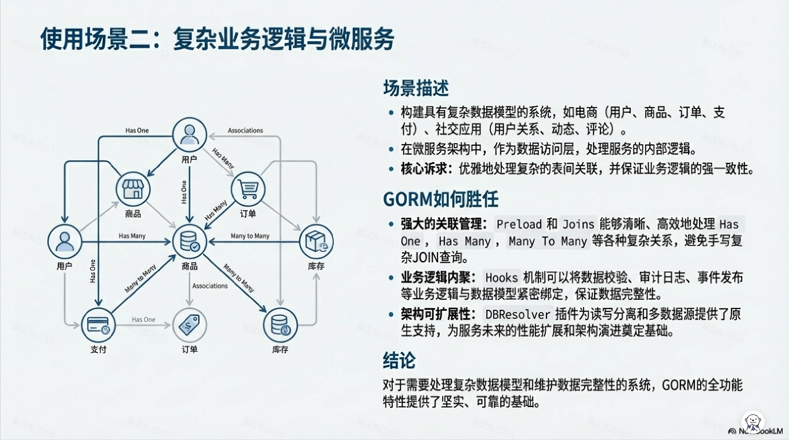

### 第 15 页

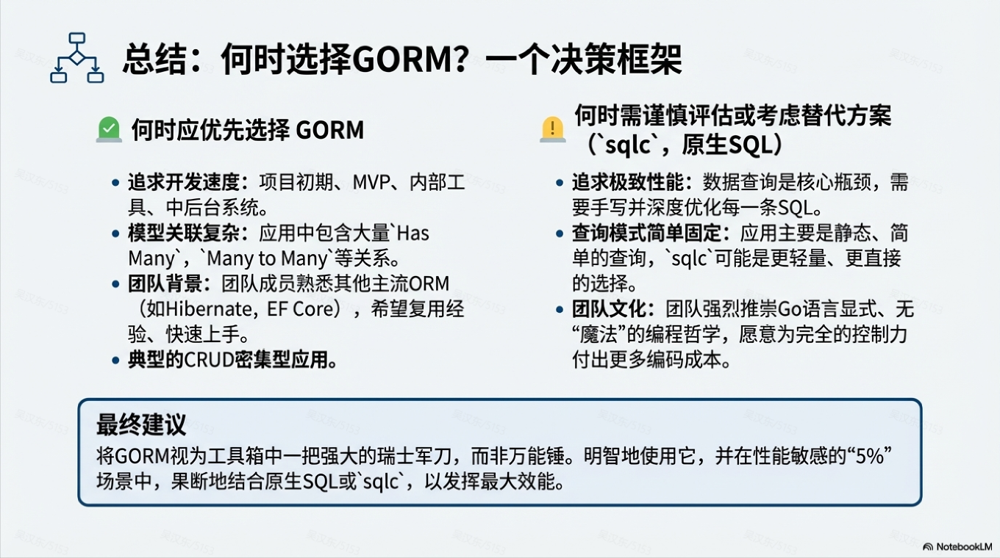

### 第 16 页

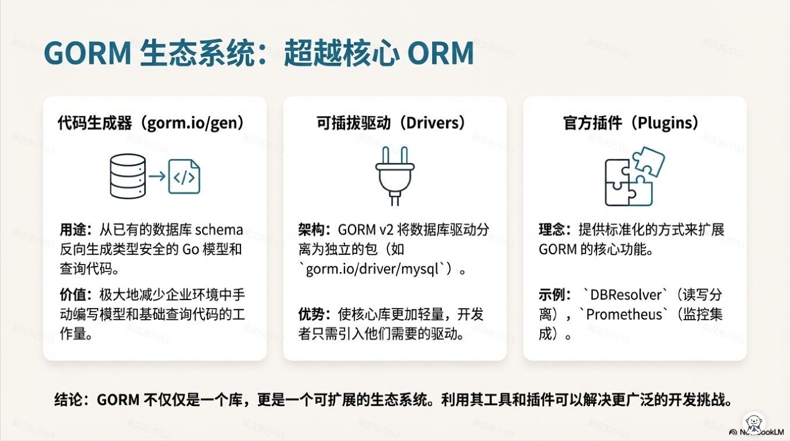

### 第 17 页

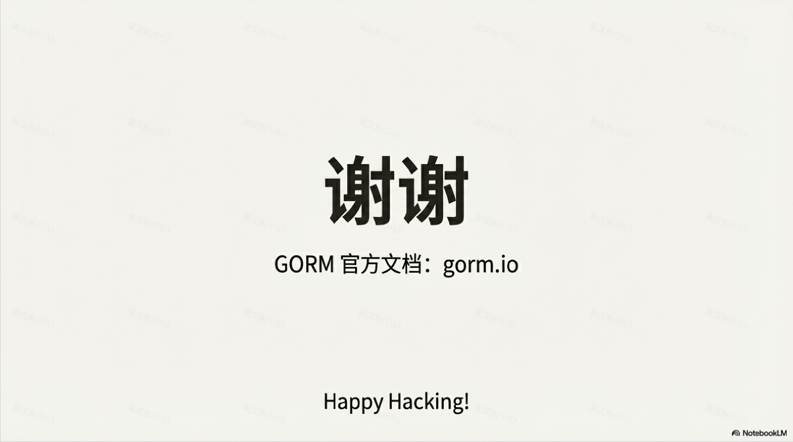
