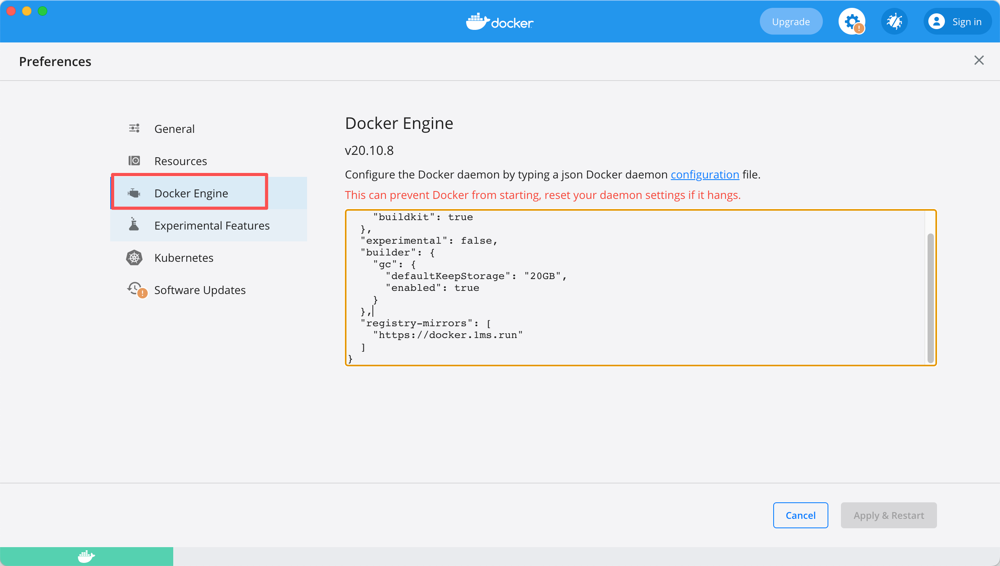

# Docker基础

来源：
- https://campus.wps.cn/contentpreview/cbefdb1e-17d4-4223-80d5-10f9c5747f26

# Docker基础

# 第一单元：Docker初识

本单元目标：理解Docker概念，能成功运行第一个容器

## 什么是 Docker？

Docker 就像是一个标准化的"货运集装箱"，将应用程序及其运行环境打包在一起，让应用可以在任何地方一致地运行。

**为什么需要 Docker？**

传统部署方式中，不同环境（开发、测试、生产）的配置差异经常导致"在我服务器上是好的"这类问题。Docker 通过容器化技术解决了这些问题：

- **环境一致性**：应用在任何环境运行结果一致
- **快速部署**：从开发到上线，一键完成
- **资源隔离**：应用之间互不影响
- **版本控制**：像管理代码一样管理运行环境

## Docker的安装

请根据你的操作系统自行安装Docker：

- Windows系统参考：<https://www.runoob.com/docker/windows-docker-install.html>
- Mac系统：下载Docker Desktop for Mac
- Linux系统：使用包管理器安装（如 `apt-get install docker.io`）

**验证安装：**

```
# 检查Docker版本
docker --version

# 查看Docker信息
docker info
```

## 配置镜像加速

安装完成后，建议配置国内镜像源以提升下载速度：



记得重启docker服务。

## 实战：运行第一个容器

让我们一键启动一个nginx服务器，体验Docker的魅力！

**什么是nginx?**

nginx是一个高性能的HTTP和反向代理服务器，在互联网公司中广泛使用。

**启动nginx容器：**

```
docker run -d --name nginx001 -p 80:80 nginx:latest
```

**命令解释：**

- `docker run`：运行一个容器
- `-d`：后台运行
- `--name nginx001`：给容器命名为nginx001
- `-p 80:80`：端口映射（宿主机端口:容器端口）
- `nginx:latest`：使用nginx的最新版本镜像

**验证运行：**

```
# 查看运行中的容器
docker ps

# 在浏览器访问
# http://localhost 或 http://localhost:80
```

你应该能看到nginx的欢迎页面！

> 💡 提示：如果80端口被占用，可以使用其他端口，如 `-p 8080:80`，然后访问 <http://localhost:8080>

## 这个命令背后发生了什么？

让我们深入理解 `docker run -d --name nginx001 -p 80:80 nginx:latest` 这条命令，看看Docker在背后做了哪些工作：

### 执行流程图解

```
用户执行命令
    ↓
1. 检查本地镜像
    ↓
2. 拉取镜像（如果本地没有）
    ↓
3. 创建容器
    ↓
4. 配置网络和端口映射
    ↓
5. 启动容器
    ↓
6. 返回容器ID
```

### 思考问题

**问题1：** 为什么第二次运行 `docker run` 会更快？

点击查看答案

因为镜像已经在本地，跳过了下载步骤（步骤2），直接创建和启动容器。

**问题2：** 如果我再次执行 `docker run -d --name nginx002 -p 8080:80 nginx:latest`，会发生什么？

点击查看答案

- 使用相同的镜像（nginx:latest）
- 创建一个新容器（名为nginx002）
- 映射到不同的宿主机端口（8080）
- 两个容器独立运行，互不影响

这就是Docker的强大之处：一个镜像可以创建多个容器！

**问题3：** 容器停止后，容器内的数据会丢失吗？

点击查看答案

- 容器停止：数据不会丢失
- 容器删除：数据会丢失

这就是为什么需要数据持久化（稍后会学习）。

## Docker三大核心概念

### 镜像（Image）

镜像就像是一个"模具"或"模板"，包含了运行应用所需的所有文件和配置。

**特点：**

- 只读的：镜像一旦创建，内容不会改变
- 可复用：一个镜像可以创建多个容器
- 分层存储：镜像由多个层组成，可以共享和复用

### 容器（Container）

容器是用镜像创建出来的运行实例。如果把镜像比作"类"，那么容器就是"对象"。

**特点：**

- 一个镜像可以启动多个容器
- 每个容器都是独立的，互不干扰
- 容器可以随时启动、停止、删除

### 仓库（Repository）

仓库就像是Docker的"应用商店"，用于存储和分发镜像。Docker Hub是最常用的公共仓库。

**作用：**

- 共享镜像：开发者可以上传和下载镜像
- 版本管理：支持镜像的版本标签
- 团队协作：团队成员共享相同的镜像

## 基本容器操作

```
# 查看运行中的容器
docker ps

# 查看所有容器（包括已停止的）
docker ps -a

# 停止容器
docker stop nginx001

# 启动已停止的容器
docker start nginx001

# 重启容器
docker restart nginx001

# 查看容器日志
docker logs nginx001

# 删除容器（必须先停止）
docker rm nginx001

# 强制删除运行中的容器
docker rm -f nginx001
```

## 第一单元小练习

1. 在本地启动一个nginx容器，并在浏览器中访问它
2. 使用 `docker ps` 查看容器状态
3. 使用 `docker logs` 查看容器日志
4. 停止并删除容器
5. 重新启动一个nginx容器，使用不同的端口映射（如8080:80）

**思考题：**

- 容器和虚拟机有什么区别？
- 为什么Docker能实现"一次构建，到处运行"？

# 第二单元：镜像与容器核心

本单元目标：熟悉核心命令与容器生命周期管理

## 镜像管理命令

### 查看和搜索镜像

```
# 查看本地镜像列表
docker images

# 搜索Docker Hub上的镜像
docker search nginx

# 搜索并限制结果数量
docker search --limit 5 mysql
```

### 拉取和删除镜像

```
# 从仓库拉取镜像
docker pull nginx

# 拉取指定版本的镜像
docker pull nginx:1.24.0

# 查看镜像详细信息
docker inspect nginx:1.24.0

# 删除镜像
docker rmi nginx

# 强制删除镜像（即使有容器在使用）
docker rmi -f nginx
```

### 镜像版本（Tags）管理

Docker镜像通过标签（Tag）来管理版本：

```
# 拉取指定版本
docker pull nginx:1.24.0      # 具体版本号
docker pull nginx:1.24        # 主版本号
docker pull nginx:stable      # 稳定版
docker pull nginx:alpine      # Alpine Linux轻量级版本
docker pull nginx:latest      # 最新版本
```

### 镜像标签操作

```
# 给镜像打标签（用于版本管理）
docker tag nginx:latest my-nginx:v1

# 查看镜像
docker images | grep my-nginx
```

### 进入容器调试

```
# 进入容器内部（交互式）
docker exec -it container_id /bin/bash

# 如果容器内没有bash，使用sh
docker exec -it container_id /bin/sh

# 在容器中执行单个命令
docker exec container_id ls -la

# 以root用户进入容器
docker exec -it -u root container_id /bin/bash
```

### 容器日志和资源监控

```
# 查看容器日志
docker logs container_id

# 实时查看日志（类似tail -f）
docker logs -f container_id

# 查看最近100行日志
docker logs --tail 100 container_id

# 查看容器资源使用情况
docker stats container_id

# 查看所有容器的资源使用
docker stats
```

### 删除容器

```
# 删除已停止的容器
docker rm container_id

# 强制删除运行中的容器
docker rm -f container_id

# 删除所有已停止的容器
docker container prune

# 删除所有容器（危险操作）
docker rm -f $(docker ps -aq)
```

## 实践：容器重启策略

容器重启策略决定了容器在退出后是否自动重启：

```
# 总是重启（推荐用于生产环境）
docker run -d --restart=always --name web nginx

# 仅在非正常退出时重启
docker run -d --restart=on-failure --name web nginx

# 除非手动停止，否则总是重启
docker run -d --restart=unless-stopped --name web nginx
```

**重启策略对比：**

| 策略 | 说明 | 使用场景 |
| --- | --- | --- |
| `no` | 不自动重启（默认） | 开发测试环境 |
| `always` | 总是重启 | 生产环境关键服务 |
| `on-failure` | 仅非正常退出时重启 | 一般生产服务 |
| `unless-stopped` | 除非手动停止 | 推荐用于生产环境 |

## 第二单元小练习

1. 拉取并运行一个MySQL容器：

```
docker run -d --name mysql-test -e MYSQL_ROOT_PASSWORD=123456 mysql:8.0
```

2. 查看MySQL容器的日志，观察初始化过程
3. 进入MySQL容器，连接数据库：

```
docker exec -it mysql-test mysql -u root -p
```

4. 停止容器，再重新启动，验证数据是否还在
5. 查看容器的资源使用情况（CPU、内存等）

**思考题：**

- 容器停止后，容器内的数据会丢失吗？
- 容器删除后，数据会怎样？
- 如何保证容器数据的持久化？（下一单元将学习）

# 第三单元：数据与网络

本单元目标：理解容器间通信与数据持久化

## 数据持久化问题

### 为什么需要数据持久化？

Docker容器被视为**无状态的**。虽然容器停止后数据仍然存在，但如果容器被删除，容器内的数据就会**永久丢失**。

**验证实验：**

```
# 1. 启动nginx容器
docker run -d --name nginx001 -p 80:80 nginx

# 2. 修改欢迎页面
docker exec -it nginx001 bash
echo "Hello Docker!" > /usr/share/nginx/html/index.html
exit

# 3. 访问 http://localhost，看到"Hello Docker!"

# 4. 删除并重新创建容器
docker rm -f nginx001
docker run -d --name nginx001 -p 80:80 nginx

# 5. 再次访问，发现修改的内容丢失了！
```

## 数据持久化解决方案

Docker提供了两种数据持久化方式：

### 方式一：数据卷（Volume）

数据卷是Docker管理的存储区域，独立于容器生命周期。

**特点：**

- 由Docker管理，存储在Docker的数据目录中
- 可以跨容器共享
- 适合生产环境

**使用方法：**

```
# 创建命名数据卷
docker volume create mydata

# 查看数据卷列表
docker volume ls

# 查看数据卷详细信息
docker volume inspect mydata

# 使用数据卷运行容器
docker run -d -v mydata:/app/data --name app1 nginx

# 另一个容器也可以使用同一个数据卷
docker run -d -v mydata:/app/data --name app2 nginx

# 删除数据卷
docker volume rm mydata

# 删除所有未使用的数据卷
docker volume prune
```

### 方式二：目录挂载（Bind Mount）

直接将宿主机的目录挂载到容器中。

**特点：**

- 直接访问宿主机目录，性能最好
- 便于开发和调试
- 需要手动管理目录权限

**使用方法：**

```
# 创建宿主机目录
mkdir -p /Users/mac/Desktop/nginx/html

# 创建一个HTML文件
echo "<h1>Hello from Host!</h1>" > /Users/mac/Desktop/nginx/html/index.html

# 使用目录挂载运行容器
docker run -d \
  -v /Users/mac/Desktop/nginx/html:/usr/share/nginx/html \
  -p 80:80 \
  --name nginx003 \
  nginx

# 访问 http://localhost，能看到你创建的HTML内容
# 修改宿主机的HTML文件，刷新页面即可看到变化
```

### 两种方式对比

| 特性 | 数据卷（Volume） | 目录挂载（Bind Mount） |
| --- | --- | --- |
| 管理方式 | Docker自动管理 | 手动管理 |
| 存储位置 | Docker数据目录 | 宿主机指定目录 |
| 跨平台性 | 好 | 一般（路径依赖操作系统） |
| 适用场景 | 生产环境 | 开发环境 |
| 性能 | 较好 | 最好（直接访问） |

## 实践：MySQL数据持久化

创建一个带数据持久化的MySQL容器：

```
# 创建本地目录
mkdir -p /Users/wuhaitao/work/mysqldata_docker

# 运行MySQL容器，挂载数据目录
docker run -d \
  --name mysql \
  -e MYSQL_ROOT_PASSWORD=123456 \
  -e MYSQL_DATABASE=testdb \
  -v /Users/wuhaitao/work/mysqldata_docker:/var/lib/mysql \
  -p 3306:3306 \
  mysql:8.0
```

**参数说明：**

- `-v /Users/wuhaitao/work/mysqldata_docker:/var/lib/mysql`：将本地目录挂载到MySQL数据目录
- `-p 3306:3306`：端口映射
- `-e MYSQL_ROOT_PASSWORD=123456`：设置root密码
- `-e MYSQL_DATABASE=testdb`：创建初始数据库

**验证持久化：**

```
# 1. 连接MySQL并创建数据
docker exec -it mysql mysql -u root -p123456
# 执行SQL: CREATE TABLE test (id INT, name VARCHAR(50));

# 2. 删除容器
docker rm -f mysql

# 3. 重新创建容器（使用相同的挂载目录）
docker run -d --name mysql \
  -e MYSQL_ROOT_PASSWORD=123456 \
  -v /Users/wuhaitao/work/mysqldata_docker:/var/lib/mysql \
  -p 3306:3306 \
  mysql:8.0

# 4. 检查数据是否还在
docker exec -it mysql mysql -u root -p123456
# 执行SQL: SHOW TABLES; -- 应该能看到之前创建的表
```

## Docker网络基础

### 网络驱动类型

```
# 查看网络列表
docker network ls
```

Docker默认提供的网络驱动：

| 网络类型 | 说明 | 使用场景 |
| --- | --- | --- |
| bridge | 桥接网络（默认） | 同宿主机上的容器通信 |
| host | 容器使用宿主机网络 | 需要高性能网络的场景 |
| none | 无网络 | 需要完全隔离的容器 |
| overlay | 跨主机通信 | Docker Swarm集群 |

### 创建和管理网络

```
# 创建自定义网络
docker network create mynetwork

# 查看网络详细信息
docker network inspect mynetwork

# 删除网络
docker network rm mynetwork

# 清理未使用的网络
docker network prune
```

## 动手实验：理解Bridge网络

### 实验目标

理解容器如何通过bridge网络进行通信。

### 实验步骤

**步骤1：创建自定义网络**

```
# 创建test-network
docker network create test-network

# 查看网络详情
docker network inspect test-network
```

**步骤2：启动两个容器并连接到同一网络**

```
# 启动container1
docker run -d --name container1 --network test-network alpine sleep 3600

# 启动container2
docker run -d --name container2 --network test-network alpine sleep 3600

# 查看容器状态
docker ps
```

**步骤3：测试容器间通信**

```
# 从container1 ping container2（使用容器名）
docker exec -it container1 ping -c 3 container2

# 从container2 ping container1
docker exec -it container2 ping -c 3 container1
```

你会看到ping成功的输出：

```
PING container2 (172.18.0.3): 56 data bytes
64 bytes from 172.18.0.3: seq=0 ttl=64 time=0.123 ms
64 bytes from 172.18.0.3: seq=1 ttl=64 time=0.098 ms
64 bytes from 172.18.0.3: seq=2 ttl=64 time=0.105 ms
```

**步骤4：验证网络隔离**

```
# 启动一个使用默认网络的容器
docker run -d --name container3 alpine sleep 3600

# 尝试从container1 ping container3（会失败）
docker exec -it container1 ping container3
# 输出：ping: bad address 'container3'
```

这证明了不同网络的容器无法直接通信。

**步骤5：将容器添加到网络**

```
# 将container3连接到test-network
docker network connect test-network container3

# 现在可以ping通了
docker exec -it container1 ping -c 3 container3
```

**步骤6：清理实验环境**

```
# 停止并删除容器
docker stop container1 container2 container3
docker rm container1 container2 container3

# 删除网络
docker network rm test-network
```

### 实验要点总结

1. **容器名作为主机名**：在同一网络中，容器可以通过容器名互相访问
2. **自动DNS解析**：Docker自动为同一网络的容器提供DNS解析
3. **网络隔离**：不同网络中的容器无法直接通信
4. **动态连接**：容器可以动态加入或离开网络

## 案例：Go服务连接MySQL

### 方式一：端口映射（开发环境）

```
# 启动MySQL并映射端口
docker run -d --name mysql \
  -e MYSQL_ROOT_PASSWORD=123456 \
  -e MYSQL_DATABASE=testdb \
  -p 3306:3306 \
  mysql:8.0
```

Go代码中连接：

```
// 使用localhost连接
dsn := "root:123456@tcp(localhost:3306)/testdb"
```

**缺点：**

- 端口暴露到宿主机，安全性较低
- 可能出现端口冲突

### 方式二：Docker网络（生产环境推荐）

```
# 1. 创建自定义网络
docker network create app-network

# 2. 启动MySQL（不映射端口）
docker run -d --name mysql \
  --network app-network \
  -e MYSQL_ROOT_PASSWORD=123456 \
  -e MYSQL_DATABASE=testdb \
  mysql:8.0

# 3. 启动Go应用（稍后我们会构建）
docker run -d --name go-app \
  --network app-network \
  -p 8080:8080 \
  go-web-app:v1
```

Go代码中连接：

```
// 使用容器名连接
dsn := "root:123456@tcp(mysql:3306)/testdb"
```

**优势：**

- MySQL端口不暴露，更安全
- 容器间通信效率更高
- 使用容器名，无需记忆IP

## 第三单元小练习

1. 创建一个nginx容器，使用目录挂载，修改主页内容
2. 创建两个nginx容器，使用同一个数据卷，验证数据共享
3. 创建自定义网络，启动两个alpine容器，测试相互ping
4. 创建一个MySQL容器，使用数据卷持久化，验证删除容器后数据不丢失
5. 尝试将Redis和一个应用容器连接到同一网络

**思考题：**

- 数据卷和目录挂载应该如何选择？
- 为什么推荐使用自定义网络而不是默认网络？
- 如何实现容器的网络隔离和通信？

# 第四单元：构建与实战

本单元目标：能独立构建与部署Go Web服务

## 为什么需要Dockerfile？

想象一个场景：你在开发环境成功运行了一个应用，现在需要部署到测试环境和生产环境，你该怎么办？

**传统方式的痛点：**

1. **手动部署**：打包代码、上传、解压、安装依赖、启动应用
2. **依赖问题**：每台服务器都要重复安装依赖
3. **版本不一致**：不同服务器的依赖版本可能不同
4. **环境差异**：操作系统、配置不同导致部署失败

**Docker的解决方案：**

把代码和运行环境一起打包到镜像中，运行镜像即可启动应用！

## 什么是Dockerfile？

Dockerfile就像是一个"菜谱"，告诉Docker如何制作镜像。

**Dockerfile的优势：**

- **环境一致性**：在任何支持Docker的系统上都能运行
- **版本控制**：可以像代码一样进行版本管理
- **自动化构建**：通过 `docker build` 自动构建
- **可重复性**：每次构建都能得到相同的结果

## Dockerfile核心指令

Dockerfile指令分为两个执行阶段：

- **Build阶段**：执行 `docker build` 时运行，用于构建镜像
- **Run阶段**：执行 `docker run` 时运行，用于启动容器

| 指令 | 阶段 | 作用 | 示例 |
| --- | --- | --- | --- |
| `FROM` | Build | 指定基础镜像（必须是第一条指令） | `FROM nginx:latest` |
| `WORKDIR` | Build | 设置工作目录 | `WORKDIR /app` |
| `COPY` | Build | 复制文件到镜像（推荐） | `COPY src/ /app` |
| `ADD` | Build | 复制文件（支持URL和解压） | `ADD app.tar.gz /app` |
| `RUN` | Build | 执行命令（安装依赖等） | `RUN go mod download` |
| `ENV` | Build | 设置环境变量 | `ENV PORT=8080` |
| `ARG` | Build | 构建参数（仅构建时可用） | `ARG VERSION=1.0` |
| `EXPOSE` | Build | 声明端口（文档说明） | `EXPOSE 8080` |
| `VOLUME` | Build | 创建数据卷挂载点 | `VOLUME ["/data"]` |
| `CMD` | Run | 容器启动时的默认命令（可覆盖） | `CMD ["./main"]` |
| `ENTRYPOINT` | Run | 容器入口点（不可覆盖） | `ENTRYPOINT ["/app/main"]` |

> 💡 提示：`CMD` 可以被 `docker run` 后的命令覆盖，而 `ENTRYPOINT` 不会

## Dockerfile基本示例

以nginx为例：

```
# 使用官方nginx镜像作为基础镜像
FROM nginx:latest

# 设置工作目录
WORKDIR /app

# 复制HTML文件到nginx目录
COPY html /usr/share/nginx/html

# 声明端口
EXPOSE 80

# 启动nginx
CMD ["nginx", "-g", "daemon off;"]
```

**构建和运行：**

```
# 构建镜像
docker build -t myapp:1.0 .

# 运行镜像
docker run -d -p 8080:80 myapp:1.0
```

## 案例实战：部署Go Web应用

让我们创建一个完整的Go Web应用并容器化。

### 准备工作

```
# 创建项目目录
mkdir -p go-web-docker/src
cd go-web-docker
```

### 创建Go Web应用

在 `src` 目录下创建 `main.go`：

```
package main

import (
    "github.com/gin-gonic/gin"
    "net/http"
)

func main() {
    r := gin.Default()
    
    // 首页接口
    r.GET("/", func(c *gin.Context) {
        c.JSON(http.StatusOK, gin.H{
            "message": "欢迎使用 Go Docker 应用!",
        })
    })
    
    // 健康检查接口
    r.GET("/health", func(c *gin.Context) {
        c.JSON(http.StatusOK, gin.H{
            "status": "healthy",
        })
    })
    
    // 启动服务器
    r.Run(":8080")
}
```

### 初始化Go模块

```
cd src
go mod init go-web-docker
go get github.com/gin-gonic/gin
cd ..
```

### 编写Dockerfile

在项目根目录创建 `Dockerfile`：

```
# ========== 第一阶段：构建应用 ==========
# 使用golang:1.21-alpine作为构建环境
# alpine版本体积小，适合作为基础镜像
FROM golang:1.21-alpine AS builder

# 设置Go环境变量
ENV GO111MODULE=on \
    CGO_ENABLED=0 \
    GOOS=linux \
    GOARCH=amd64 \
    GOPROXY=https://goproxy.cn,direct

# 设置工作目录
WORKDIR /app

# 先复制依赖文件（利用Docker缓存机制）
# 如果go.mod和go.sum没有变化，Docker会使用缓存
COPY src/go.mod ./
COPY src/go.sum ./

# 下载依赖（这一步会被缓存）
RUN go mod download

# 复制源代码
COPY src/ ./

# 编译应用
RUN go build -o main .

# ========== 第二阶段：创建最小运行镜像 ==========
# 使用alpine作为运行环境（体积小）
FROM alpine:latest

# 设置工作目录
WORKDIR /root/

# 从构建阶段复制编译好的应用
COPY --from=builder /app/main .

# 声明端口
EXPOSE 8080

# 运行应用
CMD ["./main"]
```

**为什么要分两个阶段？**

这是"多阶段构建"技术：

- 第一阶段：编译Go代码（包含完整的Go工具链）
- 第二阶段：只包含运行时必要的文件（最终镜像很小）

### 构建镜像

```
# 在项目根目录执行
docker build -t go-web-app:v1 .
```

构建过程：

1. Docker读取Dockerfile
2. 下载基础镜像（golang:1.21-alpine）
3. 设置环境变量
4. 下载Go依赖
5. 编译Go代码
6. 创建最小运行镜像
7. 复制编译好的二进制文件

### 运行容器

```
docker run -d -p 8080:8080 --name go-web-container go-web-app:v1
```

### 测试应用

```
# 使用curl测试
curl http://localhost:8080

# 输出：{"message":"欢迎使用 Go Docker 应用!"}

# 测试健康检查
curl http://localhost:8080/health

# 输出：{"status":"healthy"}
```

或在浏览器访问：<http://localhost:8080>

## Dockerfile优化技巧

### 技巧1：利用构建缓存

Docker会缓存每一层，如果文件没变化就使用缓存。

```
# ❌ 错误：代码变化时，依赖也会重新下载
COPY . .
RUN go mod download

# ✅ 正确：先复制依赖文件，再下载依赖
COPY go.mod go.sum ./
RUN go mod download  # 只有依赖变化时才重新执行
COPY . .
```

**原则：** 将变化频率低的操作放在前面

### 技巧2：使用.dockerignore

创建 `.dockerignore` 文件，排除不必要的文件：

```
# Git相关
.git
.gitignore

# 依赖目录
vendor
node_modules

# 测试文件
*_test.go
test/

# 文档
README.md
docs/

# IDE配置
.idea
.vscode

# 环境变量
.env
```

### 技巧3：多阶段构建减小镜像体积

```
# 构建阶段：包含完整工具链
FROM golang:1.21 AS builder
# ... 编译代码 ...

# 运行阶段：只包含必要文件
FROM alpine:latest
COPY --from=builder /app/main .
```

**效果对比：**

- 单阶段镜像：约 800MB（包含Go工具链）
- 多阶段镜像：约 20MB（只包含二进制文件）

## 连接MySQL数据库

让我们扩展应用，添加数据库连接。

### 更新Go代码

修改 `src/main.go`：

```
package main

import (
    "github.com/gin-gonic/gin"
    "gorm.io/driver/mysql"
    "gorm.io/gorm"
    "net/http"
    "os"
)

func main() {
    // 从环境变量读取数据库配置
    dbHost := os.Getenv("DB_HOST")
    if dbHost == "" {
        dbHost = "mysql"  // 默认容器名
    }
    
    dbPassword := os.Getenv("DB_PASSWORD")
    if dbPassword == "" {
        dbPassword = "123456"
    }
    
    // 连接数据库
    dsn := "root:" + dbPassword + "@tcp(" + dbHost + ":3306)/testdb?charset=utf8mb4&parseTime=True"
    db, err := gorm.Open(mysql.Open(dsn), &gorm.Config{})
    if err != nil {
        panic("数据库连接失败: " + err.Error())
    }
    
    r := gin.Default()
    
    r.GET("/", func(c *gin.Context) {
        c.JSON(http.StatusOK, gin.H{
            "message": "欢迎使用 Go Docker 应用!",
            "db": "connected",
        })
    })
    
    r.Run(":8080")
}
```

更新依赖：

```
cd src
go get gorm.io/gorm
go get gorm.io/driver/mysql
cd ..
```

### 使用Docker网络部署

```
# 1. 创建网络
docker network create app-network

# 2. 启动MySQL
docker run -d --name mysql \
  --network app-network \
  -e MYSQL_ROOT_PASSWORD=123456 \
  -e MYSQL_DATABASE=testdb \
  mysql:8.0

# 3. 重新构建Go应用
docker build -t go-web-app:v2 .

# 4. 启动Go应用
docker run -d --name go-app \
  --network app-network \
  -e DB_HOST=mysql \
  -e DB_PASSWORD=123456 \
  -p 8080:8080 \
  go-web-app:v2

# 5. 测试
curl http://localhost:8080
```

## 第四单元小练习

**基础练习：**

1. 修改Go应用，添加一个 `/api/time` 接口，返回当前时间
2. 重新构建镜像并运行，测试新接口
3. 尝试使用环境变量配置应用的监听端口

**进阶练习：**

4. 创建一个Go应用，连接Redis并实现简单的缓存功能
5. 使用Docker网络将应用、MySQL、Redis连接起来
6. 添加健康检查接口，检查数据库和Redis的连接状态

**思考题：**

- 为什么要使用多阶段构建？
- .dockerignore文件的作用是什么？
- 如何优化Dockerfile的构建速度？

# 第五单元：优化与生产

本单元目标：掌握生产环境部署与常见问题解决

## 常见踩坑与解决方案

### 踩坑1：镜像体积过大

**问题：** 构建的镜像几GB，拉取和部署很慢。

**原因：**

- 包含不必要的文件（源代码、构建工具、缓存）
- 使用较大的基础镜像（如 ubuntu:latest）
- 没有清理临时文件

**解决方案：**

```
# ❌ 不推荐：使用ubuntu (约70MB)
FROM ubuntu:latest

# ✅ 推荐：使用alpine (约5MB)
FROM alpine:latest

# ✅ 使用多阶段构建
FROM golang:1.21 AS builder
RUN go build -o main .

FROM alpine:latest
COPY --from=builder /app/main .
```

### 踩坑2：忘记使用.dockerignore

**问题：** 敏感文件（.env、.git）被打包进镜像。

**解决方案：** 创建 `.dockerignore`

```
# Git相关
.git
.gitignore

# 依赖
node_modules
vendor

# 敏感信息
.env
*.key
*.pem

# IDE配置
.idea
.vscode

# 测试和文档
*_test.go
README.md
docs/
```

### 踩坑3：容器意外退出不重启

**问题：** 容器异常退出后不会自动重启。

**解决方案：** 使用重启策略

```
# 总是重启（推荐生产环境）
docker run -d --restart=always myapp

# 仅非正常退出时重启
docker run -d --restart=on-failure myapp

# 除非手动停止
docker run -d --restart=unless-stopped myapp
```

| 策略 | 说明 | 使用场景 |
| --- | --- | --- |
| `no` | 不重启（默认） | 开发测试 |
| `always` | 总是重启 | 生产关键服务 |
| `on-failure` | 非正常退出时重启 | 一般服务 |
| `unless-stopped` | 除非手动停止 | 推荐生产环境 |

### 踩坑4：构建速度慢

**问题：** 每次构建都重新下载依赖。

**原因：** Dockerfile指令顺序不合理。

**解决方案：**

```
# ❌ 错误：代码变化时依赖重新下载
COPY . .
RUN go mod download

# ✅ 正确：只有依赖变化才重新下载
COPY go.mod go.sum ./
RUN go mod download  # 利用缓存
COPY . .
RUN go build -o main .
```

### 踩坑5：使用latest标签导致版本不一致

**问题：** 不同时间构建的镜像版本不同。

**解决方案：**

```
# ❌ 不推荐
FROM nginx:latest
FROM golang:latest

# ✅ 推荐：使用具体版本
FROM nginx:1.24.0
FROM golang:1.21-alpine
```

**建议：**

- 开发环境：可以使用 latest
- 生产环境：必须使用具体版本号

## 生产环境最佳实践

### 1. 使用环境变量

不要在代码中硬编码配置：

```
docker run -d \
  -e DB_HOST=prod-db.example.com \
  -e DB_PASSWORD=secure_password \
  -e REDIS_HOST=prod-redis.example.com \
  --restart=always \
  myapp:v1
```

**在Go代码中读取环境变量：**

```
import "os"

dbHost := os.Getenv("DB_HOST")
dbPassword := os.Getenv("DB_PASSWORD")
```

### 2. 健康检查

添加健康检查接口：

```
r.GET("/health", func(c *gin.Context) {
    // 检查数据库连接
    sqlDB, _ := db.DB()
    if err := sqlDB.Ping(); err != nil {
        c.JSON(500, gin.H{"status": "unhealthy", "error": err.Error()})
        return
    }
    
    c.JSON(200, gin.H{"status": "healthy"})
})
```

在Dockerfile中配置：

```
HEALTHCHECK --interval=30s --timeout=3s \
  CMD wget -q --spider http://localhost:8080/health || exit 1
```

### 3. 资源限制

限制容器的资源使用，防止单个容器占用过多资源：

```
docker run -d \
  --memory="512m" \
  --cpus="1.0" \
  --name myapp \
  myapp:v1
```

**为什么要限制资源？**

- 防止容器占用所有系统资源
- 保证其他容器正常运行
- 便于资源规划和管理

### 4. 日志管理

使用结构化日志，便于日志分析：

```
import "github.com/sirupsen/logrus"

log := logrus.New()
log.SetFormatter(&logrus.JSONFormatter{})

log.WithFields(logrus.Fields{
    "user_id": 123,
    "action": "login",
}).Info("用户登录")
```

查看容器日志：

```
# 查看实时日志
docker logs -f myapp

# 查看最近100行
docker logs --tail 100 myapp

# 查看指定时间范围的日志
docker logs --since "2024-01-01" myapp
```

### 5. 安全性建议

```
# 1. 使用非root用户运行
RUN adduser -D appuser
USER appuser

# 2. 只复制必要文件
COPY --from=builder /app/main .

# 3. 不在镜像中存储敏感信息
# 使用环境变量传递
```

**敏感信息管理：**

```
# ❌ 不要在Dockerfile中写密码
ENV DB_PASSWORD=123456

# ✅ 通过环境变量传递
docker run -e DB_PASSWORD=secure_password myapp
```

## 镜像仓库

### 什么是Docker Hub？

Docker Hub（<https://hub.docker.com/>）是Docker官方提供的公共镜像仓库，就像代码界的GitHub一样。

**Docker Hub的作用：**

- **镜像存储**：存储和分发Docker镜像
- **官方镜像**：提供Nginx、MySQL、Redis等官方维护的高质量镜像
- **社区镜像**：全球开发者共享的镜像资源
- **版本管理**：通过标签(Tag)管理镜像版本
- **镜像搜索**：快速查找所需的镜像

**如何使用Docker Hub：**

1. 在网站上搜索镜像（如nginx、mysql）
2. 查看镜像的文档和使用说明
3. 通过 `docker pull` 命令拉取镜像

```
# 搜索镜像
docker search nginx

# 从Docker Hub拉取镜像
docker pull nginx:1.24.0

# 查看镜像信息
docker images
```

### 推送镜像到Docker Hub

掌握了如何拉取镜像后，我们来看如何将自己开发的应用分享到Docker Hub：

```
# 1. 注册Docker Hub账号（https://hub.docker.com/）

# 2. 登录Docker Hub
docker login
# 输入用户名和密码

# 3. 给镜像打标签（格式：用户名/镜像名:版本）
docker tag go-web-app:v1 yourusername/go-web-app:v1

# 4. 推送镜像到Docker Hub
docker push yourusername/go-web-app:v1

# 5. 其他人可以拉取你的镜像
docker pull yourusername/go-web-app:v1
```

**Docker Hub的限制：**

- 免费账户有镜像拉取次数限制（匿名用户100次/6小时，认证用户200次/6小时）
- 公开仓库任何人都可以拉取
- 私有仓库有数量限制（免费账户1个）

### Docker Hub的访问问题

虽然Docker Hub很方便，但在实际使用中会遇到一些问题：

**大陆网络环境的挑战：**

由于网络原因，大陆地区直接访问Docker Hub常常会遇到：

- ❌ 下载速度慢（几KB/s）或超时
- ❌ 无法连接到Docker Hub
- ❌ 镜像拉取失败或中断

**解决方案：**

**方案1：配置镜像加速器**（推荐，最简单）

使用国内的镜像加速服务：

- 阿里云容器镜像服务
- 腾讯云容器镜像服务
- 网易云镜像中心
- 中科大镜像站

配置方法参考课程开头的"配置镜像加速"章节。

**方案2：使用代理**（适用于开发环境）

```
# 配置Docker使用HTTP代理
# 编辑 ~/.docker/config.json 或 Docker Desktop设置
{
  "proxies": {
    "default": {
      "httpProxy": "http://proxy.example.com:8080",
      "httpsProxy": "http://proxy.example.com:8080"
    }
  }
}

# 重启Docker服务使配置生效
```

**方案3：使用国内镜像仓库**

直接从阿里云、腾讯云等国内镜像仓库拉取常用镜像。

> 💡 **思考：** 即使配置了加速器，还是依赖外部服务，企业能接受这种依赖吗？

### 为什么企业需要自建镜像仓库？

通过前面的学习，我们发现Docker Hub虽然方便，但存在不少问题。在企业环境中，通常会选择自建私有镜像仓库：

**1. 安全性考虑**

企业的应用镜像包含业务代码，不能公开到Docker Hub：

```
❌ 风险：将包含业务代码的镜像推送到公共仓库
✅ 安全：使用私有仓库，只有授权人员可以访问
```

**2. 网络访问速度**

自建仓库通常部署在内网或同地域，访问速度显著提升：

| 场景 | 速度 | 稳定性 |
| --- | --- | --- |
| Docker Hub（国外） | 100KB/s - 1MB/s | 常超时、不稳定 |
| 镜像加速器（国内） | 5MB/s - 20MB/s | 较稳定 |
| 私有仓库（内网） | 50MB/s - 100MB/s | 非常稳定 |

**3. 无使用限制**

Docker Hub的限制问题：

- ❌ 匿名用户：100次拉取/6小时
- ❌ 认证用户：200次拉取/6小时
- ✅ 私有仓库：无限制，随意拉取

对于持续集成环境（CI/CD），可能很快就达到限制。

**4. 权限精细化控制**

企业需要根据角色分配不同权限：

| 团队 | 权限 | 用途 |
| --- | --- | --- |
| 开发团队 | 只读（拉取） | 本地开发测试 |
| 测试团队 | 只读（特定镜像） | 测试环境部署 |
| 运维团队 | 读写（推送+拉取） | 生产环境管理 |
| 安全团队 | 审计 | 镜像安全扫描 |

**5. 符合合规要求**

某些行业有严格的数据安全要求：

- 金融行业：代码和数据不能出境
- 医疗行业：需通过等保认证
- 政府机构：使用自主可控的基础设施

Docker Hub作为海外服务，无法满足这些合规要求。

### 企业私有仓库方案

了解了为什么需要私有仓库，接下来看看有哪些可选方案：

**方案对比：**

| 方案 | 类型 | 成本 | 特点 | 适用场景 |
| --- | --- | --- | --- | --- |
| **Docker Registry** | 开源自建 | 免费 | 轻量级，功能基础 | 小团队快速搭建 |
| **Harbor** | 开源自建 | 免费 | 功能完善：镜像扫描、权限管理、镜像复制 | 中大型企业 |
| **阿里云ACR** | 云服务 | 按量计费 | 国内访问快，免运维，与阿里云生态集成 | 使用阿里云的企业 |
| **腾讯云TCR** | 云服务 | 按量计费 | 国内访问快，与腾讯云生态集成 | 使用腾讯云的企业 |
| **AWS ECR** | 云服务 | 按量计费 | 与AWS生态深度集成 | 海外业务/使用AWS |

**如何选择？**

根据团队规模和需求选择：

| 团队规模 | 推荐方案 | 理由 |
| --- | --- | --- |
| 小团队（<10人） | Docker Registry | 轻量够用，5分钟搭建 |
| 中型团队（10-50人） | Harbor | 功能完善，支持团队协作 |
| 大型企业（>50人） | Harbor + 云服务 | 混合方案，灵活可靠 |
| 云原生团队 | 阿里云ACR / 腾讯云TCR | 免运维，与云平台集成 |
| 初学者 | Docker Registry | 学习成本低，快速上手 |

### 实践：快速搭建私有仓库

让我们动手搭建一个简单的私有仓库，整个过程只需5分钟！

#### 步骤1：启动Registry容器

```
# 创建数据存储目录
mkdir -p /data/registry

# 启动Registry容器
docker run -d \
  -p 5000:5000 \
  --name registry \
  --restart=always \
  -v /data/registry:/var/lib/registry \
  registry:2
```

**参数说明：**

- `-p 5000:5000`：映射5000端口
- `--restart=always`：容器总是自动重启
- `-v /data/registry:/var/lib/registry`：数据持久化

#### 步骤2：验证仓库运行

```
# 检查容器状态
docker ps | grep registry

# 访问API，查看镜像列表（目前为空）
curl http://localhost:5000/v2/_catalog
# 输出：{"repositories":[]}
```

#### 步骤3：推送镜像到私有仓库

```
# 假设我们已有一个镜像 go-web-app:v1

# 1. 给镜像打标签（指向私有仓库）
docker tag go-web-app:v1 localhost:5000/go-web-app:v1

# 2. 推送到私有仓库
docker push localhost:5000/go-web-app:v1

# 3. 查看仓库中的镜像
curl http://localhost:5000/v2/_catalog
# 输出：{"repositories":["go-web-app"]}

# 4. 查看镜像的所有标签
curl http://localhost:5000/v2/go-web-app/tags/list
# 输出：{"name":"go-web-app","tags":["v1"]}
```

#### 步骤4：从私有仓库拉取镜像

```
# 删除本地镜像（模拟其他机器）
docker rmi localhost:5000/go-web-app:v1

# 从私有仓库拉取
docker pull localhost:5000/go-web-app:v1

# 验证
docker images | grep go-web-app
```

#### 步骤5：在其他机器访问私有仓库

如果要在其他机器访问，将 `localhost` 替换为仓库服务器的IP：

```
# 在另一台机器上
docker pull 192.168.1.100:5000/go-web-app:v1
```

**注意：** 如果遇到HTTP错误，需要在Docker配置中添加信任：

```
{
  "insecure-registries": ["192.168.1.100:5000"]
}
```

## 多容器应用部署

在实际项目中，应用通常包含多个容器（应用、数据库、缓存等）。

### 手动管理多容器

```
# 1. 创建网络
docker network create app-network

# 2. 启动MySQL
docker run -d --name mysql \
  --network app-network \
  -e MYSQL_ROOT_PASSWORD=123456 \
  -e MYSQL_DATABASE=testdb \
  mysql:8.0

# 3. 启动Redis
docker run -d --name redis \
  --network app-network \
  redis:alpine

# 4. 启动应用
docker run -d --name app \
  --network app-network \
  -e DB_HOST=mysql \
  -e REDIS_HOST=redis \
  -p 8080:8080 \
  myapp:v1
```

**问题：**

- 命令繁琐，容易出错
- 难以管理启动顺序
- 不便于版本控制

> 💡 **提示：** 在Docker进阶课程中，我们将学习使用Docker Compose来简化多容器应用的管理。

## 容器监控基础

### 查看容器资源使用

```
# 查看所有容器的资源使用
docker stats

# 查看指定容器
docker stats myapp

# 只显示一次（不实时更新）
docker stats --no-stream
```

**输出示例：**

```
CONTAINER ID   NAME    CPU %   MEM USAGE / LIMIT   MEM %   NET I/O       BLOCK I/O
abc123         myapp   0.50%   50MiB / 512MiB      9.77%   1.2MB / 800KB 0B / 0B
```

### 容器进程管理

```
# 查看容器内运行的进程
docker top myapp

# 查看容器详细信息
docker inspect myapp
```

## Docker与开发流程

### 本地开发

```
# 1. 修改代码
# 2. 重新构建镜像
docker build -t myapp:dev .

# 3. 停止旧容器
docker stop myapp

# 4. 启动新容器
docker run -d --name myapp -p 8080:8080 myapp:dev
```

### 版本管理

使用明确的版本标签：

```
# 开发版本
docker build -t myapp:dev .

# 测试版本
docker build -t myapp:1.0.0-beta .

# 生产版本
docker build -t myapp:1.0.0 .
```

## 第五单元综合练习

**基础练习：**

1. 创建一个.dockerignore文件，优化镜像构建
2. 为你的应用添加健康检查接口
3. 使用环境变量配置数据库连接
4. 为容器设置资源限制（内存和CPU）

**进阶练习：**

5. 优化Dockerfile，对比优化前后的镜像大小
6. 将镜像推送到Docker Hub
7. 手动部署一个包含应用+MySQL+Redis的完整系统
8. 添加结构化日志，并查看日志输出

**思考题：**

- 为什么生产环境要限制容器资源？
- 如何保证敏感信息（如数据库密码）的安全？
- 多容器应用手动管理有什么不便？（为下节课Docker Compose做铺垫）

## 思考题汇总

1. 容器和虚拟机的本质区别是什么？
2. 为什么Docker能实现"一次构建，到处运行"？
3. 数据卷和目录挂载应该如何选择？
4. 为什么推荐使用自定义网络而不是默认网络？
5. 多阶段构建的优势是什么？
6. 为什么生产环境不建议使用latest标签？
7. 如何优化Docker镜像的大小？
8. 如何优化Dockerfile的构建速度？
9. 为什么要限制容器的资源使用？
10. 手动管理多容器应用有哪些不便之处？
