# PPT-Mysql进阶指南-最终版

来源：
- https://365.kdocs.cn/l/cb9xDdR6RxCh

说明：
- 原始内容为 WPS 在线文档阅读器页面，已导出为逐页截图的离线 Markdown 版本。

共导出 16 页离线图片。

## 第 1 页

## 第 2 页

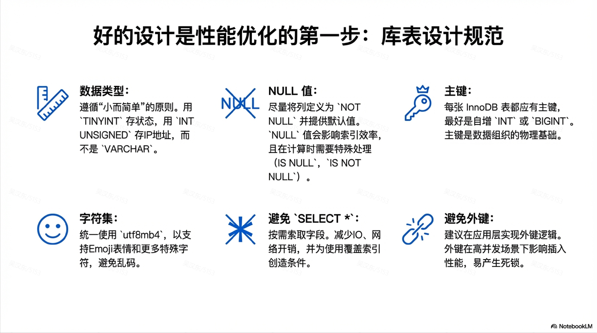

## 第 3 页

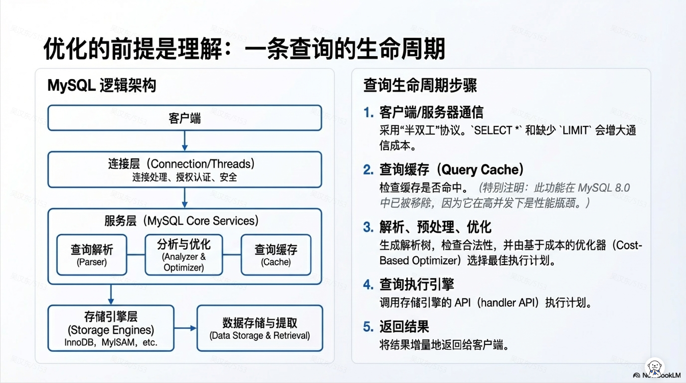

## 第 4 页

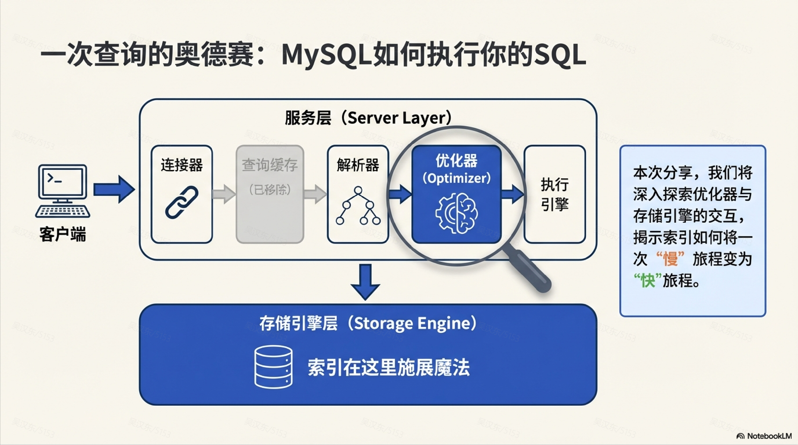

## 第 5 页

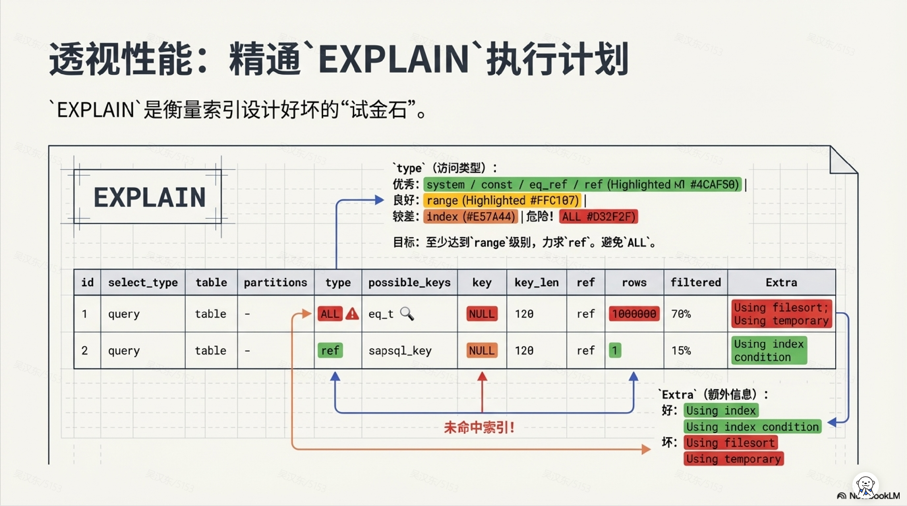

## 第 6 页

## 第 7 页

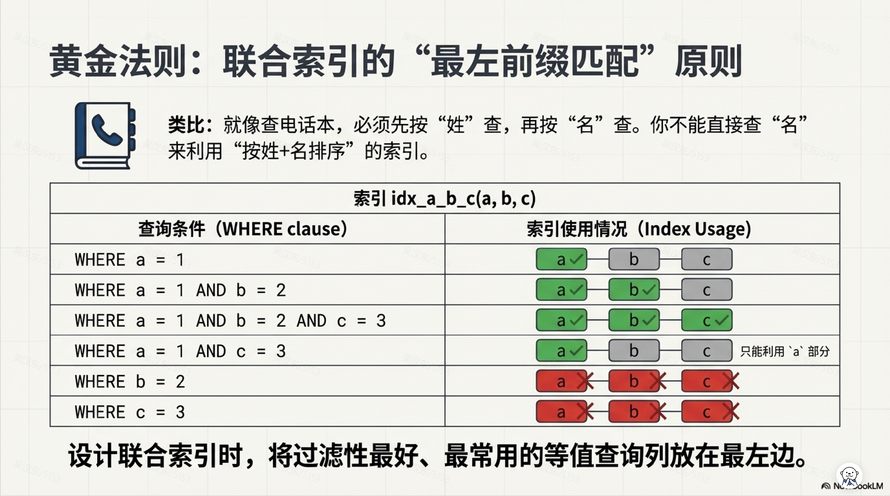

## 第 8 页

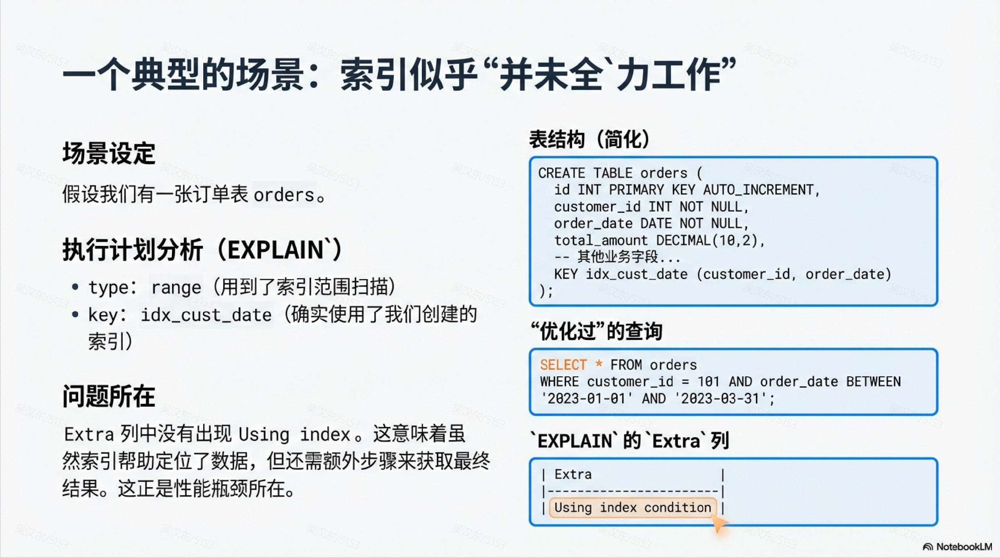

## 第 9 页

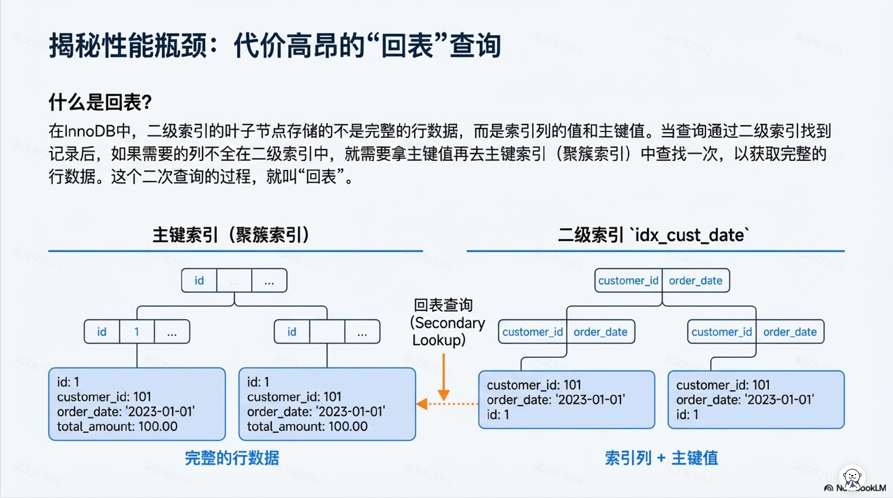

## 第 10 页

## 第 11 页

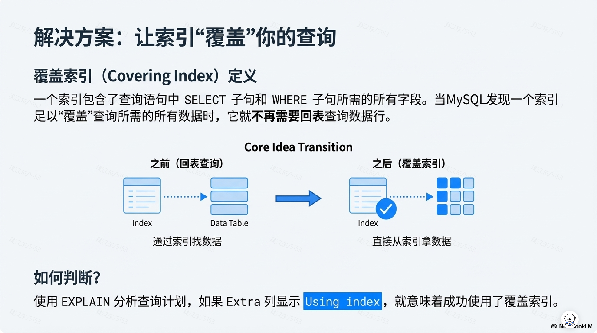

## 第 12 页

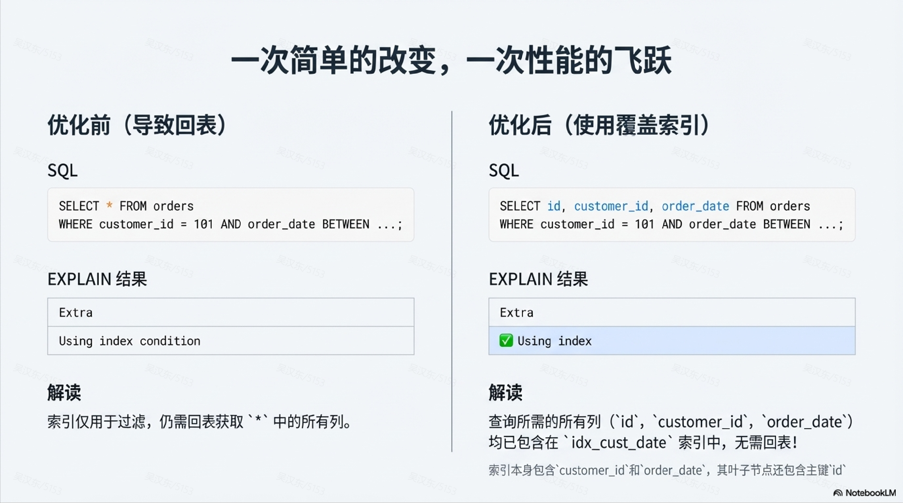

## 第 13 页

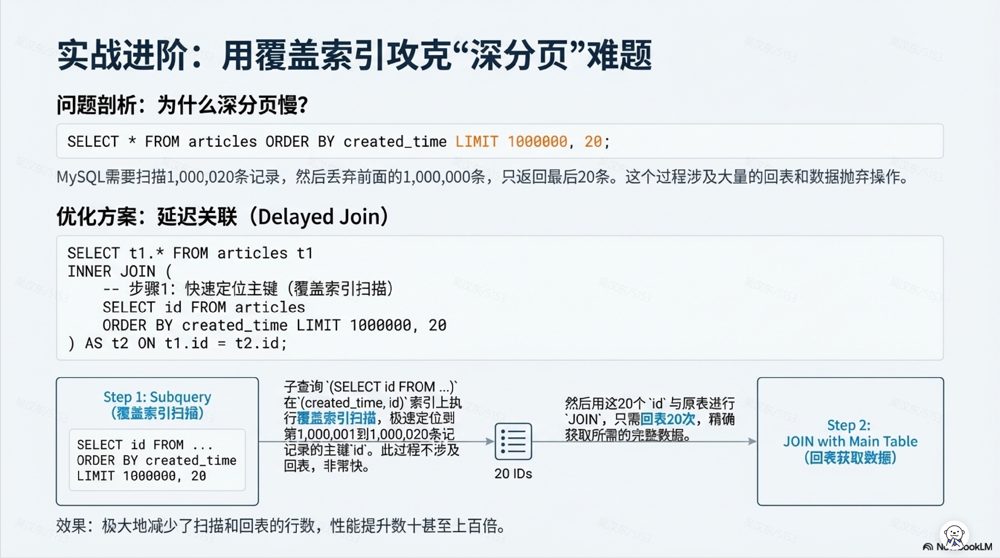

## 第 14 页

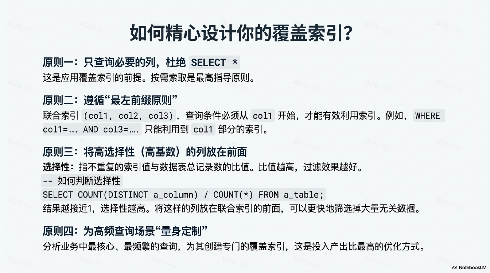

## 第 15 页

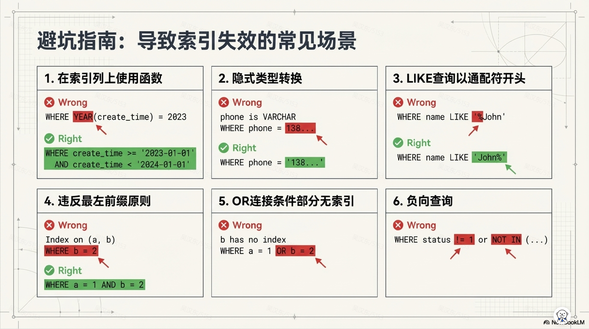

## 第 16 页

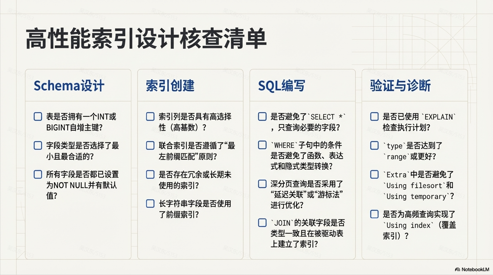
