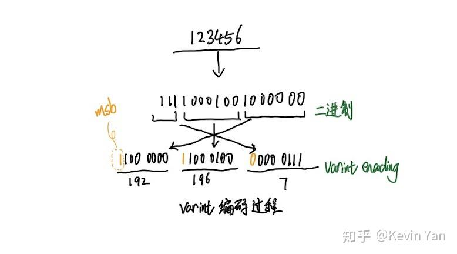
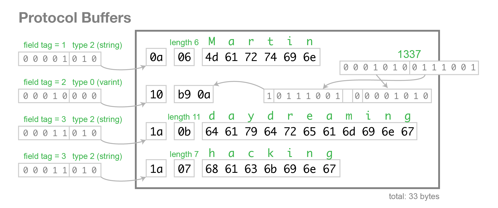

# 微服务和gRPC

来源：
- https://campus.wps.cn/contentpreview/b9416aa1-ca9d-4311-aa98-bb243fcafbfc

# 微服务&gRPC与Protobuf

# 微服务与 RPC 概述

## 什么是微服务？

微服务是一种软件架构风格，它将应用程序构建为一组小型、独立的服务。每个服务：

- 运行在自己的进程中
- 围绕业务功能构建
- 能够独立部署
- 通过轻量级机制（通常是 HTTP/RPC）通信

### 微服务的优势

1. **独立开发和部署**

   - 不同团队可以独立开发不同服务
   - 服务可以使用最适合的技术栈
   - 可以独立部署和扩展，客户端不用关注服务端实现细节。（例如：一个存储微服务从阿里云切到金山云，客户端可以无感知。）
2. **故障隔离**

   - 单个服务故障不会导致整个系统崩溃（例如：文档中图片服务异常，不影响正常的文档编辑）
   - 更容易进行故障排查和修复
   - 系统更具弹性，服务可以独立扩缩容（例如：签到服务，遇到紧急运营活动，可以独立扩缩容）

### 微服务面临的挑战

1. **服务间通信**

   - 需要处理网络延迟（例如：网络抖动，导致请求超时）
   - 要考虑服务发现，就是要知道对方服务在哪台机器上
   - 需要处理部分失败，就是对方服务可能挂了，需要有重试机制
2. **运维复杂性**

   - 服务数量增多
   - 部署和监控更复杂
   - 需要更好的运维工具
   > 微服务的粒度要合理设计，不是越细越好，也不是越粗越好。像金山办公，很多业务可能会被私有化，如果太细，将加大运维难度。

## 微服务与 RPC 的关系

在微服务架构中，RPC（远程过程调用）扮演着关键角色：

1. **服务间通信**

   - RPC 提供了服务间通信的标准方式
   - 使远程服务调用像本地调用一样简单
   - 处理网络通信的复杂性
2. **接口定义**

   - RPC 框架（如 gRPC）提供接口定义语言
   - 清晰定义服务间的契约
   - 支持多语言代码生成
3. **性能优化**

   - 二进制协议提高传输效率
   - 支持连接复用
   - 提供流式传输能力
4. **可靠性保证**

   - 内置重试机制
   - 提供超时控制
   - 支持负载均衡

# RPC 与 gRPC 基础

## 什么是 RPC？

远程过程调用(Remote Procedure Call, RPC)是一种分布式计算的通信协议，允许程序调用另一个地址空间(通常是网络上的另一台计算机)的函数或方法，就像调用本地函数一样。

**RPC（Remote Procedure Call）** 的意思是：

> **“像调用本地函数一样，去调用远程服务器上的函数。”**

**举例：**

你写了一个函数 `add(a, b)` 来求两个数之和。你在本地这样写：

```
result := add(1, 2)
```

RPC 让你可以这样调用远程服务器上的 `add` 函数，**看起来就像是本地函数，但其实它在网络另一端执行。**

**通俗流程图：**

```
你（客户端）               网络               服务器
   |                                            |
   |--- 调用 add(1, 2) ------------------------>|
   |                                            |
   |<---------- 返回结果 3 ---------------------|
```

## 为什么用 RPC？

1. RPC 框架封装了复杂的网络请求逻辑，让你用函数方式去调用远程服务。
2. 微服务架构中，服务之间通过 RPC 通信，可以提高系统的可扩展性和可维护性。

## RPC 和 HTTP 有啥区别？

| 项目 | RPC | HTTP API |
| --- | --- | --- |
| 调用方式 | 像调用函数 | 像访问 URL |
| 数据格式 | 二进制（如 protobuf） | 一般是 JSON 或者表单数据 |
| 性能 | 通常更高（小体积、低延迟） | 相对较低 |
| 接口定义 | 使用 `.proto` 或 IDL 文件 | 通常用 OpenAPI、Swagger 等或者文档 |

## RPC 的基本工作流程

```
你（客户端）               网络               服务器
   |                                            |
   |--- 调用 add(1, 2) ------------------------>|
   |                                            |
   |<---------- 返回结果 3 ---------------------|
```

1. **客户端调用**：客户端调用本地函数
2. **参数序列化**：客户端将参数打包(序列化)，也就是将参数转换为二进制数据
3. **网络传输**：二进制数据通过网络发送到服务端
4. **参数反序列化**：服务端将二进制数据转换为参数。参数包含函数名、参数值、参数类型等。
5. **执行调用**：反序列化后，服务端知道客户端想调用哪个函数，直接执行实际函数，并返回结果（结构体数据）
6. **结果序列化**：服务端将结果（结构体数据）打包，也就是将结果转换为二进制数据
7. **网络传输**：二进制数据通过网络发送回客户端
8. **结果反序列化**：客户端解包结果数据，也就是将二进制数据转换为结构体数据。
9. **返回结果**：客户端程序获得结构体数据，也就是获得函数返回值。

## 常见的 RPC 框架

| 框架 | 说明 |
| --- | --- |
| gRPC | Google 出品，支持多语言、基于 HTTP/2 和 protobuf |
| Thrift | Facebook 出品，灵活多语言 |
| Dubbo | 阿里出品，主要用于 Java 服务 |
| JSON-RPC | 使用 JSON 格式传输 |

### 微服务要解决的主要问题

- 服务注册与发现（要知道对方在哪）
- 数据传输

## 数据传输：为什么需要编解码？

### JSON 数据的问题

JSON确实可以作为RPC场景下的数据传输方案。

1. 体积大
2. 解析慢
3. 针对二进制数据，没有很好的解决方案。

### 二进制数据的问题

在上面的 RPC 工作流程中，我们可以看到序列化（编码）和反序列化（解码）是非常重要的步骤。那么为什么需要编解码呢？在分布式系统和网络通信中，编解码（序列化和反序列化）解决了以下关键问题：

1. **数据传输问题**

   - 计算机内存中的数据结构（如对象、数组）无法直接在网络上传输
   - 不同编程语言的数据表示方式不同
   - 网络传输只能传输字节流，需要将复杂数据结构转换为字节序列
2. **跨语言通信问题**

   - Java、Go、Python 等语言的数据类型实现方式不同
   - 编解码提供了一种统一的数据交换格式
   - 使不同语言编写的系统能够相互通信
3. **数据存储问题**

   - 内存中的数据结构需要持久化到磁盘
   - 数据库存储需要将对象转换为可存储的格式
   - 编解码提供了数据持久化的标准方式
4. **性能优化**

   - 减少网络传输的数据量
   - 提高数据处理速度
   - 节省存储空间
5. **版本兼容问题**

   - 数据结构随时间演进
   - 需要保持向前和向后兼容
   - 编解码协议（如 Protobuf）提供了版本兼容机制

# Protocol Buffers 详解

ProtoBuffer 是 Google 的语言中立、平台中立、可扩展的结构化数据序列化机制

## Protobuf 背景与优势

- **诞生背景**：Google 最初为内部分布式系统设计了一套高效的序列化格式，2008 年将其开源。设计目标是简单高效，生成的二进制数据比 XML 更小、更快。Protobuf 在 Google 内部广泛用于存储和交换结构化信息，并作为其 RPC 系统（即 gRPC 的前身）的基础。

一个简单的 .proto 文件示例：

```
syntax = "proto3";
package example;

message Person {
  string name = 1;
  int32 id = 2;
  float height = 3;
}
```

- **Protobuf 优势**：

  - **紧凑体积**：二进制编码格式使消息体积远小于等价的 JSON/XML 文本。例如，同一结构的数据，Protobuf 序列化后仅约 99 字节，而 JSON 约 214 字节，提高网络传输效率。
  - **高性能**：Protobuf 的序列化/反序列化开销低。实测中，Protobuf 序列化时间约为 JSON 的一半（133ns 对比 249ns），反序列化优势更明显（294ns 对比 1457ns）。
  - **严格模式与兼容性**：通过 `.proto` 文件定义模式(schema)，Protobuf 强类型检查、明确字段编号和类型，使数据结构变化时可以平滑演进。新增字段时旧客户端可忽略不识别的字段（TLV 形式跳过未知字段），保证向前/向后兼容。
  - **多语言和代码生成**：Protobuf 支持多种编程语言，可以用同一 `.proto` 定义生成各语言的数据访问类和 RPC 接口代码。这在异构微服务环境中非常有用，服务端和客户端可用不同语言开发。
  - **额外注意**：二进制格式可读性差于 JSON，但在追求性能和效率的场景下优势明显。

**示例性能对比**：下表基于一个简单 `Person{name, id, height}` 示例进行的测试，比较了 Protobuf 与 JSON 的序列化结果和时间。可以看出，在体积和速度上，Protobuf 均优于 JSON。

| 编码格式 | 序列化输出大小 | 序列化时间 | 反序列化时间 |
| --- | --- | --- | --- |
| **Protobuf** | 99 字节 | 133 纳秒 | 294 纳秒 |
| **JSON** | 214 字节 | 249 纳秒 | 1457 纳秒 |

## 编码与解码原理

### Varint 编码

Varint 是一种可变长度整数编码方式，最大支持 64 位整数，用于将**整数编码为变长字节序列**。它通过将整数表示为一系列字节块，每个字节块的**最高位表示是否继续**，其余位表示数值。

> 注意：1个字节8位，最高位是符号位，所以实际能表示的整数范围是0-127。

对于整数、布尔、enum 等类型（Wire Type 0），Protobuf 采用可变长度整数（Varint）编码。较小的数字只占用少量字节，大数字占用更多字节。每个字节的最高位为“继续”标志位：若为 1 表示后续字节仍在，0 表示结束。下图中，将十进制数 300（`100101100₂`）拆分为两个 7 位块并添加续航位，最终编码成字节序列 `[172, 2]`。

> 注意： Varint 是用的小端序，所以是反着读的。




[详解 varint 编码原理](https://zhuanlan.zhihu.com/p/84250836)

**Protobuf 序列化原理**  
Protobuf 序列化时，将每个消息视为一系列 `字段号+类型+值` 的键值对（Key-Value）组合。不过二进制流中不包含字段名、类型等描述信息，只有字段编号（Tag）和对应值，解码时必须借助 `.proto` 模式文件。具体原理包括：

- **Tag 编码**：每个字段由字段号（field number）和 Wire Type（线束类型）共同决定一个 Tag 值。计算公式为：`Tag = (field_number << 3) | wire_type`。**Tag 本身以 Varint 格式编码**。  
  字段编号与 Wire Type 组合生成 Tag（例如 `(1<<3|2)=10`）。\*

```
1000
0010
————
1010
```

> 根据上图，字段号最大是15（想一下为什么？），所以字段号和wire type 可以共用一个字节。

计算机根据 Tag 的值，可以知道字段号和类型。

- **Wire Type 分类**：Protobuf 定义了几种基本的 Wire Type ：

  - **Varint (0)**：用于 `int32/64`、`uint32/64`、`sint32/64`、`bool`、`enum` 等整型和枚举类型。
  - **64-bit (1)**：用于 `fixed64`、`sfixed64`、`double` 等 64 位定长类型。
  - **Length-delimited (2)**：用于字符串、字节数组、嵌套消息以及打包的重复字段。长度使用 Varint 表示，然后紧跟实际内容字节。
  - **32-bit (5)**：用于 `fixed32`、`sfixed32`、`float` 等 32 位定长类型。  
    （类型 3 和 4 预留用于分组，现已弃用。）
- **TLV 结构**：每个字段的序列化形式本质上是 *Tag-Length-Value* 格式：先编码 Tag，再编码值。对于 Length-delimited 类型，会额外先写入长度 Varint，再写入数据。这种设计使得解码器遇到未知字段时可以跳过，旧版本程序可忽略新字段。
- **模式依赖**：Protobuf 编码流本身不包含字段名或类型信息，只由 `.proto` 描述文件定义的字段编号来识别每个字段，所以需要外部模式文件才能解读数据。这一点使得序列化结果高效紧凑，但也意味着 Protobuf 数据本身**不可自描述**，必须有匹配的模式才能解析。

## Protobuf 序列化示例

在 **Protocol Buffers（Protobuf）** 中，**字符串（`string`）类型是以长度前缀（length-prefixed）方式进行编码的**。这种方式属于 **wire type = 2（length-delimited）** 类型。下面是它的编码细节：

### 编码结构

一个字符串字段的编码由以下三部分组成：

```
[Tag][Length][Data]
```

### 各部分说明：

1. **Tag（字段编号 + wire type）**

   - 计算方式：`(field_number << 3) | wire_type`
   - 字符串的 wire type 是 `2`（length-delimited）
   - 然后用 Varint 编码这个 tag
2. **Length**

   - 表示字符串字节数（不是字符数！）
   - 使用 Varint 编码表示字符串的字节长度（UTF-8 编码后的字节数）
3. **Data**

   - 字符串本身的内容，**以 UTF-8 编码**保存
   - 原样写入，没有压缩

### 举个例子

```
message Person {
  string name = 1;
}
```

发送 `"张三"`：

- 字段号：1，wire type：2 → tag = `(1 << 3) | 2 = 10` → Varint 编码为 `0x0A`
- "张三" 的 UTF-8 编码是 6 个字节：`E5 BC A0 E4 B8 89`
- Length = 6 → Varint 编码为 `0x06`

最终编码为：

```
0A 06 E5 BC A0 E4 B8 89
```

### 解码过程

1. **Tag**：

   - 从二进制流中读取 Varint 编码的 Tag
   - 解码为 `(field_number << 3) | wire_type`
2. **Length**：

   - 从二进制流中读取 Varint 编码的 Length
   - 解码为字符串的字节长度
3. **Data**：

   - 从二进制流中读取指定长度的字节
   - 解码为字符串内容

在线工具：<https://protobuf-decoder.netlify.app/>

## 小结

| 编码部分 | 内容 | 编码方式 |
| --- | --- | --- |
| Tag | 字段号 + 类型 | Varint |
| Length | 字节长度 | Varint |
| Data | UTF-8 字节流 | 原样写入 |

# gRPC 深入剖析

## gRPC 的优势

1. **高性能**：使用 HTTP/2 作为传输协议，支持多路复用
2. **强类型 IDL**：使用 Protocol Buffers 进行接口定义和数据序列化
3. **多语言支持**：自动生成多种语言的客户端和服务端代码
4. **双向流**：支持流式处理，适用于大数据传输和实时通信
5. **内置认证**：提供 SSL/TLS 集成和多种认证机制

## gRPC 与 Protobuf 的协同机制

gRPC 是基于 Protobuf 的高性能 RPC 框架，Protobuf 在其中既作为接口描述语言 (IDL) 又作为消息交换格式。其配合机制主要包括：

- **服务和消息定义**：在 `.proto` 文件中定义服务（service）和消息（message）。例如：

  ```
  service Greeter {
    rpc SayHello (HelloRequest) returns (HelloReply);
  }
  message HelloRequest {
    string name = 1;
    int32 age = 2;
    float height = 3;
  }
  message HelloReply {
    string message = 1;
  }
  ```

  如上所示，通过 `service` 和 `rpc` 关键字指定可远程调用的方法及其请求/响应类型。
- **生成客户端/服务器代码**：使用 `protoc` 编译器配合 gRPC 插件从 `.proto` 生成代码。该过程会生成各语言的消息类和 RPC 接口代码，包括客户端存根（stub）和服务器端骨架。生成的服务器端代码通常包含用于注册服务的函数（如 Go 的 `RegisterGreeterServer`）。开发者在服务器实现类中填充业务逻辑，并通过调用注册函数将服务注册到 gRPC 服务器上。客户端则通过生成的存根调用服务方法，存根会将请求参数打包成 Protobuf 消息并发送到服务器。
- **运行时通信流程**：客户端调用存根方法，本地代码被转换成 RPC 请求，通过 HTTP/2 传输承载的二进制帧发送给服务端。服务端的 gRPC 基础设施接收请求，解码 Protobuf 消息并调用相应的服务实现方法，方法返回值再编码为 Protobuf 响应发送回客户端。整个过程对开发者透明，就像在本地调用函数一样。

### 定义服务

Protocol Buffers 不仅可以定义数据结构，还可以定义 RPC 服务：

```
service UserService {
  rpc GetUser(UserRequest) returns (UserResponse);
  rpc ListUsers(ListUsersRequest) returns (stream UserResponse);
  rpc UpdateUser(stream UserUpdateRequest) returns (UserResponse);
  rpc ChatWithUsers(stream ChatMessage) returns (stream ChatMessage);
}
```

上面例子展示了四种调用模式：

- 一元 RPC：单个请求和响应
- 服务端流式 RPC：客户端发送一个请求，服务端返回流式响应
- 客户端流式 RPC：客户端发送流式请求，服务端返回单个响应
- 双向流式 RPC：双方都发送消息流

## gRPC 工作原理

### gRPC 架构

gRPC 的基本架构由以下几个重要组件组成：

1. **客户端 Stub**：调用方使用的桩代码，隐藏 RPC 细节
2. **服务端 Skeleton**：服务实现方的骨架代码
3. **序列化/反序列化层**：使用 Protocol Buffers 处理数据
4. **传输层**：基于 HTTP/2 协议的网络传输

### gRPC 调用类型

gRPC 支持四种调用类型，满足不同场景需求：

1. **一元 RPC(Unary RPC)**

   - 客户端发送单个请求并获得单个响应
   - 类似于传统的 HTTP 请求/响应模式
   - 适用于简单的请求处理
2. **服务端流式 RPC(Server Streaming RPC)**

   - 客户端发送单个请求，服务端返回消息流
   - 适用于大数据传输：如下载大文件或获取大量数据
3. **客户端流式 RPC(Client Streaming RPC)**

   - 客户端发送消息流，服务端返回单个响应
   - 适用于上传数据或实时处理：如文件上传或实时数据采集
4. **双向流式 RPC(Bidirectional Streaming RPC)**

   - 客户端和服务端同时发送和接收消息流
   - 适用于实时双向通信：如聊天应用或实时协作

# 使用 gRPC 构建微服务

[Step by Step写一个gRPC微服务](https://campus.wps.cn/contentpreview/a7090948-a655-4bfc-b08b-2e56d0e65f4c)
